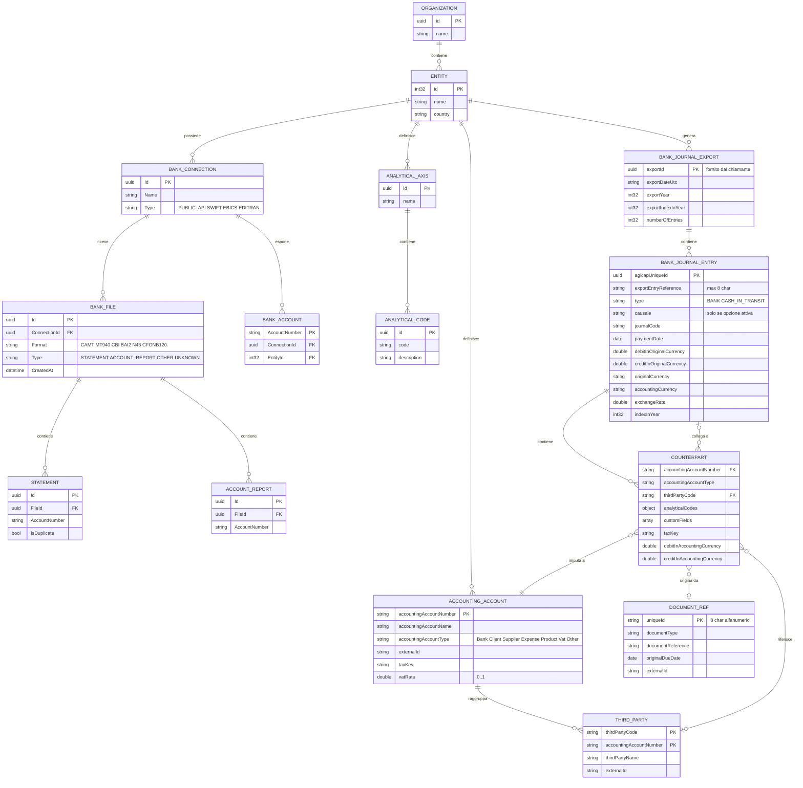
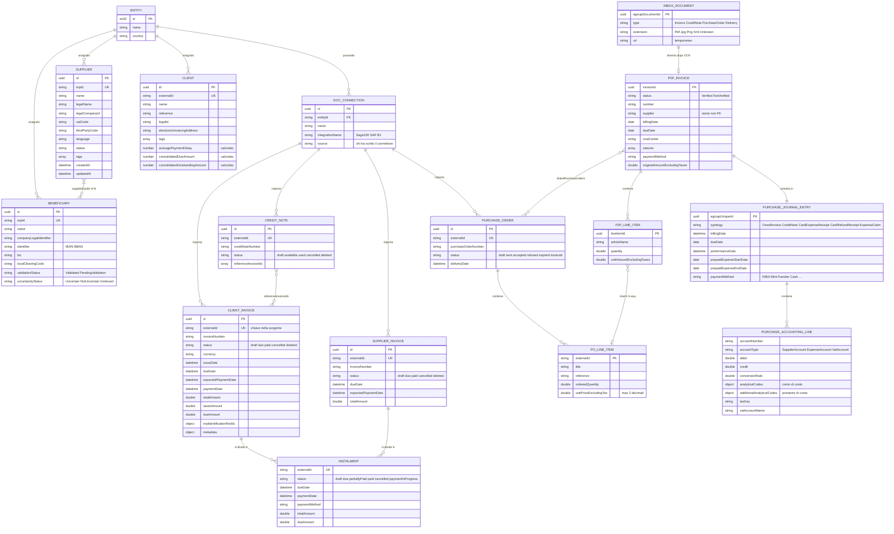

# Agicap — modello dati ricostruito dalle specifiche OpenAPI pubbliche

Analisi competitiva per WEISS S.r.l. — deliverable sul modello dati.
Data della ricostruzione: **11 agosto 2026**.

---

## Nota di metodo e perimetro dell'evidenza

Questo documento non descrive il database di Agicap. Descrive **il contratto che Agicap espone verso l'esterno**, che è una proiezione del modello interno: nasconde ciò che non serve agli integratori e a volte rinomina. Dove il contratto lascia intravedere una scelta interna, è segnalato.

**Fonte unica**: le 19 specifiche OpenAPI 3 servite in chiaro da `https://api.agicap.com/portal-api/apis/{apiId}/schema`, scaricate l'11 agosto 2026 e conservate in `assets/agicap/api-traces/openapi-specs/`. **Nessun endpoint di Agicap è stato chiamato** per produrre questa analisi: si è lavorato sui file già acquisiti. Gli estratti leggibili sono in `assets/agicap/materiali-pubblici/openapi-*.md`.

### Cosa ho letto per intero (schemi, campi, descrizioni, parametri, risposte)

| Spec | Path | Op. | Schemi | Perché |
|---|---:|---:|---:|---|
| `treasury-bank-journal-v1` | 5 | 6 | 22 | tesoreria e prima nota banca — **priorità 1** |
| `banking-documents-v1` | 9 | 12 | 13 | connessioni, file ed estratti conto — **priorità 1** |
| `card-expenses-bank-journal-v1` | 1 | 1 | 8 | scritture da carta aziendale — priorità 1 |
| `business-documents-v2` | 19 | 38 | 55 | fatture e documenti commerciali — **priorità 2** |
| `invoices-management-v1` | 4 | 4 | 31 | Purchase-to-Pay — **priorità 2** |
| `purchase-journal-v1` | 2 | 2 | 20 | registro acquisti — priorità 2 |
| `chart-of-accounts-v1` | 8 | 8 | 19 | piano dei conti e **piano analitico** |
| `organizations-v1` | 2 | 2 | 6 | organizzazione ed entità — priorità 5 |
| `payments-v2` | 8 | 11 | 19 | beneficiari e file di pagamento — priorità 6 |
| `client-risk-v1` | 1 | 4 | 39 | letto perché contraddice le convenzioni sugli importi |

### Cosa ho letto solo in superficie (elenco degli schemi e degli enum, non ogni campo)

`ar-clients-v1` (5 path, 17 op., 107 schemi) — letta a fondo la sola entità `Client` e i suoi riepiloghi per valuta; contatti, indirizzi e assegnazioni utente solo elencati.
`suppliers-v1` (3 path, 13 schemi) — letta l'entità `Supplier` e la semantica di sincronizzazione.

### Cosa non ho letto

`einvoicing-v1` (72 schemi, dominio FR/BE), `business-documents-v1` (versione precedente della v2, 45 schemi), `financial-investments-v1`, `intragroup-financing-v1`, `events-v1`, `auth-v1`, `httpbin-v1`. Sono elencate nella sezione 10 con una riga ciascuna, ricavata dall'inventario e non da una lettura di dettaglio.

### Cosa nel modello pubblico non esiste — verificato, non assunto

Ricerca sistematica su tutte e 19 le specifiche delle stringhe `categor`, `forecast`, `budget`, `scenario`, `cashflow`, `rule`, `balance`, `transaction`:

| Concetto | Esito |
|---|---|
| **Categorie e regole di categorizzazione** | **assenti**. L'unica occorrenza di `categor` è `ReportedInvoiceCategory ∈ {SaleOfGoods, ProvisionOfService}` in `einvoicing-v1`, che è una categoria fiscale francese, non una categoria di cash flow. |
| **Previsioni, budget, scenari** | **assenti** dall'API attuale. `forecast` compare solo nella prosa dell'API legacy deprecata, a proposito di `ExpectedTransaction`. |
| **Movimento bancario grezzo** | **assente**. `banking-documents-v1` espone file, estratti conto e numeri di conto, **non le singole transazioni**. Non esiste un `Transaction { data, importo, descrizione, controparte }` nell'API attuale. |
| **Saldo di conto corrente** | **assente**. Nessun campo `balance` su alcun conto bancario. L'unico `balance` è in `intragroup-financing-v1`, ed è il saldo di un finanziamento infragruppo. |

`[DEDOTTO]` Il cuore del prodotto — categorizzazione, previsione, saldi, riconciliazione — **non è esposto**. L'API pubblica copre gli anelli esterni: ingresso dei dati (file bancari, documenti, anagrafiche) e uscita dei dati (scritture contabili verso l'ERP). Chi integra Agicap non può ricostruire il previsionale: può solo alimentarlo e leggerne il risultato contabile. È una scelta di prodotto, non una dimenticanza.

---

## 1. L'albero: che cosa sta sotto che cosa

La gerarchia si legge nella forma dei path, che è quasi ovunque:

```
/public/{prodotto}/{versione}/entities/{entityId}/...
```

Sopra le entità c'è un solo livello:

```
Organization (uuid)
   └── Entity (int32, name, country)          ← unità di partizionamento di TUTTI i dati
         ├── Connection «bancaria»  (uuid)     → BankFile → Statement / AccountReport
         │                                     → BankAccount
         ├── Connection «documentale» (uuid)   → ClientInvoice, SupplierInvoice, Quote, Order, DeliveryNote…
         ├── AccountingAccount (numero)        → ThirdParty (codice)
         ├── AnalyticalAxis (uuid)             → AnalyticalCode (uuid)
         ├── Supplier / Client / Beneficiary
         ├── BankJournalExport (uuid) → BankJournalEntry → Counterpart
         └── PurchaseJournalEntry → PurchaseAccountingLine
```

Tre osservazioni sull'albero.

**a) L'organizzazione è piatta.** `OrganizationEntityPresentation` ha esattamente tre campi: `id: int32`, `name: string`, `country: string`. Nessun `parentId`, nessun gruppo di consolidamento, nessuna gerarchia di entità esposta. `GET /public/organizations/v1` restituisce «all organizations accessible with the provided access token» — un solo token può quindi vedere più organizzazioni.

**b) `Connection` è un termine sovraccarico: sono due entità diverse.**

| | `banking-documents-v1` | `business-documents-v2` |
|---|---|---|
| Cosa raggruppa | file bancari, estratti conto, conti | fatture, note di credito, ordini, DDT |
| Campi | `Id: uuid`, `Name`, `Type` | `id: uuid`, `entityId`, `name`, `integrationName`, `source` |
| `Type` | `PUBLIC_API`, `SWIFT`, `EBICS`, `EDITRAN` (la descrizione del filtro di query aggiunge `KONFIPAY`) | non esiste |
| Semantica | il canale tecnico verso la banca | la sorgente dei documenti (un ERP) |

Il campo `source` della connessione documentale merita di essere citato: la sua descrizione chiede di dichiarare **chi ha scritto il connettore** — «If you are an external integrator, put the "External integrator - `{name_of_your_company}`" - If you are the user's in-house development team, put "Internal team"». È metadato di governance messo dentro il modello dati.

**c) Il `Type` della connessione bancaria non include CBI, H2H né open banking.** I quattro valori sono `PUBLIC_API`, `SWIFT`, `EBICS`, `EDITRAN`. Le connessioni PSD2 esistono nel prodotto ma sono fuori da questa API — la descrizione lo dichiara: «This API cannot be used to export banking data that is retrieved in Agicap via an Open Banking / PSD2 connection».

---

## 2. Entità principali

### 2.1 Organization ed Entity

| Entità | Campo | Tipo | Obbl. | Valori / note |
|---|---|---|---|---|
| **Organization** | `id` | `uuid` | sì | visibile anche nell'interfaccia, pagina API settings |
| | `name` | `string` | nullable | |
| **Entity** | `id` | `int32` | sì | **intero**, non UUID — è la chiave che compare in ogni path |
| | `name` | `string` | nullable | |
| | `country` | `string` | nullable | |

L'entità ha inoltre una **valuta principale** (`entity main currency`), non esposta come campo ma citata in `ar-clients-v1`: gli importi consolidati sono espressi «into the entity main currency».

### 2.2 Connessione bancaria, file, estratti conto

| Entità | Campo | Tipo | Note |
|---|---|---|---|
| **ConnectionSummary** | `Id` | `uuid` | |
| | `Name` | `string` | |
| | `Type` | `string` | `PUBLIC_API` \| `SWIFT` \| `EBICS` \| `EDITRAN` (\| `KONFIPAY`) |
| **BankFileSummary** | `Id` | `uuid` | |
| | `ConnectionId` | `uuid` | FK |
| | `Name`, `Format` | `string` | formati accettati in push: CAMT.053, CAMT.052, N43, CFONB120, MT940, CBI, BAI2, ZIP |
| | `Type` | `string` | `STATEMENT` \| `ACCOUNT_REPORT` \| `OTHER` \| `UNKNOWN` |
| | `CreatedAt` | `date-time` | UTC |
| **StatementSummary** | `Id`, `FileId`, `ConnectionId` | `uuid` | un file contiene N estratti conto |
| | `AccountNumber` | `string` nullable | |
| | **`IsDuplicate`** | `boolean` | «`False` by default. `True` if the bank statement has already been imported.» |
| **AccountReportSummary** | come sopra | | reportistica di conto, distinta dall'estratto |
| **AccountSummary** | `AccountNumber`, `ConnectionId`, `EntityId`, `CreatedAt` | | **nessun saldo, nessun IBAN, nessuna valuta** |

Il flag `IsDuplicate` è una scelta di modello notevole: **il duplicato non viene rifiutato, viene marcato**. Il filtro `includeDuplicates=false` è il default in lettura. Chi importa due volte lo stesso estratto conto non rompe niente e può accorgersene dopo.

### 2.3 Prima nota banca — l'entità meglio modellata dell'intera API

`BankJournalExport` → `ExportedBankJournalEntry` → `ExportedCounterpart` → `Document`.

#### `BankJournalExportSummary`

| Campo | Tipo | Obbl. | Descrizione originale |
|---|---|---|---|
| `exportId` | `uuid` | sì | «Unique ID of the export» — **fornito dal chiamante** |
| `exportDateUtc` | `string` (ISO 8601 con millisecondi) | sì | `2024-10-28T14:30:59.999Z` |
| `exportYear` | `int32` | sì | anno di riferimento della numerazione |
| `exportIndexInYear` | `int32` | sì | «index starting at 1» |
| `indexInYearOfFirstEntryInBankJournal` | `int32` | sì | prima scrittura dell'export, nella numerazione annuale |
| `indexInYearOfLastEntryInBankJournal` | `int32` | sì | ultima scrittura |
| `numberOfEntries` | `int32` | sì | |

#### `ExportedBankJournalEntry` (la testata della scrittura)

| Campo | Tipo | Obbl. | Note |
|---|---|---|---|
| `agicapUniqueId` | `uuid` | sì | id stabile generato da Agicap; è la chiave di riconoscimento verso l'ERP |
| `exportEntryReference` | `string` | sì | «unique reference per entity generated by Agicap, **max 8 characters**, designed to match reference formats expected by ERPs» |
| `indexInExport` / `indexInYear` | `int32` | sì | doppia numerazione, entrambe da 1 |
| **`type`** | `string` | sì | **`BANK`** \| **`CASH_IN_TRANSIT`** |
| **`causale`** | `string` | nullable | «only populated for entities with **causale option enabled**» |
| `journalCode` | `string` | nullable | |
| `name` | `string` | sì | titolo |
| `entryMemo` | `string` | nullable | testo libero |
| `paymentDate` | `date` (solo data) | sì | |
| `bankAccountName` | `string` | sì | |
| `accountingAccountNumber` | `string` | sì | conto banca |
| `accountingAccountExternalId` | `string` | nullable | id ERP del conto |
| `debitInOriginalCurrency` / `creditInOriginalCurrency` | `double` | nullable | «rounded to four decimals» |
| `debitInAccountingCurrency` / `creditInAccountingCurrency` | `double` | nullable | «rounded to four decimals» |
| `originalCurrency` / `accountingCurrency` | `string` | sì | ISO 4217, tre lettere maiuscole |
| `exchangeRate` | `double` | nullable | «rounded to six decimals»; null per le contropartite sintetiche di utile/perdita su cambi |
| `counterparts` | `array` | sì | |

**`CASH_IN_TRANSIT` è direttamente rilevante per WEISS**: Agicap modella come tipo di scrittura di primo livello il denaro in transito — il contante versato ma non ancora accreditato. Non è un conto contabile fra i tanti: è un discriminante sulla testata.

#### `ExportedCounterpart` (le righe in contropartita)

| Campo | Tipo | Note |
|---|---|---|
| `accountingAccountNumber` | `string` | obbl. |
| `accountingAccountType` | enum | `OTHER` \| `SUPPLIER` \| `CLIENT` \| `EXPENSE` \| `PRODUCT` \| `VAT` \| `BANK` |
| `thirdPartyCode` / `thirdPartyName` / `thirdPartyExternalId` | `string` | nullable |
| **`analyticalCodes`** | `object` | dizionario asse → codice |
| `customFields` | `array<{name, value}>` | «Additional fields coming from **the reconciled expected** used to initialize the counterpart, they include the ERP identification fields from business document when imported in Agicap» |
| `taxKey` | `string` | solo per conti IVA |
| `document` | `Document` | nullable |
| `linkedExportedEntry` | `{agicapUniqueId, exportEntryReference}` | «used for ERP reconciliation» |
| debit/credit ×2 valute, `exchangeRate`, `journalCode`, `name` | | come sulla testata |

La descrizione di `customFields` è la frase più densa dell'intera specifica. Dice tre cose in fila: (1) esiste un'entità **«expected»** (il movimento atteso), (2) esiste una **riconciliazione** fra atteso ed effettivo, (3) quando la riconciliazione avviene, gli identificativi ERP del documento commerciale **si propagano fino alla riga contabile**. La catena completa è: documento nell'ERP → `erpIdentificationFields` → movimento atteso → riconciliazione col movimento bancario → `customFields` della contropartita → export verso l'ERP. Il cerchio si chiude e l'ERP ritrova i propri identificativi.

#### `Document` (riferimento al documento che ha originato la contropartita)

| Campo | Tipo | Note |
|---|---|---|
| `documentType` | `string` | `CLIENT_INVOICE` \| `CLIENT_CREDIT_NOTE` \| `SUPPLIER_INVOICE` \| `SUPPLIER_CREDIT_NOTE` \| `CLIENT_QUOTE` \| `SALES_ORDER` \| `PURCHASE_ORDER` \| `PROFORMA_INVOICE` \| `OTHER` — **dichiarato solo in prosa** |
| `uniqueId` | `string` | «A unique **8-character alphanumeric** identifier for the document» |
| `documentReference` | `string` nullable | numero fattura/ordine |
| `documentIssueDate` | `date-time` nullable | |
| `originalDueDate` | `date` | obbligatorio |
| `externalId` / `externalEntityId` | `string` nullable | id nel sistema sorgente |

### 2.4 Piano dei conti e piano analitico

| Entità | Campo | Tipo | Note |
|---|---|---|---|
| **AccountingAccount** | `accountingAccountNumber` | `string` | **chiave naturale**, «must be unique» |
| | `accountingAccountName` | `string` | obbl. |
| | `accountingAccountType` | `string` | `Bank` \| `Client` \| `Supplier` \| `Expense` \| `Product` \| `Vat` \| `Other` — **solo in prosa**; tipi fuori lista vengono ignorati in import |
| | `externalId` | `string` nullable | max 300 caratteri |
| | `taxKey` | `string` nullable | solo per conti IVA, max 300 caratteri |
| | `vatRate` | `double` nullable | solo per conti IVA, **fra 0 e 1** («0.15 for 15%») |
| **ThirdParty** | `thirdPartyCode` | `string` | «should be **unique in an accounting account**» → chiave composta |
| | `accountingAccountNumber` | `string` | FK, «should already exist» |
| | `thirdPartyName` | `string` | |
| | `externalId` | `string` nullable | max 300 caratteri |
| **AnalyticalAxis** | `id` | `uuid` | **obbligatorio anche in creazione**: lo genera il chiamante |
| | `name` | `string` | |
| | `codes` | `array<AnalyticalCode>` | l'asse possiede i suoi codici |
| **AnalyticalCode** | `id` | `uuid` | obbligatorio in creazione |
| | `code` | `string` | |
| | `description` | `string` nullable | |

**Il piano analitico è multi-asse e i codici sono figli dell'asse**, non di una tabella piatta. Le operazioni sono solo bulk (`bulk-create`, `bulk-update`, `bulk-delete`) e **ogni asse è processato indipendentemente**: «if one fails, the others are still created», con un report per elemento.

Sulle righe contabili gli assi tornano come **dizionari**, e nel registro acquisti sono **due** dizionari distinti:

- `analyticalCodes` — «codes linked to the **expense account**»
- `additionalAnalyticalCodes` — «codes which are related to the **cost bearer**»

`[DEDOTTO]` Agicap distingue *dove nasce il costo* (conto di costo) da *chi lo porta* (portatore di costo). È una distinzione che il nostro piano v4, con un unico centro di costo, non fa.

Nota di ambito dichiarata dal portale: il piano dei conti API alimenta «Treasury's bank journal & Account Receivable's sales journal preaccounting features (**does not work for Account Payable's purchase journal**)».

### 2.5 Documenti commerciali (`business-documents-v2`)

Nove tipi con **la stessa forma di base**. Campi comuni a tutti:

| Campo | Tipo | Obbl. in creazione | Note |
|---|---|---|---|
| `id` | `uuid` | — (in risposta) | «Unique identifier generated by Agicap» |
| `externalId` | `string` minLength 1 | **sì** | «Unique identifier of the document in the source data» — **chiave naturale** |
| `counterParty` | `{id, name}` | sì | id e nome della controparte **nel sistema sorgente**, non un FK verso `Client`/`Supplier` |
| `currency` | `string` | sì | ISO 4217 |
| `issueDate`, `dueDate` | `date-time` | sì | ISO 8601 — **date-time anche per date pure** |
| `label` | `string` nullable | no | |
| `status` | `string` | sì | vedi §6 |
| `amounts` | oggetto | sì | «amount must be positive» |
| `accounting` | `{accountCode, accountNumber, amount, currency}` | no | la valuta contabile può differire da quella del documento |
| `erpIdentificationFields` | `object` | no | sacchetto JSON libero |
| `metadata` | `object` | no | secondo sacchetto JSON libero |

Campi specifici per tipo:

| Tipo | Numero documento | Extra |
|---|---|---|
| `client-invoices` / `supplier-invoices` | `invoiceNumber` | `paymentDate`, `expectedPaymentDate`, `financingSolution`, `hasReadable`, **`instalments[]`** |
| `client-credit-notes` / `supplier-credit-notes` | `creditNoteNumber` | `referenceInvoiceIds[]`, `hasReadable` |
| `client-quotes` | `quoteNumber` | — |
| `proforma-invoices` | `proformaInvoiceNumber` | — |
| `sales-orders` | `salesOrderNumber` | — |
| `purchase-orders` | `purchaseOrderNumber` | `deliveryDate`, `lineItems[]` |
| `delivery-notes` | `deliveryNoteNumber` | `deliveryDate`, `lineItems[]`; **nessun importo, nessuna controparte, nessuno stato** |

#### `Instalment` — la rata come entità di primo livello

| Campo | Tipo | Note |
|---|---|---|
| `externalId` | `string` | obbl., chiave nella sorgente |
| `label` | `string` nullable | |
| `dueDate` | `date-time` nullable | scadenza contrattuale |
| `paymentDate` | `date-time` nullable | incasso/pagamento effettivo |
| `paymentMethod` | `string` nullable | |
| `status` | `string` | `draft` \| `due` \| `partiallyPaid` \| `paid` \| `cancelled` \| `paymentInProgress` |
| `amounts` | `{totalAmount, taxesAmount, dueAmount}` | |
| `accountingAmount` | `{amount, currency}` | importo nella valuta contabile |
| `erpIdentificationFields`, `metadata` | `object` | |

Sulla **testata** della fattura convivono tre date: `dueDate` (scadenza), `expectedPaymentDate` (stima), `paymentDate` («Payment **in full** date»). La stessa terna scende sulla rata. È il meccanismo con cui il previsionale si aggancia al dato reale: la stima è un campo del modello, non un calcolo a valle.

#### Righe

| Entità | Campi |
|---|---|
| `PurchaseOrderLineItem` | `externalId`, `title`, `reference` («Article reference in the ERP catalog»), `orderedQuantity` («strictly positive»), `unitPriceExcludingTax` e `totalAmountExcludingTax` («**Maximum 2 decimal places**») |
| `DeliveryNoteLineItem` | `externalId`, `deliveredQuantity`, `purchaseOrderExternalId` + `purchaseOrderLineItemExternalId` («Must be provided together») |

Solo ordini d'acquisto e DDT hanno righe. **Le fatture di `business-documents-v2` non hanno righe**: la fattura è un totale con scadenze. Le righe di fattura esistono altrove, in `invoices-management-v1`.

### 2.6 Ciclo acquisti

Due API distinte con due modelli diversi della stessa fattura fornitore.

#### `invoices-management-v1` — il ciclo operativo

| Entità | Campo | Tipo | Note |
|---|---|---|---|
| **InboxDocument** | `agicapDocumentId` | `uuid` | |
| | `type` | enum | `Invoice` \| `CreditNote` \| `PurchaseOrder` \| `Delivery` |
| | `extension` | enum nullable | `Jpg` \| `Pdf` \| `Png` \| `Xml` \| `Unknown` |
| | `url` | `string` | «A **temporary, time-limited URL** to download the document's attached file» |
| **Invoice** | `invoiceId` | `uuid` | |
| | `status` | enum | **`Verified` \| `NotVerified`** — due soli stati |
| | `number`, `reference`, `title`, `supplier` (nome, non FK) | `string` | |
| | `billingDate`, `dueDate` | `date` | qui **date pure**, non date-time |
| | `costCenter` | `string` nullable | **una stringa singola**, non gli assi analitici |
| | `natures` | `array<string>` | «The nature names» |
| | `originalAmountExcludingTaxes` / `IncludingTaxes` | `double` | |
| | `paymentMethod` | `string` nullable | |
| | `lineItems[]`, `linkedPurchaseOrders[]` | | |
| **PurchaseOrder** | `status` | enum | **`Open` \| `Closed`** |
| | `deliveryStatus` | `string` | |
| | `lineItems[]` con `orderedQuantity`, `deliveredQuantity`, `billedQuantity` | | |
| | `deliveries[]`, `linkedInvoices[]` | | |

Le tre quantità sulla riga d'ordine — ordinata, consegnata, fatturata — servono al **three-way matching**, che la specifica nomina esplicitamente: «the delivery references needed to finalize the 3-way matching and close orders upon invoice creation».

`natures` e `costCenter` sono i due soli attributi di classificazione gestionale del ciclo acquisti, sono **stringhe di sola lettura** e **non hanno endpoint di gestione**. È il residuo più vicino a una «categoria» in tutta l'API.

#### `purchase-journal-v1` — la proiezione contabile

| Campo | Tipo | Note |
|---|---|---|
| `agicapUniqueId` | `uuid` | «unique and stable through time» |
| `uniqueId` | `string` | «unique identifier as string» — **secondo identificatore, non spiegato** |
| `typology` | enum | `OwedInvoice` \| `CreditNote` \| `CardExpenseReceipt` \| `CardRefundReceipt` \| `ExpenseClaim` |
| `billingDate` | `date-time` | |
| `dueDate` | `date` | |
| `performanceDate` | `date-time` nullable | «date when the service occurred» — data di competenza |
| `prepaidExpenseStartDate` / `prepaidExpenseEndDate` | `date` nullable | **risconti** modellati sulla singola fattura |
| `paymentMethod` | enum nullable | `Check`, `CreditCard`, `DebitCard`, `DirectDebit`, `WireTransfer`, `Cash`, `Paypal`, `Giropay`, `Girocard`, **`RIBA`**, `BillOfExchange`, `Compensation`, `Other`, `None` |
| `originalFileUrl` / `originalFileExtension` | `string` nullable | |
| `supplierErpExternalId` | `string` nullable | |
| `taxKey` | `string` nullable | **deprecato**, «Use TaxKey on AccountingLines» |
| `accountingLines[]` | | una per conto da movimentare |
| `invoiceInformation` | oggetto nullable | popolato **solo** con `?include=invoiceInformation` e solo se `typology == OwedInvoice` |

`PurchaseJournalAccountingLine`: `accountNumber`, `accountType ∈ {SupplierAccount, ExpenseAccount, VatAccount}`, `debit`/`credit`, `convertedDebitAmount`/`convertedCreditAmount`, `conversionRate`, `currency`/`accountingCurrency`, `analyticalCodes`, `additionalAnalyticalCodes`, `taxKey`, `vatAccountName` («or of the **reverse charge** for reverse-charge entries»), `thirdPartyAccount`, `lineItemId`, `type` = `"G" for General`.

Il **reverse charge** (inversione contabile) è previsto nel modello. Per WEISS non è rilevante nell'operatività ordinaria di un bar, ma lo è per capire quanto in profondità sia stata modellata la contabilità.

#### `card-expenses-bank-journal-v1` — la spesa da carta

`AccountingTransactionLine { uniqueId, title, supplierOrMerchant, paymentDate: date-time, debit: {accountNumber, accountType, amount, currency, thirdPartyAccount}, credit: {…} }` con `accountType ∈ {SupplierAccount, BankLedger}`. È una partita doppia a **due sole righe**, molto più povera della prima nota banca: nessun codice analitico, nessuna valuta contabile separata, nessun cambio.

### 2.7 Anagrafiche

| | `Supplier` | `Client` | `Beneficiary` |
|---|---|---|---|
| API | `suppliers-v1` | `ar-clients-v1` | `payments-v2` |
| Id Agicap | `id: uuid` «stable» | `id: uuid` | `id: uuid` |
| Chiave naturale | **`erpId`** | **`externalId`** | **`erpId`** |
| Nome | `name` + `legalName` | `name` | `name` |
| Id legale | `legalCompanyId` | `legalId` («SIREN, SIRET, VAT») | `companyLegalIdentifier` |
| Fiscale | `vatCode` | — | — |
| Codice contabile | `thirdPartyCode` | — | — |
| Indirizzo | `legalAddress` | via `client-addresses` (entità separata) | `postalAddress` |
| Contatti | `contacts[]` + `primaryContact` | contatti **interni** ed **esterni**, due entità distinte | — |
| Etichette | `tags[]` | `tags[]` | — |
| Lingua | `language` (ISO 639-1) | — | — |
| Stato | `status` «as pushed by the ERP» | — | `validationStatus`, `uncertaintyStatus` |
| Audit | `createdAt`, `updatedAt` | — | — |
| Calcolati | — | `averagePaymentDelay`, `consolidatedDueAmount`, `consolidatedOutstandingAmount`, `dueAmountSummary[]`, `outstandingAmountSummary[]`, `numberOfContacts` | — |
| Fatt. elettronica | — | `electronicInvoicingAddress` («Chorus Pro, Peppol, etc.») | — |

**`Beneficiary` è deliberatamente separato da `Supplier`**, e la specifica spiega perché: «The same supplier may have several beneficiaries (multiple bank accounts), and a single beneficiary may be shared across suppliers (e.g. **a factoring company** collecting on behalf of multiple suppliers)». Il legame è **N↔N**, stabilito con `supplierErpIds[]` in fase di sincronizzazione dei beneficiari.

Coordinate bancarie del beneficiario: `identifier` (IBAN/BBAN/altro), `bic`, `bankName`, `country` (ISO 3166 a 2 lettere), `intermediaryBankBic`, `localClearingCode` («usually useful when the account number is not an IBAN»).

Il `Client` porta **importi consolidati per valuta**: `dueAmountSummary[]` e `outstandingAmountSummary[]` sono array di `{currencyCode, amount, convertedCurrencyCode, convertedAmount}`. La conversione alla valuta principale dell'entità è **materializzata nel payload**, non lasciata al lettore, e può essere `null` «when no exchange rate is available» — un caso di indisponibilità esplicitamente modellato.

### 2.8 Pagamenti

Nessuna entità «pagamento». Solo:

- `Beneficiary` (§2.7);
- il **routing di un file già generato**: `POST /payments-files/import` e `/secured-import`, con alias `/remittances/…`. «the API supports all standard banking formats in `.xml` and `.txt`»; «Once imported, the files are processed and sent to the bank **without any modifications**».

`[OSSERVATO]` L'API non consente di *comporre* una disposizione: nessun DTO con importo, data, beneficiario e conto d'addebito. La composizione resta nell'interfaccia.

Errori di sincronizzazione beneficiari, che rivelano le validazioni applicate: `InvalidName`, `InvalidIban`, `InvalidBic`, `InvalidBankIdentifier`, `InvalidLocalClearingCode`, `InvalidCountry`, **`UnsupportedCountry`**, `MissingBankCountry`, `IncompletePostalAddress`, `NameAlreadyUsed`, `AccountNumberAlreadyUsed`, `NameAndAccountNumberAlreadyUsed`, `SupplierNotFound`.

---

## 3. Relazioni e cardinalità

| Da | A | Cardinalità | Chiave | Evidenza |
|---|---|---|---|---|
| Organization | Entity | 1 → N | `entityId` nei path | `organizations-v1` |
| Entity | Connection (banking) | 1 → N | `connectionId` | path annidato |
| Connection (banking) | BankFile | 1 → N | `ConnectionId` | campo |
| BankFile | Statement | 1 → N | `FileId` su `StatementSummary` | campo |
| BankFile | AccountReport | 1 → N | `FileId` | campo |
| Connection (banking) | BankAccount | 1 → N | `ConnectionId` su `AccountSummary` | campo |
| Entity | Connection (documents) | 1 → N | `entityId` su `ConnectionDto` | campo |
| Connection (documents) | ClientInvoice / SupplierInvoice / … | 1 → N | path annidato | path |
| Invoice | Instalment | 1 → N | `instalments[]` annidato | composizione |
| CreditNote | Invoice | N → N | `referenceInvoiceIds[]` | campo |
| Entity | AccountingAccount | 1 → N | `accountingAccountNumber` unico per entità | «must be unique» |
| AccountingAccount | ThirdParty | 1 → N | `(accountingAccountNumber, thirdPartyCode)` | «unique in an accounting account» |
| Entity | AnalyticalAxis | 1 → N | `id: uuid` | `analytical-plan/axes` |
| AnalyticalAxis | AnalyticalCode | 1 → N | `codes[]` annidato | composizione |
| Entity | BankJournalExport | 1 → N | `exportId: uuid` | path |
| BankJournalExport | BankJournalEntry | 1 → N | `entries[]` annidato | composizione |
| BankJournalEntry | Counterpart | 1 → N | `counterparts[]` annidato | composizione |
| Counterpart | Document | N → 1 (0..1) | `document` inline | denormalizzato |
| Counterpart | BankJournalEntry (precedente) | N → 1 | `linkedExportedEntry.agicapUniqueId` | «used for ERP reconciliation» |
| Counterpart | AccountingAccount | N → 1 | `accountingAccountNumber` | riferimento per valore |
| Counterpart | ThirdParty | N → 1 | `thirdPartyCode` | riferimento per valore |
| Supplier | Beneficiary | **N → N** | `supplierErpIds[]` | dichiarato in prosa |
| Invoice (P2P) | PurchaseOrder | N → N | `linkedPurchaseOrders[]` con `associatedAmountExcludingTaxes` | ripartizione d'importo sul legame |
| InvoiceLineItem | PurchaseOrderLineItem | N → 1 | `purchaseOrderLineItemId` | |
| PurchaseOrderLine | DeliveryNoteLine | 1 → N | `linkedDeliveryNotesLines[]` | |
| Client | ClientAddress / ExternalContact / InternalContact | 1 → N | `clientExternalId` | entità separate |
| Client | CreditLimit | 1 → 0..1 | `clientExternalId` | `client-risk-v1` |

**Le relazioni verso le anagrafiche sono per valore, non per identità.** `counterParty` su un documento commerciale è `{id, name}` dove `id` è «Unique identifier of the linked Counterpart (Supplier / Client) **in the source data**» — cioè l'`erpId`, non l'UUID Agicap. `supplier` nella fattura P2P è una **stringa col nome**. Il legame forte esiste solo nella catena beneficiario→fornitore.

Un dettaglio che tradisce un'integrazione incompleta, dichiarato apertamente nella specifica: `InvoiceSupplierDto.id` è «null while invoices-management does not yet expose the ERP vendorId», e `PurchaseOrderSupplierDto` ha «id always null today, name carries the display value».

---

## 4. Diagrammi ER

Due diagrammi, perché uno solo sarebbe illeggibile.

**Escluse da entrambi**: contatti e indirizzi cliente (`ar-clients-v1`), limiti di fido, investimenti finanziari, finanziamenti infragruppo, flussi di fatturazione elettronica FR/BE, webhook, spese da carta, preventivi, proforma, ordini di vendita, DDT (che seguono la forma dei documenti già rappresentati). Sono descritte nel testo.

### 4.1 Organizzazione, banca e prima nota



### 4.2 Documenti commerciali, ciclo acquisti e anagrafiche



---

## 5. Identificatori e idempotenza

### 5.1 Tre famiglie di identificatori

| Famiglia | Generato da | Esempi | Uso |
|---|---|---|---|
| **UUID Agicap** | server | `agicapUniqueId`, `invoiceId`, `id` dei documenti, `Supplier.id`, `Client.id` | identità stabile lato Agicap |
| **UUID del chiamante** | **client** | `exportId`, `importId`, `AnalyticalAxis.id`, `AnalyticalCode.id` | **chiave di idempotenza** o identità decisa dall'integratore |
| **Chiave naturale esterna** | ERP del cliente | `externalId`, `erpId`, `accountingAccountNumber`, `thirdPartyCode`, `clientExternalId` | upsert e riconciliazione |

Che `AnalyticalAxis.id` e `AnalyticalCode.id` siano UUID **obbligatori in creazione** è una scelta netta: chi importa il piano analitico decide gli identificatori, e può quindi rieseguire l'import senza duplicare.

### 5.2 Idempotenza: il pattern è esplicito e ripetuto

Tre endpoint usano la stessa formula — l'identificatore dell'operazione sta **nell'URL** e lo fornisce il chiamante:

```
POST /treasury-bank-journal/v1/entities/{entityId}/exports/{exportId}
POST /chart-of-accounts/v1/entities/{entityId}/accounting-accounts/import/{importId}
POST /chart-of-accounts/v1/entities/{entityId}/third-parties/import/{importId}
```

con la stessa nota: «Unique ID … **provided by the caller. In case of network issue, use the same unique ID to retry.**» I due import rispondono `409 Conflict` in caso di collisione e `202 Accepted` quando l'elaborazione è asincrona.

Il caso dell'export ha una protezione in più: «This must be done only once, **the request will fail if you try to set these counts multiple times**» — i contatori di ripresa della numerazione annuale si possono impostare una volta sola.

### 5.3 Chiavi naturali e upsert

| Entità | Chiave di upsert | Semantica dell'assenza dal payload |
|---|---|---|
| `Supplier` | `erpId` | **cancellazione**: «Suppliers absent from the synchronisation payload are automatically deleted from Agicap» |
| `Beneficiary` | `erpId` | **nessuna azione**: «beneficiaries absent from the payload are not deleted — the sync is purely additive» |
| documenti commerciali | `externalId` | nessuna: si usano POST/PUT espliciti |
| `ThirdParty` | `(accountingAccountNumber, thirdPartyCode)` | «if ever you re-import third party info that already exists in our system, **we won't create a duplicate**» |
| `CreditLimit` | `clientExternalId` | PUT: «Non-existing clients or clients without a credit limit are **ignored**» |

Che due API sorelle abbiano semantiche opposte (riflessiva vs additiva) e lo dichiarino apertamente, invece di lasciarlo scoprire, è la cosa migliore che ho letto in queste specifiche. **La semantica di sincronizzazione va documentata sul contratto, non dedotta dal comportamento.**

### 5.4 Limiti di batch dichiarati

| Operazione | Limite |
|---|---|
| export prima nota | **5.000** scritture per export |
| `mark-as-imported` / `mark-as-not-imported` | **1.000** scritture per richiesta |
| import terze parti | **5.000** per lotto |
| cancellazione conti / terze parti | **1.000** per chiamata |
| limiti di fido (create/update/delete) | **1.000** per richiesta |
| pagina documenti commerciali | fino a **10.000** elementi |
| pagina prima nota, P2P, registro acquisti | **100** |

### 5.5 Tolleranza agli errori

Il modello preferisce sistematicamente il **successo parziale con report per elemento** al fallimento globale:

- assi analitici: «Each axe is processed independently: if one fails, the others are still created»;
- documenti commerciali: risposte `{created: [], notCreated: [{…, reason}]}`;
- fatture marcate come verificate: `{results: [{invoiceId, success, error}]}`;
- `mark-as-imported`: «Unknown agicapUniqueId values are **silently ignored**».

---

## 6. Modello degli stati

### 6.1 Prima nota banca — la macchina a stati più significativa

Gli stati non sono un campo del DTO: **sono impliciti nelle transizioni degli endpoint**.

```
                    (creata dalla riconciliazione in Agicap)
                                   │
                                   ▼
                        ┌────────────────────┐
                        │  Ready to export   │
                        └─────────┬──────────┘
                                  │  POST /exports/{exportId}
                                  │  (max 5000 per volta, exportId dal chiamante)
                                  ▼
                        ┌────────────────────┐
                        │      Exported      │  ← «won't be exportable anymore»
                        └────┬──────────┬────┘
        POST mark-as-imported│          │POST mark-as-not-imported
                             ▼          ▼
                   ┌──────────────┐  ┌──────────────────────────┐
                   │   Importata  │  │  Errore nell'ERP con     │
                   │   nell'ERP   │  │  errorType tipizzato     │
                   └──────────────┘  └──────────────────────────┘
```

Due dettagli di prodotto rilevanti:

- `mark-as-imported` «Entries with **pending corrections** will have their corrections cancelled» — esiste quindi uno stato di *correzione in sospeso* non altrimenti documentato;
- gli errori dell'ERP sono tipizzati e riferiti al modello: `UNKNOWN_JOURNAL_CODE`, `UNKNOWN_ACCOUNTING_ACCOUNT`, `UNKNOWN_THIRD_PARTY`, `UNKNOWN_ANALYTICAL_CODE`, `OTHER`. Sono esattamente i quattro riferimenti per valore che la contropartita porta con sé — Agicap ha modellato in anticipo *quali disallineamenti* possono esistere fra il proprio piano dei conti e quello dell'ERP.

### 6.2 Documenti commerciali — quattro macchine a stati

Nessuna è dichiarata come `enum` OpenAPI: **tutte e quattro vivono nella descrizione testuale del campo `status`**.

| Documenti | Stati |
|---|---|
| Fatture cliente e fornitore | `draft` → `due` → `paid`, più `cancelled`, `deleted` |
| **Rate** | `draft` → `due` → `partiallyPaid` / `paymentInProgress` → `paid`, più `cancelled` |
| Note di credito | `draft` → `available` → `used`, più `cancelled`, `deleted` |
| Preventivi, proforma, ordini di vendita **e ordini d'acquisto** | `draft`, `sent`, `accepted`, `refused`, `expired`, `partiallyinvoiced`, `invoiced`, `cancelled`, `deleted` |

Tre osservazioni:

1. **La rata ha due stati che la fattura non ha**: `partiallyPaid` e `paymentInProgress`. Il pagamento parziale e il pagamento in corso di esecuzione esistono solo al livello della rata. È coerente: è lì che il denaro si muove.
2. **La nota di credito ha un ciclo di vita proprio** — `available` → `used` — che modella il credito come risorsa consumabile, non come documento con un totale.
3. **L'ordine d'acquisto condivide la macchina a stati del preventivo.** Un ordine d'acquisto in stato `sent`/`accepted`/`refused`/`expired` è una forzatura: quella terna descrive un preventivo inviato al cliente, non un ordine emesso verso un fornitore. `[DEDOTTO]` Riuso di uno stesso enum su domini diversi. Da non imitare.

Nota: `partiallyinvoiced` è l'unico valore in minuscolo continuo in una lista altrimenti camelCase.

### 6.3 Cancellazione logica

**Nessun tipo di documento commerciale ha un endpoint DELETE.** In `business-documents-v2` gli unici `DELETE` sono gli `unattach-readable`, cioè lo stacco dell'allegato: il documento si cancella portando `status` a `deleted`.

Le `DELETE` HTTP dell'intera API riguardano solo infrastruttura e anagrafiche: connessioni bancarie, file bancari, clienti, indirizzi e contatti cliente, limiti di fido, beneficiari, webhook. Conti contabili, terze parti e assi analitici si cancellano invece con **`POST .../delete`** e `POST/PUT .../bulk-delete` — verbo POST su una risorsa d'azione, perché la cancellazione è massiva e passa un corpo con la lista delle chiavi.

Un endpoint merita attenzione: **`DELETE /payments/v2/entities/{entityId}/Beneficiaries` senza identificatore cancella tutti i beneficiari dell'entità**. Una cancellazione totale a un solo verbo, senza conferma nel contratto.

### 6.4 Altri stati

| Entità | Campo | Stati |
|---|---|---|
| Fattura P2P | `status` | `Verified` \| `NotVerified` |
| Ordine P2P | `status` | `Open` \| `Closed` |
| Import piano dei conti | `importStatus` | `Started` \| `Done` \| `Failed` |
| Sync beneficiari | `status` | `Running` \| `Completed` \| **`CompletedWithErrors`** |
| Beneficiario | `validationStatus` | `Validated` \| `PendingValidation` |
| Beneficiario | `uncertaintyStatus` | `Uncertain` \| `NotUncertain` \| **`Irrelevant`** |

`uncertaintyStatus` è la traccia nel modello dati del controllo antifrode sui beneficiari: un beneficiario può essere *sospetto*, e il terzo valore `Irrelevant` dice che per certi beneficiari la domanda non si pone (`[IPOTESI]`: beneficiari interni, giroconti).

---

## 7. Multi-entità

### 7.1 Quello che serve anche a noi

- **L'entità è il confine di tutto.** Ogni dato appartiene a un'entità, e l'`entityId` è nel path, non in un filtro. Non esiste un endpoint che restituisca dati di più entità insieme: chi vuole il consolidato itera. È una scelta forte a favore dell'isolamento — e sarebbe imitabile per le tre sedi WEISS, con la differenza che le nostre tre sedi sono **una sola ragione sociale**, non tre.
- **Il piano dei conti è per entità, non per organizzazione.** `accountingAccountNumber` è unico *dentro* l'entità. Tre entità possono avere piani diversi.
- **Anche il piano analitico è per entità** (`GET /entities/{entityId}/analytical-plan/axes`).
- **La numerazione dei registri è per entità e per anno**: `indexInYear`, `exportIndexInYear`, `exportYear`, con i contatori di ripresa se il registro è stato iniziato altrove. Chi tiene registri numerati progressivamente deve modellare esattamente questo.
- **`country` sull'entità** guida presumibilmente le localizzazioni — fra cui l'opzione `causale`, che la specifica dichiara attiva «for entities with causale option enabled».

### 7.2 Quello che non ci riguarda

`[FUORI SCALA]` — presente nel modello Agicap, fuori portata e fuori bisogno per WEISS:

- **Doppia valuta su ogni importo contabile.** `debitInOriginalCurrency` / `debitInAccountingCurrency` + `exchangeRate` a sei decimali su **ogni riga** di prima nota e del registro acquisti. Serve a entità che fatturano in valuta diversa da quella di bilancio. WEISS è interamente in euro: replicarlo raddoppierebbe le colonne senza guadagno.
- **Contropartite sintetiche di utile/perdita su cambi**, che l'API cita come caso in cui `exchangeRate` è `null`.
- **Consolidamento multi-valuta sull'anagrafica cliente**: `dueAmountSummary[]` / `outstandingAmountSummary[]` con conversione materializzata alla valuta principale dell'entità.
- **Finanziamenti infragruppo** (`intragroup-financing-v1`): prestiti fra entità dello stesso gruppo, con posizione giornaliera e interessi maturati.
- **Investimenti finanziari** (`financial-investments-v1`): impieghi di liquidità, cedole, ratei d'interesse.
- **Multi-organizzazione su un solo token**, con l'entità intera come unità di consolidamento.
- **Coordinate bancarie internazionali**: `intermediaryBankBic`, `localClearingCode`, BBAN non-IBAN, `UnsupportedCountry`.
- **Reverse charge** e `vatAccountName` dedicato all'inversione contabile.

---

## 8. Date, valute, importi

### 8.1 Importi — la scelta che più mi ha sorpreso

**Gli importi sono decimali in virgola mobile (`number` / `number(double)`), non interi in centesimi.** Vale per tutta l'API: prima nota, documenti commerciali, registro acquisti, spese da carta, anagrafiche.

La specifica lo dice a parole tutte sue, in `ar-clients-v1`:

> «Due amount in the original currency, expressed **in currency units (not cents)**, rounded.»

Gli arrotondamenti sono dichiarati per campo, e **non sono uniformi**:

| Contesto | Precisione dichiarata |
|---|---|
| Importi di prima nota | «rounded to **four** decimals» |
| Tassi di cambio | «rounded to **six** decimals» |
| Righe di ordine d'acquisto | «Maximum **2** decimal places» |
| Importi consolidati cliente | «rounded», senza numero |

**L'unica eccezione dell'intera API è `client-risk-v1`**, ed è un'eccezione che racconta una migrazione in corso:

```
CreditLimit         (lettura)  required: [limitCents, limit, currency]
                               limit: number          — "Credit limit amount"
                               limitCents: number     — DEPRECATED
CreditLimitToCreate (scrittura) required: [clientExternalId, limitCents, currency]
                               limitCents: number     — "in cents. Must be >= 0."
```

In lettura restituiscono entrambe le forme e marcano **`limitCents` come deprecato**; in scrittura accettano **solo** `limitCents`. `[DEDOTTO]` Agicap sta migrando **dai centesimi verso i decimali**, non il contrario. Su un dominio finanziario è una direzione contro-intuitiva, e vale come avvertimento: la loro scelta di `double` non è un'ingenuità dei primi tempi rimasta lì, è la convenzione verso cui stanno convergendo.

Da notare anche che **`limitCents` è `number`, non `integer`** — centesimi in virgola mobile, che è il peggiore dei due mondi.

`[OSSERVATO]` Nessun campo `amount` dell'API è `integer`.

**Segno.** Gli importi sono positivi per contratto: «amount must be positive» su tutti i totali dei documenti commerciali. Il segno è portato dal **tipo di documento** (fattura vs nota di credito) e dalla **colonna** (`debit` vs `credit`, che sono due campi separati, non un campo con segno). L'API legacy usava invece un booleano, `isCashInflow`.

**Valuta.** Sempre ISO 4217 a tre lettere. Ogni documento ha `currency`; ogni riga contabile ha `currency` **e** `accountingCurrency`. L'enum `Currency` in `ar-clients-v1` contiene 180 valori inclusi `BTC`, `XAU`, `XAG` (oro e argento) e i codici tecnici `XXX` e `XTS`.

### 8.2 Date — tre formati e nessuna regola visibile

| Formato OpenAPI | Dove |
|---|---|
| `string(date)` — solo data | `paymentDate` della prima nota, `originalDueDate` del documento, `dueDate` del registro acquisti, i risconti, le date del P2P |
| `string(date-time)` — data e ora | tutte le date di `business-documents-v2` (comprese `issueDate` e `dueDate`), `billingDate` e `performanceDate` del registro acquisti, `paymentDate` delle spese da carta |
| `string` semplice con formato descritto a parole | i cursori del bank journal: «ISO 8601 date/time in UTC in this format: `2024-10-28T14:30:00.123Z`» |

**La stessa nozione cambia tipo fra API**: `dueDate` è `date` nel registro acquisti e in P2P, `date-time` nei documenti commerciali. Una scadenza non ha un'ora; modellarla come `date-time` significa esporsi a spostamenti di giorno al cambio di fuso. `[DEDOTTO]` È un'incoerenza fra team, non una scelta.

**Fuso orario.** Dichiarato UTC dove compare (`exportDateUtc`, «Creation date (**UTC**) of the file», «Date and time the synchronization was started (ISO 8601, **UTC**)»). Gli esempi mostrano entrambe le notazioni: `2024-10-28T14:30:59.999Z` e `2026-06-09T14:30:00+00:00`. **Non esiste alcun campo di fuso orario né di locale sull'entità** — solo `country` sull'entità e `language` sul fornitore (ISO 639-1). Come Agicap decida a quale giornata appartiene un movimento non è deducibile dalle specifiche.

**Anno contabile.** `exportYear` è un `int32` e la numerazione riparte da 1 ogni anno: l'esercizio è implicitamente **l'anno solare UTC** («Current year in UTC when the bank journal has been exported»). Nessuna nozione di esercizio non coincidente con l'anno solare.

---

## 9. Incoerenze osservate

Le riporto perché sono istruttive per noi: mostrano cosa succede a un'API cresciuta per accrezione da team diversi.

| # | Incoerenza | Evidenza |
|---|---|---|
| 1 | **Il tipo di `entityId` cambia fra API** | `integer(int32)` in 10 spec; `number(int)` in `ar-clients-v1` e `client-risk-v1`; **`string`** in `business-documents-v1/v2` e `intragroup-financing-v1` |
| 2 | **Anche il nome cambia** | `entityId` quasi ovunque, `entityid` tutto minuscolo in `business-documents-v1/v2` |
| 3 | **Cinque convenzioni di paginazione** | `pageNumber`/`pageSize`; `PageNumber`/`PageSize`; `pageindex`/`pagesize`; `offset`/`limit`; cursore (`after`/`before`/`size`, `cursor`/`limit`, `token`) |
| 4 | **Indice di pagina base 0 o base 1 a seconda dell'API** | P2P: «The **zero-based** page index. Defaults to 0»; organizations: `pageNumber` con `minimum: 1` |
| 5 | **Nomi di schema generati dal codice .NET** | `PaymentsPreparation.Web.Models.Presentations.Beneficiary.BeneficiaryPresentation`; e un nome di schema che contiene un backtick e parentesi angolari, `PagedResult` seguito da `` `1<PurchaseJournal.UseCases.Ports.PublicApiPurchaseJournalPresentation> `` |
| 6 | **DTO duplicati fra v1 e v2** | `AccountingDto` e `AccountingDtoV2` coesistono **nella stessa specifica v2**; `ClientInvoiceDtoV2` referenzia `AccountingDto` (senza V2) mentre `CreateClientInvoiceDtoV2` referenzia `AccountingDtoV2` |
| 7 | **Enum importanti dichiarati solo in prosa** | tutti gli stati dei documenti, i tipi di conto contabile, i tipi di connessione, i tipi di documento, `BANK`/`CASH_IN_TRANSIT`. Nessun generatore di codice li vede |
| 8 | **Enum incompleto fra schema e parametro** | `ConnectionSummary.Type` elenca 4 valori; il filtro di query sullo stesso campo ne elenca 5 (in più: `KONFIPAY`) |
| 9 | **Doppio identificatore non spiegato** | `PublicApiPurchaseJournalPresentation` ha sia `agicapUniqueId: uuid` sia `uniqueId: string` («unique identifier as string») |
| 10 | **Campi deprecati ancora obbligatori** | `taxKey` sulla testata del registro acquisti («Deprecated, Use TaxKey on AccountingLines»); `limitCents` deprecato in lettura ma richiesto in scrittura |
| 11 | **Integrazioni dichiaratamente incomplete nel contratto** | «id always null today»; «null while invoices-management does not yet expose the ERP vendorId» |
| 12 | **`natures` e `costCenter` senza endpoint di gestione** | si leggono, non si scrivono, e non hanno un'entità propria |

---

## 10. Le API non lette, in una riga ciascuna

| Spec | Contenuto, dall'inventario |
|---|---|
| `einvoicing-v1` | 72 schemi, fattura «pivot» completa in stile UBL/CII (righe, sconti, maggiorazioni, ripartizione IVA, rappresentante fiscale, mezzi di pagamento). `ValidationCountry ∈ {FR, BE}`: dominio francese e belga, non italiano |
| `business-documents-v1` | versione precedente della v2, 45 schemi; stessi tipi di documento senza le variazioni `V2` |
| `financial-investments-v1` | `Investment {amount, currency, rate, subscriptionDate, maturityDate, closingDate, status, interests{due, accrued{thisMonth,lastMonth,thisYear,lastYear}}}` |
| `intragroup-financing-v1` | `Financing {lender, borrower, balance, accruedInterests, startDate}` con `DailyPosition {date, balance, drawDown, repayment, periodInterests, accruedInterests}` |
| `client-risk-v1` | letta solo per gli importi: `CreditLimit {limit, limitCents, currency}` per `clientExternalId`, operazioni bulk fino a 1.000 |
| `ar-clients-v1` (parte non letta) | contatti esterni e interni, indirizzi cliente, assegnazione utenti ai clienti; eventi SignalR di avanzamento per operazioni massive |
| `events-v1` | webhook: `{url, secret HMAC-SHA256 min 24 char, eventTypes[], status ∈ {active, disabled_manually, disabled_by_organization, disabled_for_errors}}`. L'elenco dei tipi di evento **non è pubblicato** |
| `auth-v1` | OAuth2 client credentials, scope `agicap:public-api` |
| `httpbin-v1` | sandbox di test, 52 path, nessuno schema |

---

## 11. Le sei cose che porterei nel nostro modello

Solo quelle sostenute dall'evidenza raccolta, senza estenderle a raccomandazioni di progetto.

1. **La terna di date sulla rata, non sulla fattura.** `dueDate` / `expectedPaymentDate` / `paymentDate` per singola scadenza. È il punto in cui previsione e consuntivo si toccano, e Agicap lo mette nel modello invece che in una vista.

2. **Il ciclo di export a stati con riconoscimento di ritorno.** `Ready to export` → `Exported` → `mark-as-imported` / `mark-as-not-imported` con errori tipizzati sui quattro riferimenti che possono disallinearsi. È poco codice e rende l'integrazione contabile diagnosticabile.

3. **L'idempotenza come identificatore nell'URL fornito dal chiamante**, con `409` sul conflitto e la nota esplicita «in case of network issue, use the same unique ID to retry». Più semplice di un header `Idempotency-Key` e visibile nella firma dell'endpoint.

4. **La semantica di sincronizzazione dichiarata sul contratto.** Riflessiva per i fornitori (l'assenza cancella), additiva per i beneficiari (l'assenza non fa nulla): due comportamenti opposti, entrambi scritti. Il costo di documentarlo è una frase; il costo di non documentarlo è una cancellazione di massa.

5. **`CASH_IN_TRANSIT` come tipo di scrittura**, non come conto fra i tanti. Per WEISS, dove il contante versato e non ancora accreditato è quotidiano su tre punti vendita, il transito merita di essere un discriminante di primo livello.

6. **Il flag `IsDuplicate` invece del rifiuto.** Il doppio import di un estratto conto viene marcato e filtrato per default, non respinto. Rende l'import ripetibile senza pensarci.

E una da **non** imitare: gli importi in `double`. Agicap ci sta perfino convergendo (`limitCents` deprecato), ma quattro decimali sulla prima nota, sei sul cambio e due sulle righe d'ordine sono tre precisioni diverse nello stesso sistema, tutte in virgola mobile.

---

## 12. Limiti di questa ricostruzione

1. **È il contratto esterno, non lo schema interno.** Nessuna delle entità qui descritte corrisponde necessariamente a una tabella. `Counterpart` e `AccountingLine` sono quasi certamente la stessa cosa internamente, esposta due volte in due forme.

2. **Il nucleo del prodotto non è esposto** e quindi non è ricostruibile: categorie, regole di categorizzazione, previsioni, scenari, saldi, il motore di riconciliazione fra atteso ed effettivo. Del movimento atteso conosco solo l'esistenza — dalla frase su `customFields` e dall'API legacy deprecata, dove `ExpectedTransaction {amount, isCashInflow, externalReference, name, paymentDate, billingDate, metadata}` era un'entità di primo livello sotto `Company → Connection → Account`.

3. **Non ho letto sette specifiche per intero**, elencate in §10. Per `einvoicing-v1` (72 schemi) e `business-documents-v1` (45 schemi) l'omissione è deliberata: dominio francese la prima, versione superata la seconda.

4. **Gli enum dichiarati in prosa potrebbero essere incompleti.** Non essendo vincolati dallo schema, nulla garantisce che il prodotto non accetti altri valori — il caso `KONFIPAY` lo dimostra: compare nella descrizione di un parametro e manca in quella dello schema.

5. **Le cardinalità sono dedotte dalla forma dei path e dai nomi dei campi**, non da vincoli dichiarati. OpenAPI non esprime chiavi esterne: dove ho scritto «FK» ho letto un campo che *si chiama* come la chiave di un'altra entità.

6. **Nulla è stato verificato contro il comportamento reale.** Per vincolo di incarico non è stata effettuata alcuna chiamata alle API di Agicap. Tutto ciò che è scritto qui vale quanto vale la specifica: se il servizio si comporta diversamente da come si descrive, questo documento riporta la descrizione.

7. **Le specifiche sono una fotografia dell'11 agosto 2026.** Sei prodotti su diciotto sono in `beta` o `preview` (`banking-documents`, `treasury-bank-journal`, `chart-of-accounts`, `suppliers`, `business-documents`, `intragroup-financing`, `events`): sono i più interessanti e i più esposti a cambiare.
