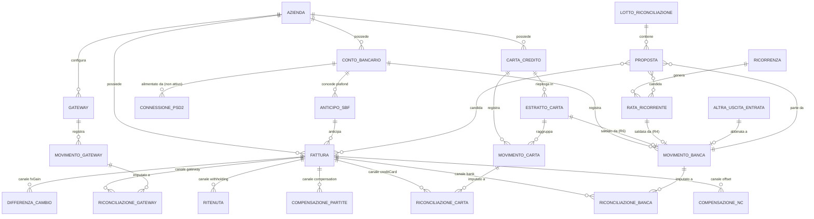
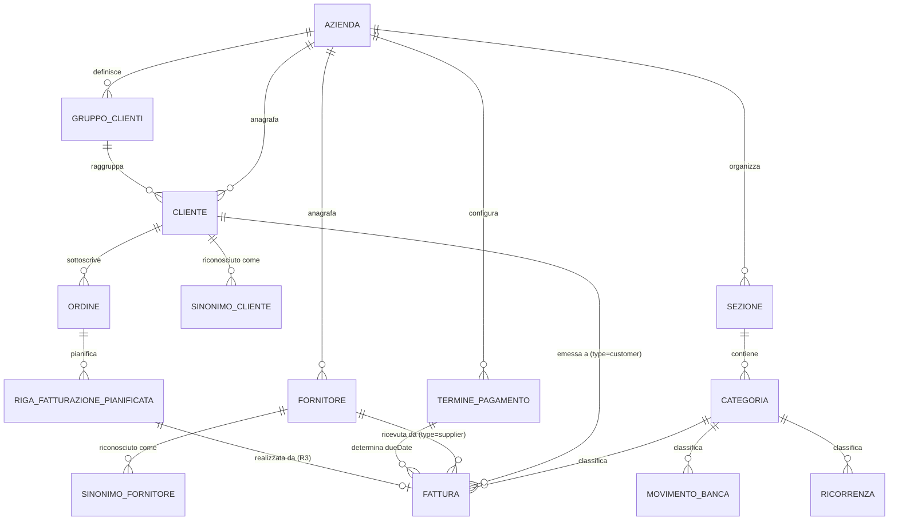
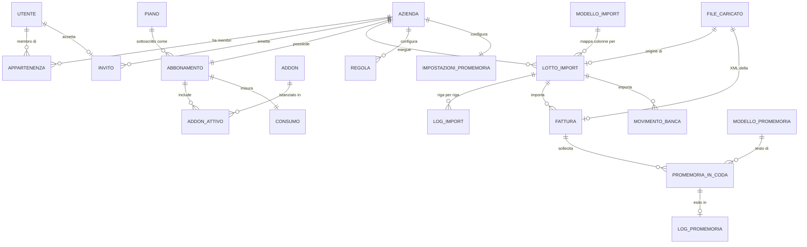

# Cash King — Modello dati ricostruito

Entità, campi e relazioni del prodotto, inferiti dalle osservazioni raccolte
nelle fasi 1 e 2. Prima stesura: 11 agosto 2026, ambiente sandbox con dataset
dimostrativo, account trial Weiss Srl.

Convenzione dei tag come in `01-inventario-rotte.md`, con un'avvertenza che
vale per l'intero documento: **la maggior parte di ciò che segue è
`[DEDOTTO]`**. Solo due entità — la fattura e il conto bancario — sono state
lette direttamente nella risposta di un'API, e sono le uniche di cui si conosca
l'elenco esatto dei campi. Tutto il resto è ricostruito dai nomi degli endpoint,
dalle etichette dell'interfaccia e dalle relazioni che le schermate rendono
evidenti. Dove di un'entità si conosce solo il nome dell'endpoint, la scheda
dice esattamente questo e non aggiunge campi inventati.

Legenda dei tag applicati al singolo campo:

- `[OSSERVATO]` — il nome del campo compare in una risposta API che ho letto,
  oppure è un'etichetta esplicita dell'interfaccia.
- `[DEDOTTO]` — il campo deve esistere perché una funzionalità osservata non
  potrebbe funzionare senza, ma il suo nome è mio.
- `[IPOTESI]` — congettura plausibile, da validare con un test.

I tipi sono desunti dalla serializzazione osservata. Nota importante sul
formato: gli importi viaggiano come **stringhe decimali** (`"1000.00"`,
`"22.00"`), non come numeri in virgola mobile. È la serializzazione tipica di
una colonna `numeric`/`decimal` esposta da un ORM che evita la perdita di
precisione — scelta corretta per un applicativo contabile e da imitare.

---

## 1. Nucleo: la fattura

### 1.1 Fattura (`invoice`) — l'entità meglio conosciuta

Fonte: risposta integrale di `GET /api/invoices`. Tutti i campi elencati sono
`[OSSERVATO]`; le note fra parentesi sono interpretazioni.

**Identità e appartenenza**

| Campo | Tipo | Note |
|---|---|---|
| `id` | intero | chiave primaria |
| `companyId` | intero | tenant di appartenenza; presente su ogni entità del prodotto |
| `invoiceNumber` | stringa | numero documento (nel dataset di prova `TEST_CK_SCAD_3GG`) |
| `documentType` | enum stringa | distinto da `type`; `[DEDOTTO]` fattura, nota di credito, autofattura |
| `type` | enum stringa | `"customer"` o `"supplier"` — attiva o passiva |

**Controparte**

| Campo | Tipo | Note |
|---|---|---|
| `clientName` | stringa | denormalizzato accanto a `clientId` |
| `supplierName` | stringa | denormalizzato accanto a `supplierId` |
| `clientId` | intero, nullo | valorizzato sulle fatture attive |
| `supplierId` | intero, nullo | valorizzato sulle fatture passive |

`[DEDOTTO]` Due coppie di campi anziché una relazione polimorfa unica verso una
tabella «controparte». La ridondanza del nome accanto all'id è deliberata:
permette di importare una fattura con un nome che non corrisponde ancora a
nessuna anagrafica, e di risolverla dopo (vedi i sinonimi al capitolo 3.3).

**Importi e imposta**

| Campo | Tipo | Note |
|---|---|---|
| `amount` | decimale come stringa | totale lordo (`"1220.00"`) |
| `netAmount` | decimale come stringa | imponibile (`"1000.00"`) |
| `vatPercentage` | decimale come stringa | aliquota (`"22.00"`) |
| `vatAmount` | decimale come stringa | imposta (`"220.00"`) |

`[OSSERVATO]` Le quattro grandezze sono **memorizzate tutte e quattro**, non
ricalcolate a ogni lettura. `[DEDOTTO]` È la scelta giusta per un documento
fiscale, che deve restare identico a com'è stato emesso anche se un giorno la
formula cambiasse; e regge il caso «Aliquote IVA diverse» presente nel modulo di
inserimento, dove `vatPercentage` da sola non basterebbe a ricostruire `vatAmount`.

`[IPOTESI]` Con più aliquote sullo stesso documento deve esistere una tabella
di righe IVA (imponibile e aliquota per riga), oppure `vatPercentage` resta
nullo e `vatAmount` è la somma. Il campo non è stato osservato in questo caso.

**Date e ciclo di vita**

| Campo | Tipo | Note |
|---|---|---|
| `date` | data | emissione |
| `dueDate` | data | scadenza |
| `status` | enum stringa | `"due"` osservato; l'interfaccia offre Da Pagare, Parzialmente Pagato, Pagato, Scaduto, In Attesa |
| `receivedAt` | data-ora, nullo | ricezione (rilevante sulle passive e sull'elettronica) |
| `trashedAt` | data-ora, nullo | soft delete |
| `isManual` | booleano | inserita a mano contro importata |
| `isEdited` | booleano | modificata dopo la creazione |

`[OSSERVATO]` Una fattura creata con `dueDate` nel passato nasce comunque in
stato `due` e non `overdue`: lo stato è **scritto da un processo periodico**
(esiste `/api/invoices/update-overdue`), non calcolato in lettura. Questo rende
`status` un dato che può essere temporaneamente in ritardo sulla realtà, mentre
il cruscotto confronta `dueDate` con oggi e vede lo scaduto subito. Sono due
nozioni di «scaduto» che convivono nel modello.

**Classificazione e collegamenti**

| Campo | Tipo | Note |
|---|---|---|
| `categoryId` | intero, nullo | verso Categoria |
| `bankAccountId` | intero, nullo | conto atteso di incasso/pagamento |
| `paymentTermId` | intero, nullo | verso Termine di pagamento |
| `importBatchId` | intero, nullo | lotto di importazione di provenienza |
| `matchedTransactionId` | intero, nullo | movimento bancario abbinato |
| `description` | testo | |

`[DEDOTTO]` La compresenza di `matchedTransactionId` (uno a uno) e dei sette
canali di riconciliazione (molti a molti, capitolo 5.1) suggerisce una
stratificazione storica: prima un abbinamento singolo, poi un modello a canali.
`[IPOTESI]` `matchedTransactionId` è oggi ridondante o tenuto per compatibilità.
Test: riconciliare parzialmente una fattura con due bonifici e vedere quale dei
due valori si popola.

**Specificità fiscali italiane**

| Campo | Tipo | Note |
|---|---|---|
| `hasWithholding` | booleano | soggetta a ritenuta d'acconto |
| `withholdingRate` | decimale come stringa | aliquota della ritenuta |
| `withholdingBaseAmount` | decimale come stringa | base imponibile della ritenuta |
| `withholdingAmount` | decimale come stringa | ritenuta calcolata |
| `splitPayment` | booleano | scissione dei pagamenti verso la PA |
| `vatDateOverride` | data, nullo | forza il periodo di competenza IVA |
| `crossCountry` | enum stringa | `"local"` osservato; l'interfaccia offre Italia, UE, Extra UE |

**Fattura elettronica**

| Campo | Tipo | Note |
|---|---|---|
| `sdiId` | stringa, nullo | identificativo del Sistema di Interscambio |
| `xmlFilePath` | stringa, nullo | percorso del file XML originale |
| `rowHash` | stringa | impronta della riga, per la deduplica in importazione |

**Stato di saldo — i sette canali**

| Campo | Tipo | Note |
|---|---|---|
| `totalPaid` | decimale come stringa | totale saldato da tutte le fonti |
| `creditNoteOffsetAmount` | decimale come stringa | quota compensata da nota di credito |
| `reconciliationAmounts` | oggetto | sette chiavi: `bank`, `creditCard`, `gateway`, `offset`, `compensation`, `withholding`, `fxGain` |
| `hasLinkedTransactions` | booleano | flag riepilogativo |
| `hasLinkedBankTransactions` | booleano | |
| `hasLinkedCreditCardPayments` | booleano | |
| `hasLinkedGatewayPayments` | booleano | |
| `hasOffsets` | booleano | |
| `hasWithholdings` | booleano | |
| `hasUnsettledWithholdings` | booleano | ritenute non ancora versate |
| `hasFxGains` | booleano | |

`[DEDOTTO]` `reconciliationAmounts` non è una colonna ma un **aggregato
calcolato** su tabelle di collegamento distinte, una per canale; i flag `has*`
sono la sua versione booleana, precalcolata per poter filtrare l'elenco senza
ricalcolare gli importi. Il capitolo 5.1 spiega perché questo cambia il modello.

---

## 2. Conti, movimenti e canali di pagamento

### 2.1 Conto bancario (`bankAccount`)

Fonte: risposta di `GET /api/dashboard/total-balance`. Campi `[OSSERVATO]`.

| Campo | Tipo | Note |
|---|---|---|
| `id` | intero | |
| `name` | stringa | «Conto Corrente Principale» |
| `bankName` | stringa | «Intesa Sanpaolo» |
| `balance` | decimale | saldo contabile |
| `availableBalance` | decimale | saldo più fido di cassa residuo |
| `fidoCassaTotal` | decimale | affidamento di cassa concesso |
| `fidoCassaUsed` | decimale | quota utilizzata |
| `fidoCassaResidual` | decimale | quota residua |
| `sbfLimit` | decimale | plafond salvo buon fine |
| `sbfUsed` | decimale | |
| `sbfResidual` | decimale | |
| `sbfMode` | enum stringa | `"none"` osservato |
| `creditLimit` | decimale | `[VERIFICATO]` coincide con `fidoCassaTotal` su tutti e tre i conti (cap. 11.2). `[DEDOTTO]` è quindi un doppione o un residuo, ma la causa non è dimostrata |
| `accountType` | enum stringa | `"checking"` e `"deposit"` osservati |

`[DEDOTTO]` Devono esistere anche un tasso creditore e un tasso debitore per
conto, perché la Tesoreria mostra «Tasso medio creditore», «Tasso medio
debitore» e una riga «Interessi Stimati» giorno per giorno. I nomi dei campi non
sono osservati e la funzione ha un difetto di scala (113,333 % di tasso medio),
ma i dati di ingresso devono esserci.

### 2.2 Movimento bancario (`transaction`)

Nessuna risposta API letta. I campi sono `[DEDOTTO]` dalle colonne della tabella
di Cash Command — Data, Stato, Descrizione, Controparte, Banca, Categoria,
Impatto Liquidità, Saldo Banca, Saldo Progressivo — e dagli endpoint
`/api/transactions/{server-preview,server-import}` e `/api/transaction-reconciliations`.

| Campo | Tipo | Origine |
|---|---|---|
| `id`, `companyId` | intero | `[DEDOTTO]` per coerenza con la fattura |
| `bankAccountId` | intero | `[DEDOTTO]` colonna «Banca» |
| `date` | data | `[OSSERVATO]` come colonna |
| `description` | testo | `[OSSERVATO]` («Addebito Telecom Italia — Canone mensile») |
| `amount` | decimale con segno | `[OSSERVATO]` come «Impatto Liquidità» |
| `status` | enum | `[OSSERVATO]` cinque valori: Consolidato, Completo, Previsto, Provvisorio, Non riconciliato |
| `categoryId` | intero, nullo | `[OSSERVATO]` come colonna «Categoria» |
| `counterpartyId` | intero, nullo | `[DEDOTTO]` colonna «Controparte», che riporta «Non riconciliato» quando manca |
| `rowHash` | stringa | `[VERIFICATO]` presente, sia qui sia sui movimenti di carta (cap. 11.1) |
| `importBatchId` | intero, nullo | `[DEDOTTO]` |
| ~~`source`~~ | — | `[VERIFICATO]` **smentita**: il campo non esiste; l'origine si ricava da `isManual` e `importBatchId` (cap. 11.2) |

`[DEDOTTO]` I «Saldo Banca» e «Saldo Progressivo» della tabella **non** sono
campi memorizzati: sono somme correnti calcolate nella query, come conferma il
fatto che siano due (per conto e consolidata) sulla stessa riga.

I cinque stati meritano attenzione perché non sono un booleano riconciliato
sì/no: separano il movimento reale non ancora abbinato («Consolidato»), il
movimento abbinato a un documento («Completo»), e la proiezione generata da una
fattura non ancora movimentata («Previsto»). Questo implica che nel modello
**esistono righe di movimento che non corrispondono ad alcun accredito
bancario**, generate dal previsionale.

### 2.3 Carta di credito (`creditCard`)

Endpoint `/settings/credit-cards`, `/credit-card-movements`. Nessun campo
osservato direttamente.

| Campo | Tipo | Origine |
|---|---|---|
| `id`, `companyId` | intero | `[DEDOTTO]` |
| `name` / `label` | stringa | `[DEDOTTO]` |
| `bankAccountId` | intero | `[DEDOTTO]` — deve esistere, perché la regola R6 abbina l'estratto conto della carta all'addebito sul conto |
| `billingCycleDay` / `billingDebitDay` | intero | `[VERIFICATO]` esistono, con questi nomi: giorno di chiusura e giorno di addebito (cap. 11.1) |

### 2.4 Movimento carta (`creditCardMovement`) ed estratto conto (`creditCardStatement`)

`[OSSERVATO]` Esistono come rotte distinte (`/credit-card-movements` e
`/credit-card-statements`) e come endpoint distinti, quindi sono due entità
separate in relazione uno a molti: un estratto conto mensile raccoglie N
movimenti.

`[OSSERVATO]` Esistono due parser diversi per l'acquisizione,
`/api/credit-card-pdf/parse` e `/api/credit-card-pdf/parse-ocr`. `[DEDOTTO]`
L'estratto conto è acquisito da PDF, anche scansionato, quindi l'entità porta
con sé un riferimento al file di origine.

`[DEDOTTO]` Campi minimi dell'estratto: `creditCardId`, periodo, totale,
data di addebito, e un collegamento al movimento bancario che lo salda —
quest'ultimo è esattamente ciò che la regola R6 della riconciliazione crea.

### 2.5 Gateway di pagamento e relativi movimenti

`[OSSERVATO]` Rotta `/settings/payment-gateways` per la configurazione,
`/gateway-movements` e `/online-payments` per i movimenti, e
`/api/payment-gateway-reconciliations` per gli abbinamenti.

`[DEDOTTO]` Tre entità: il gateway configurato (Stripe, PayPal o simili), il
movimento del gateway, e il collegamento fra il movimento e la fattura che
salda. Il canale `gateway` di `reconciliationAmounts` è alimentato da qui.

`[IPOTESI]` La distinzione fra `/gateway-movements` e `/online-payments` è fra
il movimento grezzo del gateway (compresa la commissione trattenuta) e
l'incasso netto riversato sul conto. È il problema classico dei gateway: un
accredito bancario da 970 € corrisponde a 1.000 € di vendite meno 30 € di
commissione, e senza le due entità separate la riconciliazione non chiude.
Non verificabile senza dati di gateway nel dataset.

### 2.6 Connessione bancaria PSD2

`[OSSERVATO]` Endpoint `/api/enable-banking/{aspsps,connect,connections,status}`
e rotta `/psd2-movements`. Il fornitore terzo è Enable Banking.

⚠️ **Aggiornamento dell'11 agosto: l'entità «connessione» non esiste per il
cliente.** La verifica in `01-inventario-rotte.md`, cap. 4.11, ha stabilito che
`status` risponde `{"configured": true}` e il catalogo restituisce **337
istituti**, ma `connections` è vuoto, la pagina dei conti non offre alcun
comando di collegamento e `/psd2-movements` risponde «Accesso riservato — solo
per gli amministratori di sistema». La funzione è costruita ma **non consegnata
ai clienti**.

`[DEDOTTO]` Resta quindi una sola entità osservabile, il **catalogo degli
istituti** (ASPSP), che è dato del fornitore e non dell'azienda. Della
connessione attiva — che per obbligo normativo dovrebbe avere uno stato e una
scadenza del consenso a 90 giorni — non è osservabile alcun campo, perché
nessun cliente può crearne una.

---

## 3. Anagrafiche e classificazione

### 3.1 Cliente (`client`)

`[OSSERVATO]` Un cliente creato automaticamente durante il test ha ricevuto
`id: 1211`, quindi la chiave è un intero su una sequenza condivisa o comunque
già molto avanzata. `[OSSERVATO]` Esistono `/api/clients/merge`,
`/bulk-edit`, `/bulk-delete` e `/update-types`.

| Campo | Tipo | Origine |
|---|---|---|
| `id`, `companyId` | intero | `[OSSERVATO]` l'id; `[DEDOTTO]` il tenant |
| `name` | stringa | `[OSSERVATO]` («TEST_CK_Cliente Prova») |
| `clientGroupId` | intero, nullo | `[DEDOTTO]` dalla scheda «Gruppi Clienti» del cruscotto |
| `type` | enum | `[DEDOTTO]` dall'endpoint `update-types`, che agisce in blocco su un campo di tipo |
| `defaultPaymentTermId` | intero, nullo | `[VERIFICATO]` termine predefinito del cliente, con questo nome (cap. 11.1) |
| `trashedAt` | data-ora, nullo | `[DEDOTTO]` per simmetria con la fattura e con `/api/trashed-synonyms` |

`[DEDOTTO]` L'esistenza di `merge` è un dato di modello, non solo di
interfaccia: implica che l'applicazione sappia riassegnare tutte le fatture,
i movimenti e i sinonimi da un'anagrafica all'altra e poi eliminare la
superflua. È l'ammissione che i duplicati si creano — inevitabile quando le
controparti nascono dall'importazione.

`[OSSERVATO]` Un cliente inesistente viene **creato automaticamente**
inserendo una fattura con un nome nuovo (è così che è nato l'id 1211).

### 3.2 Fornitore (`supplier`)

`[DEDOTTO]` Entità speculare al cliente, con la propria tabella e i propri
sinonimi (`/api/supplier-synonyms`). Il prodotto non le unifica in una singola
«controparte»: lo dimostrano sia i due campi separati sulla fattura
(`clientId` e `supplierId`) sia i due endpoint di sinonimi distinti.

### 3.3 Sinonimo di controparte (`clientSynonym`, `supplierSynonym`)

`[OSSERVATO]` Rotta `/synonyms`, endpoint `/api/client-synonyms`,
`/api/supplier-synonyms`, `/api/trashed-synonyms`.

| Campo | Tipo | Origine |
|---|---|---|
| `id`, `companyId` | intero | `[DEDOTTO]` |
| `clientId` o `supplierId` | intero | `[DEDOTTO]` la controparte canonica |
| `synonym` | stringa | `[DEDOTTO]` la forma alternativa da riconoscere |
| `trashedAt` | data-ora, nullo | `[OSSERVATO]` indirettamente, dall'endpoint `trashed-synonyms` |

`[DEDOTTO]` Serve a riconoscere che «GREEN ENERGY COOP SOC COOP» nella causale
di un bonifico e «Green Energy Coop» in anagrafica sono lo stesso soggetto. È
l'entità che rende possibile la motivazione «Controparte probabile» vista nella
riconciliazione assistita, e va letta come **memoria persistente delle
decisioni dell'utente**, non come semplice tabella di alias.

### 3.4 Gruppo clienti (`clientGroup`)

`[OSSERVATO]` Rotta `/client-groups` e scheda «Gruppi Clienti» fra le
classifiche del cruscotto. `[DEDOTTO]` Un'entità con nome e appartenenza
all'azienda, in relazione uno a molti con i clienti, usata per aggregare i
ricavi per gruppo. Nessun campo osservato oltre al nome implicito.

### 3.5 Categoria (`category`) e Sezione (`section`)

`[OSSERVATO]` Rotta `/categories`, endpoint `/api/categories/reorder`,
`/api/categories/totals`, `/api/sections`, `/api/sections/reorder`.

| Campo | Tipo | Origine |
|---|---|---|
| `id`, `companyId` | intero | `[DEDOTTO]` |
| `name` | stringa | `[OSSERVATO]` come etichetta («Utenze», «Telefonia e Internet») |
| `sectionId` | intero | `[DEDOTTO]` dalla coesistenza di categorie e sezioni |
| `sortOrder` | intero | `[OSSERVATO]` indirettamente: esiste `reorder` su entrambe |
| `type` | enum | `[VERIFICATO]` la direzione esiste ed è il campo `type`, insieme a `sectionId`, `color`, `sortOrder` (cap. 11.1) |

`[DEDOTTO]` La gerarchia è a due livelli fissi — sezione contiene categorie —
non un albero ricorsivo: se lo fosse, ci sarebbe un solo endpoint con un
`parentId`. Entrambi i livelli sono **ordinabili a mano dall'utente**, il che
implica una colonna di ordinamento persistita e non un semplice ordine
alfabetico.

`[OSSERVATO]` `/api/categories/totals` è un endpoint separato: i totali per
categoria sono calcolati lato server, non aggregati dal client.

---

## 4. Pianificazione, ricorrenze e partite accessorie

### 4.1 Costo e ricavo ricorrente (`recurring`) e le sue rate

`[OSSERVATO]` Rotta `/manual`, etichetta «Entrate/Uscite Ricorrenti». Dalle
proposte di riconciliazione si legge il formato di una rata:

```
RATA RICORRENTE
Telefonia e Internet
Utenze
10/08/2026
180,00
Rata #3 · Uscita ricorrente
```

| Entità | Campi | Origine |
|---|---|---|
| Ricorrenza | `name` («Telefonia e Internet»), `categoryId` («Utenze»), `amount` (180,00), `direction` (entrata/uscita), periodicità e data di inizio | `[OSSERVATO]` i primi quattro come etichette; `[DEDOTTO]` la periodicità |
| Rata | `recurringId`, numero progressivo (`#3`), `dueDate` (10/08/2026), `amount`, stato | `[OSSERVATO]` numero, data e importo |

`[DEDOTTO]` Le rate sono **righe materializzate**, non calcolate al volo: hanno
un numero progressivo stabile, sono candidabili singolarmente
all'abbinamento e conservano l'esito. Ma la materializzazione ha un limite
osservato: il motore propone di abbinare pagamenti di giugno e luglio alla
stessa rata #3 di agosto, il che suggerisce che **le rate passate non esistano
o non siano candidabili**, lasciando in gioco solo quelle future.

### 4.2 Altra uscita / entrata (`otherCost`)

`[OSSERVATO]` Rotta `/other-costs`, endpoint
`/api/bulk-reconciliation/{other-cost,create-other-cost}`.

`[DEDOTTO]` È la voce di spesa o incasso senza fattura: bollo, commissione
bancaria, rimborso. Il dettaglio rivelatore è `create-other-cost` **dentro** la
riconciliazione in blocco: dalla schermata di riconciliazione si può creare al
volo la partita mancante che giustifica un movimento orfano, invece di dover
uscire, crearla e tornare. Campi non osservati; presumibilmente data, importo,
categoria, descrizione e direzione.

### 4.3 Ritenuta d'acconto (`withholding`)

`[OSSERVATO]` Rotta `/withholdings`, stampa `/prints/withholding-f24`, e sulla
fattura i quattro campi `hasWithholding`, `withholdingRate`,
`withholdingBaseAmount`, `withholdingAmount`, più il flag
`hasUnsettledWithholdings`.

`[DEDOTTO]` La ritenuta esiste **due volte** nel modello: come attributo della
fattura (quanto è stato trattenuto) e come entità autonoma con un proprio ciclo
di vita, perché il flag «non ancora regolata» e la stampa dedicata all'F24
implicano uno stato di versamento all'erario che la fattura da sola non può
portare. È anche uno dei sette canali di saldo: la parte trattenuta chiude la
fattura pur non essendo mai transitata in banca.

### 4.4 Anticipo salvo buon fine (`sbfAdvance`)

`[OSSERVATO]` Rotta `/sbf-advances`, e sul conto i campi `sbfLimit`, `sbfUsed`,
`sbfResidual`, `sbfMode`.

`[DEDOTTO]` L'anticipo è un'entità che lega un insieme di fatture attive a un
conto bancario, consumando plafond: è il meccanismo con cui la banca anticipa
l'incasso di crediti non ancora scaduti. Campi minimi dedotti: `bankAccountId`,
data, importo anticipato, e un collegamento alle fatture anticipate. Nessun
campo osservato — nel dataset l'SBF è a zero e `sbfMode` vale `"none"`, quindi
neanche i valori possibili di quell'enum sono noti.

### 4.5 Termine di pagamento (`paymentTerm`)

`[OSSERVATO]` Rotta `/payment-terms`, endpoint
`/api/payment-terms/seed-standard`, e sulla fattura il campo `paymentTermId`.

`[DEDOTTO]` Entità di configurazione riutilizzabile, con un catalogo
precaricabile in un clic. `[VERIFICATO]` Il catalogo esiste: 8 record con `type`, `days` e `calculationType` (cap. 11.1). Contiene i termini
italiani consueti (30 giorni data fattura, 60 giorni fine mese, 90 giorni, e
simili), il che implica campi per il numero di giorni e per la regola di
arrotondamento a fine mese. Il seeding è un dettaglio piccolo ma di sostanza:
l'anagrafica dei termini è precisamente il tipo di configurazione che nessuno
compila volentieri al primo accesso.

### 4.6 Ordine (`order`) e riga di fatturazione pianificata (`plannedBillingRow`)

`[OSSERVATO]` Rotte `/orders-planning`, `/revenue/orders`,
`/revenue/invoice-calendar`, `/revenue/payment-planning`; endpoint
`/api/orders`, `/api/planned-billing-rows`, `/api/payment-planning/auto-link`.

`[DEDOTTO]` L'ordine acquisito genera N righe di fatturazione pianificata
distribuite nel tempo — è il calendario di fatturazione visibile in
`/revenue/invoice-calendar`. Quando la fattura vera viene emessa, la regola R3
della riconciliazione («Prevista ↔ Fattura») abbina la riga pianificata al
documento reale, e `auto-link` fa la stessa cosa in blocco.

Questo è il punto in cui il modello si distingue da un semplice registro di
fatture: **il fatturato futuro esiste come dato prima di essere fatturato**, e
alimenta il previsionale. Campi non osservati; per l'ordine servono almeno
cliente, importo totale, data e stato, e per la riga pianificata l'ordine di
appartenenza, la data prevista, l'importo e la fattura reale abbinata.

---

## 5. Riconciliazione

### 5.1 Lotto di analisi (`reconciliationBatch`) e proposta (`proposal`)

`[OSSERVATO]` Endpoint `/api/assisted-reconciliation/batches`. Lo storico mostra
una riga per esecuzione:

```
11/08 00:22 · 01/05/26 - 31/08/26 · 0 approvati · 0 saltati · / 10 · 0%
```

**Lotto** — campi `[DEDOTTO]` dalla riga di storico: data-ora di esecuzione,
data di inizio e di fine del periodo analizzato, numero di proposte generate,
numero di approvate, numero di saltate, percentuale di completamento.
L'esistenza stessa del lotto è `[OSSERVATO]`: un'esecuzione è persistita e
riprendibile, non un calcolo effimero.

**Proposta** — campi `[DEDOTTO]` dalla scheda mostrata:

| Campo | Origine |
|---|---|
| `batchId` | `[DEDOTTO]` |
| regola applicata (R1…R6) | `[OSSERVATO]` le sei regole sono dichiarate prima dell'esecuzione |
| oggetto di partenza (movimento banca, movimento carta, estratto) | `[OSSERVATO]` |
| candidato (fattura, rata ricorrente, nota di credito) | `[OSSERVATO]` |
| `score` 0-100 | `[OSSERVATO]` valori 66, 67, 72, 77 |
| `reasons` — elenco di motivazioni testuali | `[OSSERVATO]`: «Importo identico alla rata», «Controparte probabile», «Nome ricorrente nel testo», «Unico match possibile», «3 alternative» |
| stato: in attesa / approvata / saltata | `[OSSERVATO]` dai contatori |
| candidati alternativi, ciascuno col proprio punteggio | `[OSSERVATO]` |

`[DEDOTTO]` Il fatto che le motivazioni siano più d'una per proposta e che le
alternative abbiano ciascuna il proprio punteggio implica che la proposta non
sia una coppia (a, b, score) ma un piccolo albero: un oggetto di partenza, N
candidati valutati, e per ciascuno una lista di contributi al punteggio. È il
modello che rende la decisione contestabile, ed è la cosa più trasferibile del
prodotto.

### 5.2 Le sette tabelle di collegamento

`[DEDOTTO]` Ai sette canali di `reconciliationAmounts` corrispondono almeno
quattro tabelle di collegamento osservabili per endpoint
(`/api/transaction-reconciliations`, `/api/payment-gateway-reconciliations`,
`/api/credit-card-bulk-reconciliation/*`, più le compensazioni), ciascuna con
fattura, oggetto collegato, importo imputato e data. Il capitolo 9.1 spiega
perché la struttura conta.

---

## 6. Configurazione, importazione e abbonamento

### 6.1 Azienda (`company`) e utente (`user`)

`[OSSERVATO]` Endpoint `/api/auth/me`, `/api/auth/switch-company`,
`/api/company/suspension-status`, `/api/company/{members,invite,invitations,transfer-ownership,usage-statistics}`.

`[OSSERVATO]` Il multi-azienda è la novità principale della v0.26.5: «Ora puoi
appartenere a più aziende con lo stesso account». `[DEDOTTO]` Esiste quindi una
tabella di appartenenza fra utente e azienda, non un `companyId` sull'utente —
altrimenti il cambio azienda non sarebbe possibile. La `transfer-ownership`
implica inoltre che l'appartenenza porti un **ruolo**, e che uno dei ruoli sia
proprietario.

| Entità | Campi | Origine |
|---|---|---|
| Azienda | ragione sociale, dati fiscali, regime IVA | `[DEDOTTO]` da `/settings/company` e dal trattamento delle liquidazioni |
| Azienda | stato di sospensione | `[OSSERVATO]` da `/api/company/suspension-status` |
| Utente | email, password, profilo | `[OSSERVATO]` dai campi di login (`input-email`) |
| Appartenenza | `userId`, `companyId`, ruolo | `[DEDOTTO]` |
| Invito | token, email, azienda, stato | `[OSSERVATO]` dalle rotte `/accetta-invito` e `/invitation/:token` |

`[VERIFICATO]` L'azienda porta il campo `vatPeriod` con valori `monthly` e `quarterly`,
perché il previsionale colloca l'uscita IVA il 16 del mese successivo
all'emissione; con il regime trimestrale la data cambierebbe. Test necessario:
modificare il regime nelle impostazioni azienda e osservare se le uscite IVA
si spostano nel grafico di flusso.

`[OSSERVATO]` Esiste `/api/auth/api-token`, interrogato a ogni caricamento.
`[VERIFICATO]` L'endpoint restituisce effettivamente un token, ma **nessuna delle
cinque schede di `/settings/profile` lo espone** e le parole «API» e «token»
hanno zero occorrenze nei quattro documenti legali (`00`, cap. 10.3).
`[DEDOTTO]` Si tratta quindi di un token interno di sessione e non di una chiave
per accesso programmatico — deduzione, non osservazione diretta.
Vedi `01-inventario-rotte.md`, cap. 1.

### 6.2 Lotto di importazione (`importBatch`), log e modello

`[OSSERVATO]` Endpoint `/api/import-batches`, `/api/import-logs/bulk`,
`/api/import-models`; rotta `/import/history`. Sulla fattura il campo
`importBatchId` conferma la relazione.

| Entità | Campi | Origine |
|---|---|---|
| Lotto | `companyId`, tipo di importazione, file di origine, data, esito, conteggi | `[DEDOTTO]` da `/import/history` |
| Log | `batchId`, riga, esito, messaggio | `[DEDOTTO]` dall'endpoint `bulk`, che suggerisce scritture massive riga per riga |
| Modello | `companyId`, nome, mappatura delle colonne | `[DEDOTTO]` da «modelli di importazione riutilizzabili» |

`[DEDOTTO]` Il modello di importazione è una mappatura salvata fra le colonne
del file della banca e i campi dell'applicazione. È l'entità che rende
l'importazione mensile un'operazione da trenta secondi invece che da dieci
minuti. Non ho elementi per dire quanto sia diffusa altrove, e il confronto con
altri prodotti è materia della sessione di sintesi.

### 6.3 Regola (`rule`)

`[OSSERVATO]` Rotta `/settings/rules`, endpoint `/api/rules`. Nient'altro.

`[VERIFICATO]` La schermata è stata aperta e il modello è noto per intero:
**dieci tipi** di regola, **tredici operatori**, **undici campi** condizionabili
e **undici azioni**, con logica AND/OR, ambito per tipo di documento e priorità
numerica. Il payload di creazione è trascritto in
`02-aree-funzionali/02-05-regole-e-sinonimi.md`, cap. 1b, dove è documentato
anche il fatto che la creazione **fallisce sempre** perché il client omette
`companyId`.

### 6.4 Promemoria (`reminder`), modelli, coda e registro

`[OSSERVATO]` Rotte `/reminders`, `/settings/reminders`,
`/settings/reminder-templates`; endpoint `/api/reminders/settings`,
`/templates`, `/queue`, `/logs`, `/api/reminders/scheduler/{status,trigger}`.

`[OSSERVATO]` L'area è bloccata da un addon a pagamento (2,99 €/mese) che il
nostro account non ha, quindi **nessun campo è stato visto**. Le quattro
entità dedotte dai nomi degli endpoint:

| Entità | Ruolo dedotto |
|---|---|
| Impostazioni promemoria | configurazione per azienda: quando sollecitare, con quale anticipo |
| Modello di messaggio | testo parametrico del sollecito |
| Coda | invii programmati non ancora partiti |
| Registro | invii effettuati, con esito |

`[DEDOTTO]` La presenza sia di una coda sia di un registro, e di uno scheduler
con trigger manuale, indica un invio asincrono con storia — non una mail
spedita al volo dal click dell'utente.

### 6.5 Piano, abbonamento e addon

Fonte: `assets/cashking/api-traces/02-billing-piani-addon.json`. Campi
`[OSSERVATO]`.

**Piano (`plan`)**

| Campo | Tipo | Esempio |
|---|---|---|
| `id` | intero | 2 |
| `code` | stringa | `"micro"` |
| `name` | stringa | «Micro» |
| `description` | stringa | |
| `monthlyPrice`, `annualPrice` | decimale come stringa | `"59.00"`, `"597.00"` |
| `earlyBirdMonthlyPrice`, `earlyBirdAnnualPrice` | decimale come stringa | `"49.00"`, `"497.00"` |
| `movementsLimit`, `accountsLimit`, `usersLimit` | intero, nullo | `null` = illimitato |
| `includesConsultantAccess` | booleano | `false` su tutti e tre i piani |
| `onboardingCalls` | intero | 0 su tutti e tre |
| `prioritySupport` | booleano | `false` su tutti e tre |
| `features` | nullo | predisposto, mai valorizzato |
| `sortOrder` | intero | |
| `isActive` | booleano | |

**Addon (`addon`)**

| Campo | Tipo | Esempio |
|---|---|---|
| `id`, `code`, `name`, `description` | | `"f24_facile"`, «F24 Facile» |
| `monthlyPrice`, `annualPrice` | decimale come stringa | `"19.99"`, `"199.90"` |
| `eligiblePlans` | array di codici piano | `["pmi", "pmi_plus"]` |
| `includedInPlans` | array, nullo | mai valorizzato |
| `isActive` | booleano | |
| `hideIfNoSubscription` | booleano | `true` nasconde del tutto il modulo dal menu |
| `sortOrder` | intero | |

**Abbonamento e consumo**

| Campo | Tipo | Esempio |
|---|---|---|
| `addonConfig` | oggetto per codice addon | `{ "f24_facile": { "hideIfNoSubscription": true } }` |
| `withinLimits` | booleano | `true` |
| `movementsUsed`, `movementsAvg` | intero | 46, 42 |
| `accountsUsed`, `usersUsed` | intero | 3, 1 |
| `addons`, `suspendedAddons` | array | vuoti sul trial |
| `subscriptionStatus` | stringa, nullo | |
| `blockedBySubscription` | booleano | `false` |

`[DEDOTTO]` La compresenza di `movementsUsed` e `movementsAvg` dice che il
limite sui movimenti è misurato sul mese corrente ma monitorato anche come
media, presumibilmente per avvisare prima di bloccare. La presenza di
`suspendedAddons` distinto da `addons` implica uno stato intermedio fra attivo
e assente — l'addon il cui pagamento è fallito ma i cui dati restano.

`[OSSERVATO]` La fatturazione passa da Stripe (`/api/stripe/create-checkout-session`,
`create-portal-session`, `update-subscription`), quindi devono esistere sul
record di abbonamento i riferimenti al cliente e alla sottoscrizione Stripe.
I nomi dei campi non sono osservati.

### 6.6 File caricato (`uploadedFile`)

`[OSSERVATO]` Rotta `/settings/uploaded-files`, e sulla fattura il campo
`xmlFilePath`. `[DEDOTTO]` Esiste un archivio dei file caricati con percorso,
nome originale, tipo e data, referenziato dalle fatture elettroniche e dagli
estratti conto delle carte. Nessun campo osservato direttamente oltre al
percorso sulla fattura.

---

## 7. Moduli non esplorabili

Le due sezioni che seguono sono ricostruite **esclusivamente dai nomi degli
endpoint**. Nessuna schermata è stata aperta, nessuna risposta letta: il modulo
fiscale risponde 403 al nostro account, e il modulo retail — che pure risponde
200 — non è stato usato perché sarebbe stato aggirare un paywall. Le entità qui
elencate sono nomi con un ruolo probabile, non schede di campi.

### 7.1 Modulo fiscale (addon «F24 Facile») `[NON ESPLORABILE]`

| Entità dedotta | Endpoint che la suggerisce |
|---|---|
| Delega F24 | `/api/fiscal/f24`, `/api/fiscal/f24/parse-pdf`, rotte `/fiscal/f24/{new,:id,:id/edit}` |
| Codice tributo | `/fiscal/tax-codes` |
| Debito fiscale | `/fiscal/debts`, `/api/fiscal/debts/parse-pdf` |
| Piano di rateizzazione | `/fiscal/installment-plans`, `/api/fiscal/installment-plans/risk-summary` |
| Rata fiscale | `/api/fiscal/installments/pending-for-cashflow` |
| Calcolo di ravvedimento | `/api/fiscal/ravvedimento/{calculate,eligible,generate-f24}` |
| Tasso di interesse legale | `/api/fiscal/legal-interest-rates` con `refresh` e `refresh-status` |
| Simulazione di leva fiscale | `/api/fiscal/leverage/{summary,simulate-installment-plan,simulate-non-payment}` |
| Regime speciale | `/api/fiscal/special-schemes` |

Due osservazioni di modello che si possono fare anche da fuori. La prima:
`pending-for-cashflow` dice che le rate fiscali **entrano nel previsionale di
cassa** come qualunque altra uscita, quindi il modulo non è un silo separato.
La seconda: `legal-interest-rates` con un endpoint di aggiornamento e uno di
stato dell'aggiornamento è una tabella di dati normativi mantenuta dal
fornitore, non dall'utente — un'entità di sistema, non di tenant.

### 7.2 Modulo retail `[NON ESPLORABILE]`

| Entità dedotta | Endpoint che la suggerisce |
|---|---|
| Chiusura Z / vendita giornaliera | `/api/retail/z-reports`, rotta `/retail/daily-sales` |
| Versamento in banca | `/api/retail/deposits` |
| Operatore di cassa | `/api/retail/operators` |
| Quadratura | `/api/retail/reconciliation/{match,suggestions}` |
| Regolamento / chiusura periodica | `/api/retail/settlements`, `/api/retail/settlements/generate` |
| Modello di previsione vendite | `/api/retail/forecast/models` |
| Correzione manuale della previsione | `/api/retail/forecast/adjustments` |

`[DEDOTTO]` Il ciclo descritto è quello completo del contante in un punto
vendita: si incassa, si chiude la cassa con la Z, si conta, si versa in banca,
e si verifica che il versato corrisponda al venduto. `[IPOTESI]` Il ponte con
la tesoreria è il versamento: la chiusura genera un atteso, il movimento
bancario lo consuma — lo stesso schema fattura → movimento applicato al
contante. Non verificabile senza accesso.

L'addon **non compare nel listino pubblico** (`/api/public/billing/addons`
restituisce solo `f24_facile` e `reminders`), quindi non esiste nemmeno un
modo evidente di acquistarlo.

---

## 8. Diagrammi ER

Tre diagrammi tematici anziché uno solo: un unico grafo con tutte le entità
sarebbe illeggibile. La cardinalità è `[DEDOTTO]` ovunque tranne dove i campi
osservati sulla fattura la impongono.

### 8.1 Nucleo documenti e pagamenti



### 8.2 Anagrafiche, classificazione e pianificazione dei ricavi



### 8.3 Utenti, abbonamento, importazione e automazioni



---

## 9. Scelte di modellazione notevoli

### 9.1 Sette canali di saldo invece di un flag «pagato»

È la decisione strutturale più importante del prodotto, e vale la pena
enunciarla con precisione. Nella maggior parte dei gestionali una fattura ha un
campo `pagata` booleano, oppure — nei migliori — un `totalPaid` e una lista di
pagamenti tutti dello stesso tipo. Qui una fattura può essere chiusa da sette
fonti eterogenee, e ciascuna è tracciata separatamente:

| Canale | Che cosa chiude la fattura |
|---|---|
| `bank` | un bonifico o un addebito sul conto |
| `creditCard` | un movimento di carta di credito |
| `gateway` | un incasso da Stripe, PayPal o simili |
| `offset` | una nota di credito che compensa |
| `compensation` | una partita opposta della stessa controparte (fornitore che è anche cliente) |
| `withholding` | la ritenuta d'acconto trattenuta dal committente |
| `fxGain` | una differenza di cambio |

Quattro di questi sette **non sono denaro che passa dalla banca**. Una fattura
da 1.000 € con 200 € di ritenuta è saldata integralmente quando il cliente
bonifica 800 €: con un modello a un solo canale bancario resterebbe scoperta
di 200 € per sempre, e nessuna riconciliazione automatica la chiuderebbe mai.

La conseguenza sul previsionale è più sottile e più importante: se una fattura
può essere chiusa da fonti che non generano flusso di cassa, allora **lo stato
di saldo e l'impatto sulla liquidità sono due grandezze diverse**, e il modello
deve poterle calcolare separatamente. È esattamente ciò che rende possibile il
riquadro «Saldate fuori sistema» dello scadenzario: le fatture in cui lo stato
è «pagato» ma tutti e sette i canali valgono zero. Quel riquadro è il
complemento a zero di questa struttura, e non sarebbe scrivibile senza.

Il costo è la complessità: sette tabelle di collegamento, un aggregato da
mantenere coerente, sette flag booleani precalcolati per poter filtrare senza
ricalcolare. Il beneficio è che il modello dice la verità sui casi reali
italiani, che sono pieni di ritenute, note di credito e compensazioni.

### 9.2 `rowHash` e la deduplica in importazione

`[OSSERVATO]` La fattura porta un campo `rowHash`.

`[DEDOTTO]` È l'impronta dei campi identificanti della riga importata, e serve
a riconoscere che una riga già vista non va inserita due volte. Il problema che
risolve è banale da descrivere e feroce da subire: l'utente riesporta
l'estratto conto del mese e lo reimporta perché non ricorda se l'aveva già
fatto, e senza deduplica si ritrova ogni movimento doppio, il saldo sbagliato e
nessun modo semplice di capire quali righe eliminare.

`[DEDOTTO]` L'impronta e non una chiave naturale, perché una riga di estratto
conto non ha un identificativo stabile: data, importo e causale insieme sono
l'unica cosa che la individua. `[VERIFICATO]` Il campo `rowHash` esiste
effettivamente sia sui movimenti bancari sia su quelli di carta (vedi §11.1),
dove il problema è più acuto che sulle fatture.

Questa è la voce che consiglierei di copiare per prima: costa una colonna e un
indice unico, e previene la classe di errori più difficile da rimediare a
posteriori.

### 9.3 Soft delete via `trashedAt`

`[OSSERVATO]` La fattura ha `trashedAt`, ed esiste un endpoint
`/api/trashed-synonyms` che elenca i sinonimi cestinati.

`[DEDOTTO]` Il prodotto non cancella: marca la data di cestinamento e filtra.
La scelta è coerente con la natura contabile del dato — una fattura cancellata
davvero è un buco nella numerazione che nessuno può più spiegare — e con
l'esistenza di operazioni in blocco come `/api/clients/bulk-delete`, dove un
errore dell'utente colpisce decine di righe insieme e deve essere reversibile.

Il costo è che ogni query deve ricordarsi la condizione `trashedAt IS NULL`, e
che il dato cestinato continua a occupare spazio e a comparire negli indici
unici. `[IPOTESI]` La deduplica per `rowHash` deve tenerne conto: se una riga
cestinata mantiene il suo hash, reimportarla non è possibile; se lo perde, non
protegge più. Non determinabile dall'esterno.

### 9.4 `sdiId` e `xmlFilePath`: la fattura elettronica come cittadina di prima classe

`[OSSERVATO]` Due campi dedicati sulla fattura: l'identificativo assegnato dal
Sistema di Interscambio e il percorso del file XML originale.

`[DEDOTTO]` Il documento non è ricostruito dall'XML e poi buttato: **l'XML
resta**, ed è recuperabile dalla fattura. In Italia questo non è un vezzo, è
l'unico modo di rispondere a una contestazione, perché il documento fiscalmente
valido è l'XML firmato, non la sua rappresentazione nel gestionale. Il
`sdiId` è inoltre l'unica chiave che permette di riconciliare quanto si ha in
casa con quanto risulta all'Agenzia.

`[DEDOTTO]` La presenza di `/api/invoices/parse-xml-preview` accanto a
`xml-import` completa il quadro: l'XML viene letto, mostrato all'utente per
conferma, e solo dopo scritto. L'anteprima è la sede naturale dove si applicano
i sinonimi delle controparti e le regole di categorizzazione.

### 9.5 `splitPayment` e `vatDateOverride`: due specificità italiane nel modello, non nell'interfaccia

`[OSSERVATO]` Due campi che in un prodotto internazionale non esisterebbero.

**`splitPayment`** — la scissione dei pagamenti verso la pubblica
amministrazione: chi fattura a un ente pubblico incassa il solo imponibile,
perché l'IVA la versa direttamente l'ente. `[DEDOTTO]` Sul previsionale questo
cambia due cose insieme: l'incasso atteso è `netAmount` e non `amount`, e
l'uscita IVA alla liquidazione non c'è. Un modello che tenesse l'informazione
solo come nota testuale sbaglierebbe la previsione del 22 %.

**`vatDateOverride`** — forza il periodo di competenza IVA a una data diversa
da quella del documento. `[DEDOTTO]` Serve nei casi in cui l'esigibilità non
coincide con l'emissione: fatture a cavallo d'anno, differita, IVA per cassa.
Due esperimenti indipendenti hanno verificato che il previsionale colloca
l'uscita IVA alla liquidazione del mese successivo alla competenza (la data
del 16 è `[OSSERVATO]`: due misurazioni indipendenti, la serie IVA isolata nel
grafico e la dichiarazione esplicita del produttore): questo
campo è quindi la leva che sposta un'uscita da un mese all'altro nella
previsione di cassa.

`[DEDOTTO]` Insieme, i due campi dicono che l'IVA nel modello **non è un
attributo dell'importo ma un flusso con una data propria**. È la stessa cosa
che si vede nel grafico del cruscotto, dove «IVA» è una serie separata accanto
a entrate e uscite.

### 9.6 Fido di cassa e SBF: due leve distinte sul conto

`[OSSERVATO]` Il conto porta due terne parallele: `fidoCassaTotal` / `Used` /
`Residual` e `sbfLimit` / `Used` / `Residual`, più un `sbfMode` e un
`creditLimit` separato.

`[DEDOTTO]` Non sono due nomi per la stessa cosa. Il **fido di cassa** è lo
scoperto concesso sul conto: si può andare sotto zero fino a quella soglia, e
per questo confluisce nel «saldo disponibile» — è denaro spendibile oggi.
L'**anticipo salvo buon fine** è invece un plafond su cui la banca anticipa
l'incasso di crediti non ancora scaduti: non è liquidità disponibile finché non
si presentano le fatture da anticipare, e infatti **non entra** nel saldo
disponibile del prodotto.

`[VERIFICATO]` La formula `saldo disponibile = saldo contabile + fidi di cassa
residui` torna su tre proiezioni diverse (oggi, fine mese, 90 giorni) usando
solo i 70.000 € di fido di cassa, con l'SBF a zero. Ma il sottotitolo di Cash
Command recita «Saldo + fido residuo + SBF», il che lascia aperta la
possibilità che l'SBF entri quando è valorizzato. `[IPOTESI]` Con `sbfMode`
diverso da `"none"` il comportamento cambia. Non verificabile sul dataset.

La distinzione è la ragione per cui esiste `sbfMode`: `[IPOTESI]` sono modalità
di gestione dell'anticipo (per singola fattura, per portafoglio, per plafond
rotativo), che in Italia hanno trattamenti contabili diversi.

### 9.7 Due modi di essere scaduto

`[OSSERVATO]` Il campo `status` vale `due` anche su una fattura con `dueDate`
di due giorni fa, mentre il cruscotto la conteggia subito nello scaduto.
Esiste `/api/invoices/update-overdue`.

`[DEDOTTO]` Il modello tiene lo stato di scaduto come **dato scritto**,
aggiornato da un processo periodico, e non come predicato calcolato in lettura.
La ragione plausibile è la performance su liste lunghe e la possibilità di
filtrare per stato con un indice; il prezzo è una finestra di incoerenza fra
il filtro «Solo Scaduti» della lista e il totale del cruscotto.

È una scelta di modellazione a tutti gli effetti, non un difetto di
implementazione, e vale la pena registrarla come tale: chi copiasse il modello
erediterebbe anche l'incoerenza.

### 9.8 Nomi denormalizzati accanto agli identificativi

`[OSSERVATO]` `clientName` accanto a `clientId`, `supplierName` accanto a
`supplierId`.

`[DEDOTTO]` Serve a due cose distinte. La prima è pratica: importare una
fattura il cui nome controparte non corrisponde ad alcuna anagrafica, senza
bloccare l'importazione. La seconda è storica: il nome scritto sul documento
resta quello, anche se poi l'anagrafica viene rinominata o fusa con un'altra
via `/api/clients/merge`. In un archivio contabile è la scelta corretta, ed è
il motivo per cui l'operazione di fusione non distrugge informazione.

---

## 10. Incertezze e test necessari

> ⚠️ **Questo capitolo è stato scritto prima degli esperimenti dell'11 agosto e
> sopravvaluta ciò che non sappiamo.** Sei delle dodici voci sono state chiuse
> altrove e vanno lette come **già risolte**, non come lavoro da fare:
>
> | Voce | Dove è chiusa |
> |---|---|
> | 10.1 Struttura delle sette riconciliazioni | `04-logiche-di-calcolo.md`, cap. 10 — l'esperimento è stato fatto: 800 € di banca più 420 € di nota di credito su una fattura da 1.220 € |
> | 10.3 Regime IVA e data di liquidazione | `04-logiche-di-calcolo.md`, cap. 4 — regime commutato a trimestrale e riportato a mensile |
> | 10.8 Struttura delle regole | `02-aree-funzionali/02-05`, capp. 1 e 1b — dieci tipi, tredici operatori, payload trascritto |
> | 10.10 `rowHash` fuori dalla fattura | §11.1 di questo stesso file — confermato su movimenti bancari e di carta |
> | 10.11 Snapshot storici delle previsioni | `04b`, cap. 5b — ricerca esaustiva: assenti in tesoreria, presenti nel Retail |
> | 10.12 Entità dei moduli non esplorabili | l'estrazione dal bundle è stata fatta, ed è la base di `02-04` e di `06-guida-interna-estratta.md` |
>
> Restano effettivamente aperte solo le voci **10.2** (aliquote multiple),
> **10.4** (`sbfMode`), **10.5** (rate ricorrenti passate), **10.6** (movimenti
> «Previsti»), **10.7** (gateway e commissioni) e **10.9** (ruoli multi-azienda —
> parzialmente ridotta: i ruoli sono due, Membro e Amministratore, vedi
> `02-aree-funzionali/02-07`, cap. 2.1).
>
> Il paragrafo «**Test.**» che chiude ciascuna delle sei voci chiuse va quindi
> ignorato: quel test è già stato eseguito.

Quello che segue è l'elenco onesto di ciò che non è determinabile con le
osservazioni raccolte, ciascuna voce con il test che la chiuderebbe.

### 10.1 Struttura interna delle sette riconciliazioni

**Cosa non so.** Se i sette canali siano sette tabelle distinte, una sola
tabella polimorfa con un campo `channel`, o un misto. Né se una singola
riconciliazione possa imputare un importo parziale.

**Test.** Riconciliare parzialmente una fattura da 1.000 € con un bonifico da
800 €, poi compensare i restanti 200 € con una nota di credito, e rileggere
`reconciliationAmounts`: se mostra `bank: 800, offset: 200` il modello è a
importi imputati; se mostra valori interi il collegamento è tutto-o-niente.
Osservare contestualmente `matchedTransactionId` e `totalPaid`.

### 10.2 Fatture a più aliquote IVA

**Cosa non so.** Come sia rappresentata una fattura con imponibili a 22 % e a
10 %, dato che `vatPercentage` è un campo singolo. Se esista una tabella di
righe IVA, o se `vatPercentage` resti nullo.

**Test.** Creare una fattura con la casella «Aliquote IVA diverse» attiva e due
righe, poi rileggerla da `/api/invoices`.

### 10.3 Regime IVA e data della liquidazione

**Cosa non so.** Se la data del 16 sia costante o dipenda da un campo di regime
sull'azienda. Il previsionale colloca l'uscita IVA al 16 del mese successivo
alla competenza — verificato due volte — ma con regime trimestrale la data
sarebbe diversa.

**Test.** Cambiare il regime IVA in `/settings/company` e osservare se le
uscite IVA si spostano nel grafico di flusso e nel saldo a fine mese.

### 10.4 `sbfMode` e comportamento dell'SBF

**Cosa non so.** Quali valori assuma `sbfMode` oltre a `"none"`, e se l'SBF
entri nel saldo disponibile quando è valorizzato — il sottotitolo di Cash
Command dice di sì, l'aritmetica verificata dice di no perché l'SBF è a zero.

**Test.** Impostare un plafond SBF su un conto in `/settings/bank-accounts` e
rileggere `availableBalance` e i quattro indicatori di testata.

### 10.5 Rate ricorrenti passate

**Cosa non so.** Se le rate già trascorse siano materializzate e semplicemente
escluse dai candidati, o se non vengano generate affatto. Il sintomo osservato
è che due bonifici di mesi diversi vengono proposti entrambi per la rata #3 di
agosto.

**Test.** Approvare l'abbinamento del bonifico di luglio alla rata #3 e
verificare se la rata sparisce dai candidati del bonifico di giugno. Se
sparisce, le rate passate non esistono; se resta, il vincolo di unicità manca.

### 10.6 Movimenti «Previsti»: righe vere o proiezioni?

**Cosa non so.** Se lo stato «Previsto» della tabella di Cash Command
corrisponda a righe scritte nella tabella dei movimenti o a una proiezione
calcolata in lettura dalle fatture aperte.

**Test.** Contare i movimenti restituiti dall'endpoint con e senza il filtro
«Previsto», e confrontare con il conteggio delle fatture aperte nel periodo.
Oppure creare una fattura futura e vedere se il conteggio dei movimenti sale.

### 10.7 Il modello del gateway e le commissioni

**Cosa non so.** Se `/gateway-movements` e `/online-payments` siano due entità
distinte (movimento lordo e riversamento netto) o due viste sulla stessa. È la
differenza fra poter riconciliare un accredito Stripe al netto delle
commissioni e non poterlo fare.

**Test.** Configurare un gateway fittizio in `/settings/payment-gateways` e
osservare quali entità compaiono nelle due rotte. Nel dataset dimostrativo non
c'è alcun dato di gateway.

### 10.8 Struttura delle regole

**Cosa non so.** Praticamente tutto: di `/api/rules` conosco il nome e nulla
più. Non so se le regole abbiano condizioni multiple, se agiscano solo sulla
categoria o anche sulla controparte, se si applichino all'importazione o a
posteriori, né in che ordine.

**Test.** Aprire `/settings/rules`, creare una regola e osservare la richiesta
di creazione. È il test a più alto rapporto fra informazione e sforzo fra
quelli elencati qui, perché l'entità è oggi completamente ignota.

### 10.9 Multi-azienda: ruoli e visibilità

**Cosa non so.** Quali ruoli esistano nell'appartenenza utente-azienda, e se
il modello preveda un ruolo «commercialista» distinto — la comunicazione della
v0.26.5 si rivolge esplicitamente ai commercialisti, ma i piani hanno tutti
`includesConsultantAccess: false`.

**Test.** Aprire `/api/company/members` con l'account corrente e osservare la
forma del record di appartenenza, e il modulo di invito per l'elenco dei ruoli
selezionabili.

### 10.10 Presenza di `rowHash` fuori dalla fattura

**Cosa non so.** Se i movimenti bancari abbiano anch'essi un `rowHash`. È
l'entità in cui la deduplica serve di più, ma non ho letto una risposta di
`/api/transactions`.

**Test.** Leggere una risposta di `/api/transactions` e cercare il campo.
Alternativa più informativa: reimportare due volte lo stesso file di movimenti
e contare le righe.

### 10.11 Snapshot storici delle previsioni

**Cosa non so.** Nulla suggerisce che esistano. Nei 279 endpoint non c'è
traccia di uno storico delle previsioni, cioè del previsto di ieri confrontato
col consuntivo di oggi. `[VERIFICATO]` L'entità non esiste nella tesoreria — ricerca esaustiva in `04b`, cap. 5b — mentre nel Retail esiste una «Varianza Previsione». Per un prodotto di
tesoreria è una lacuna di modello significativa: senza previsioni storicizzate
non è possibile misurare quanto il previsionale sia affidabile.

**Test.** Rileggere gli endpoint del cruscotto a distanza di giorni e verificare
se compaia un riferimento a una data di calcolo o a una versione. È già in
programma nel piano di osservazione longitudinale.

### 10.12 Entità dei moduli non esplorabili

Di fiscale e retail conosco solo i nomi degli endpoint. Nessun campo, nessuna
cardinalità, nessun tipo. Non esiste un test che possa chiudere queste
incertezze **entro i vincoli dell'analisi**: il modulo fiscale risponde 403, e
il retail — pur rispondendo 200 — non va usato perché sarebbe aggirare un
paywall.

L'unica via praticabile è l'estrazione delle stringhe di interfaccia dal bundle
JavaScript, che viene servito integralmente a tutti i clienti e contiene quindi
etichette e nomi dei campi del retail. È una lettura di codice pubblicamente
distribuito, senza chiamare alcuna funzionalità non pagata, e va decisa
esplicitamente prima di procedere.

---

## 11. Verifica dei campi ipotizzati `[VERIFICATO]`

Passata di bonifica dell'11 agosto. Le congetture sui singoli campi sono state
chiuse in blocco leggendo un oggetto rappresentativo per ciascuna entità dagli
endpoint dell'account. Quanto segue sostituisce le corrispondenti `[IPOTESI]`
sparse nei capitoli precedenti.

### 11.1 Congetture confermate

| Ipotesi | Esito |
|---|---|
| Il movimento bancario ha un `rowHash` come la fattura | ✔ confermato: `rowHash` presente su `transactions` **e** su `credit-card-movements` |
| La carta di credito ha giorni di chiusura e addebito | ✔ confermato, con nomi diversi: **`billingCycleDay`** e **`billingDebitDay`** |
| Le categorie hanno una direzione entrata/uscita | ✔ confermato dal campo **`type`**, insieme a `sectionId`, `color`, `sortOrder` |
| Le categorie sono raggruppate in sezioni | ✔ confermato: 7 record in `/api/sections`, con `type`, `description`, `sortOrder` |
| Il cliente porta un termine di pagamento predefinito | ✔ confermato: **`defaultPaymentTermId`** |
| Esiste un catalogo standard di termini di pagamento | ✔ confermato: 8 record con `type`, **`days`** e **`calculationType`** |
| L'azienda porta il regime IVA | ✔ confermato: `vatPeriod`, con valori `monthly` e `quarterly` |
| Esistono regole di categorizzazione configurabili | ✔ confermato: dieci tipi, tredici operatori (vedi `02-aree-funzionali/02-05`) |
| Le differenze di cambio alimentano un canale di saldo | ✔ confermato: `other-costs` ha il flag **`isExchangeRateDifference`** |

### 11.2 Congetture smentite

| Ipotesi | Realtà |
|---|---|
| Il movimento ha un campo `source` (manuale / file / PSD2) | ✘ **non esiste**. L'origine si ricava da due campi separati: `isManual` e `importBatchId` |
| `creditLimit` del conto è un limite distinto dal fido | ✘ nei dati osservati `creditLimit` **coincide** con `fidoCassaTotal` su tutti e tre i conti; è con ogni probabilità un doppione o un residuo |

### 11.3 Campi trovati che non avevo previsto

Sono la parte più utile della passata, perché nessuna congettura li aveva
immaginati.

**Sul movimento bancario:** `inAmount` e `outAmount` separati oltre ad `amount`;
**`causale`** (il campo della causale bancaria italiana); **`history`**, che
suggerisce un versionamento della singola riga; `isF24Delegation` e
`isCbillPagopa` come flag di riconoscimento del tipo di pagamento;
`remainingAmount` accanto a `reconciledAmount`.

**Sulla carta di credito:** un modello dei costi sorprendentemente completo —
`monthlyStatementFee`, `annualRenewalCost`, `annualRenewalMonth`,
`isMonthlyFeeInStatement`, `isAnnualFeeInStatement` — più
**`avgMonthlyCommitment`** con `isManualAvgCommitment` e
`avgCommitmentCalculatedAt`, cioè un impegno medio mensile calcolato dal sistema
ma sovrascrivibile a mano, con la data dell'ultimo calcolo. E `synonyms`
direttamente sulla carta.

**Sul movimento di carta:** `merchant` (che è il campo «Esercente» delle
regole), `postingDate` distinto da `date`, e soprattutto
**`originalAmount` + `originalCurrency` + `eurAmount`**: le spese in valuta sono
modellate a tre campi, il che spiega da dove nasca il canale `fxGain`.

**Sul cliente:** l'anagrafica porta con sé le statistiche già calcolate —
`totalNetAmount`, `invoiceCount`, `currentYearNet`, `prevYearNet`,
`otherYearsNet` — e, dato che chiude un cerchio, **`avgPaymentDays` e
`avgPaymentDaysPure`**: le due misure di DSO sono memorizzate sul cliente, non
ricalcolate a ogni lettura. È la conferma definitiva che «pesato» e «puro»
convivono come coppia in tutto il prodotto.
Ci sono poi `mergedAt` e **`mergedIntoClientId`**: l'unione di due anagrafiche
non cancella la vecchia ma la fa puntare alla nuova, il che preserva i
riferimenti storici. E `reminderEmails`, più un blocco di ricorrenza
(`isRecurring`, `recurringFrequency`, `recurringAvgAmount`,
`recurringInvoiceDay`, `recurringPaymentDay`) che permette di prevedere il
fatturato di un cliente abituale senza un ordine.

### 11.4 Entità vuote nel dataset dimostrativo

`payment-gateways`, `sbf-advances` e `client-synonyms` rispondono con array
vuoti. Di queste tre conosco quindi solo il nome dell'endpoint: i campi restano
ignoti e le relative schede di questo documento restano `[DEDOTTO]`.

`[DEDOTTO]` Che il dataset dimostrativo non popoli gateway di pagamento né
anticipi SBF dice anche qualcosa sulle priorità: sono funzioni presenti nel
modello ma non ritenute necessarie per mostrare il prodotto.

---

## 12. Ipotesi non verificabili dall'esterno

Chiudere un'ipotesi non significa sempre risolverla. Le seguenti **non sono
risolvibili** con l'accesso di cui disponiamo, e vanno lette come limiti
dichiarati dell'analisi, non come lavoro rimasto da fare.

| Ipotesi | Perché non è verificabile |
|---|---|
| Perché il listino pubblico e il sistema di fatturazione divergano | Richiede di sapere quale delle due fonti governa l'addebito reale, cioè completare un acquisto |
| La causa dello scarto di 858,69 € sui crediti | Richiede di decompilare il bundle minificato o di leggere il codice sorgente |
| Lo scarto residuo di 1,1 punti sulla percentuale dei Crediti | Stessa ragione |
| Se la regressione delle regole venga dal multi-azienda della 0.26.5 | Congettura sulla storia del loro codice |
| Se esistano corse concorrenti sull'aggiornamento dello scaduto | Servirebbe un secondo account che operi in contemporanea |
| Se `matchedTransactionId` sia un residuo di compatibilità | Richiede la storia dello schema |
| Se «30 giorni di prova» e «primo mese gratis» siano due promozioni | Richiede di arrivare in fondo al ciclo commerciale |
| I campi delle entità dei moduli fiscale e retail | Il fiscale risponde 403; il retail non va usato perché sarebbe aggirare un paywall |

`[DEDOTTO]` Otto ipotesi sono di questo tipo. Il conteggio complessivo delle
ipotesi aperte è dichiarato in un punto solo, `PIANO-RESIDUO.md`, per evitare
numeri divergenti. Che restino aperte
non è un difetto dell'analisi: è la forma che prende l'onestà quando si osserva
un prodotto dall'esterno.
