# Trezy — Modello dati ricostruito

**Perimetro**: entità, campi, relazioni e architettura delle API, ricostruiti dal traffico di rete
dell'applicazione `appv2.trezy.io` e dalle schermate.
**Data della rilevazione**: 11 agosto 2026. Account reale, piano Premium in prova, ambiente di
produzione.
**Metodo**: cattura dei corpi di risposta durante la navigazione autenticata (10 sessioni, oltre 500
chiamate registrate), più lettura dei dump strutturati dell'interfaccia per i campi che l'API non
espone.

**Legenda**: `[OSSERVATO]` = letto in una risposta API o in una schermata · `[DEDOTTO]` = inferito da
evidenza osservata · `[IPOTESI]` = congettura non verificata · `[DA DOCUMENTAZIONE]` = proveniente
dall'inventario di Fase 0 (bundle JavaScript pubblico), **non** visto nel traffico ·
`[NON POPOLATO]` = struttura esistente, dati assenti nell'account osservato.

**Riservatezza**: tutti gli identificativi, gli IBAN, i nomi di controparte e i numeri di documento
sono sostituiti da segnaposto. Gli aggregati economici sono riportati perché servono a rendere
verificabili i calcoli.

---

## 1. Le tre origini API

`[OSSERVATO]` L'applicazione è una SPA React servita da `appv2.trezy.io` che parla con **tre origini
HTTP distinte**. Non c'è un unico gateway: il browser conosce e chiama direttamente tutti e tre.

| Origine | Prefisso | Che cosa serve |
|---|---|---|
| `auth.trezy.io` | `/api/v2/…` | identità, sessione, organizzazioni, abbonamenti Stripe, entitlement, stato di onboarding |
| `p3001-…-gtw.<id>.prm.sh` | `/api/v2/…` e `/api/…` | dominio applicativo: conti, transazioni, categorie, previsioni, scenari, contabilità stimata, reporting, assistente AI |
| `p8080-…-gtw.<id>.prm.sh` | `/api/…` | servizio documenti/fatture: fatture, organizzazioni (fornitori e clienti), note, job di estrazione |

### Che cosa implica sull'architettura

`[DEDOTTO]` **Sono tre servizi, non tre percorsi.** La numerazione di versione lo conferma: le prime
due origini sono a `v2`, la terza non ha versione affatto (`/api/invoices`, non `/api/v2/invoices`).
Anche i vocabolari divergono: il dominio applicativo usa UUID e `camelCase`, il servizio fatture usa
interi autoincrementali (`invoice_id: 160656`, `organisation_id: 26631`) e `snake_case`. Sono due
squadre o due epoche.

`[OSSERVATO]` **Gli host di gateway espongono la porta nel sottodominio**: `p3001-…` e `p8080-…`
sono il pattern di naming di una piattaforma di anteprima (`prm.sh`), dove `p<porta>` instrada verso
il container che ascolta su quella porta. In produzione questo significa che la topologia interna
dei servizi — 3001 per l'applicativo, 8080 per le fatture — è pubblicata nel nome DNS di ogni
chiamata che il browser effettua.

`[DEDOTTO]` Ne discendono tre conseguenze pratiche:

1. **Non c'è API pubblica né un dominio stabile a cui puntare.** Il nome dell'host contiene
   identificativi opachi generati dalla piattaforma (`p3001-z55710310-zb696d683-gtw.z216d71b1`):
   nulla che un cliente possa mettere in una configurazione. Coerente con quanto rilevato in Fase 0,
   dove `api.trezy.io` esiste ma risponde 404 ovunque.
2. **Il coordinamento fra i servizi è a carico del client.** Il legame documento↔transazione vive a
   cavallo delle origini: l'identificativo di un documento nasce nel servizio 8080 (è l'hash del
   file) e viene interrogato sul servizio 3001. Nessuno dei due può risolvere la relazione da solo.
3. **Il servizio d'identità è separato dai dati.** `auth.trezy.io` non conosce transazioni; il
   gateway applicativo non conosce abbonamenti. L'unico ponte è l'`accountId` che compare come
   colonna in quasi tutte le entità.

`[OSSERVATO]` L'autenticazione è JWT: `POST auth.trezy.io/api/v2/auth/login` restituisce
`accessToken` + `refreshToken` con `expiresIn: 21600` (6 ore). Il token viaggia poi su tutte e tre
le origini.

---

## 2. Inventario degli endpoint osservati

Solo endpoint effettivamente visti nel traffico. Legenda origini: **A** = `auth.trezy.io`,
**G3** = gateway 3001, **G8** = gateway 8080.

### 2.1 Identità, organizzazione, abbonamento

| Or. | Metodo e percorso | Scopo | Campi principali della risposta |
|---|---|---|---|
| A | `POST /api/v2/auth/login` | autenticazione | `user{id,name,email,language,super_admin,accounts[],role}`, `currentAccount{…}`, `accessToken`, `refreshToken`, `expiresIn` |
| A | `GET /api/v2/auth/validate-session` | rinnovo/verifica sessione | `valid`, `user`, `currentAccount` |
| A | `GET /api/v2/accounts/{accountId}/users` | membri dell'organizzazione | `users[]{id,name,email,role}` |
| A | `GET /api/v2/invitations/account/{accountId}` | inviti pendenti | `[]` `[NON POPOLATO]` |
| A | `GET /api/v2/users/{userId}/onboarding` | avanzamento tutorial | `onboarding_cashflow`, `onboarding_transactions`, `onboarding_categories` (booleani) |
| A | `GET /api/v2/accounts/{accountId}/entitlements` | interruttori funzionali | `planType`, `country`, `entitlements{cashBooster,invoicing,accounting,factoringMarketplace}` |
| A | `GET /api/v2/subscriptions/plans?currency=` | listino | 4 piani con `stripe_price_id`, `stripe_product_id`, `price`, `features{}`, `trial_days` |
| A | `GET /api/v2/subscriptions/accounts/{accountId}/status` | abbonamento corrente | `subscription{…,plan{…}}`, `trialInfo`, `billingInfo`, `nextBilling` |
| A | `GET /api/v2/subscriptions/accounts/{accountId}/history` | storico e cambi programmati | `summary`, `upcomingChanges[]`, `subscriptions{active[],historical[]}` |
| A | `GET /api/v2/subscriptions/accounts/{accountId}/summary` | vista per l'interfaccia | come sopra + `formatted{}`, `recommendations[]`, `actions{canUpgrade,canDowngrade,canCancel,canReactivate}` |

### 2.2 Configurazione dell'account

| Or. | Metodo e percorso | Scopo | Campi principali |
|---|---|---|---|
| G3 | `GET /api/v2/account-settings` | preferenze di calcolo | `requireCategoryValidation`, `validationNotificationFrequency`, `useAccountingForPerformance`, `useAccountingForCashflow`, `sector`, `categorizationMode`, `useDocumentTotals`, `accountingStandardCode` |
| G3 | `GET /api/v2/account-forecast-config` | modalità di previsione | `forecastMode` (`default` \| dettagliato/globale) |
| G3 | `GET /api/v2/balance-thresholds` | soglie di allerta saldo | `[]{bankConnectionId,bankName,accountName,currency,balance,alert}` |
| G3 | `GET /api/v2/custom-account-mapping` | mappatura conti personalizzata | `mappings[]`, `stats{total,confirmed,pending}` — `[NON POPOLATO]` |
| G3 | `GET /api/accounting-mappings` | **catalogo** dei codici categoria | `balanceSheet[]` (14 codici), `profitLoss[]` (185), `all[]` (199) con `accountingType`, `bsCategory`, `defaultVatRate`, `paymentDelayDays`, `subcategoryInheritance` |
| G3 | `GET /api/v2/quickbooks/connections` | integrazione QuickBooks | `[]` `[NON POPOLATO]` |

### 2.3 Conti bancari e transazioni

| Or. | Metodo e percorso | Scopo | Campi principali |
|---|---|---|---|
| G3 | `GET /api/v2/bank-accounts?currency=&grouped=` | elenco conti raggruppati per connessione | `connections[]{id,bankName,connectorName,bankAccounts[],totalBalance,status,unverifiedTransactionsCount}` |
| G3 | `GET /api/v2/transactions?offset=&limit=&selectedBankAccountIds=&categories=&currency=` | lista paginata | `transactions[]` (25 campi, § 3.6), `totalCount`, `totalNeedsConfirmation`, `limit`, `offset` |
| G3 | `GET /api/v2/transactions/verification-stats?selectedBankAccountIds=` | contatori | `total`, `verified`, `unverified`, `hasTransactionsToVerify` |
| G3 | `GET /api/v2/transactions/is_document_link/{documentHash}` | transazione legata a un documento | l'entità Transaction **completa**, con `rawData` PSD2 e `bankConnection` annidata (§ 3.6) |
| G3 | `GET /api/v2/transaction-links/batch?documentIds=` | legami in blocco | `links{ <documentHash>: {count,total_paid,transactions[]} }` |

`[OSSERVATO]` **Nota sul carico.** In una singola sessione di navigazione sono state contate **198
chiamate** a `is_document_link/{hash}`, una per documento visibile, **mentre esisteva già** la
variante in blocco `transaction-links/batch` che risolve gli stessi legami in una chiamata sola. Le
due convivono e vengono usate entrambe nella stessa pagina. `[DEDOTTO]` La versione in blocco è
stata aggiunta dopo, senza rimuovere la precedente.

### 2.4 Categorie e regole

| Or. | Metodo e percorso | Scopo | Campi principali |
|---|---|---|---|
| G3 | `GET /api/v2/categories?used=true\|false` | categorie dell'account | `{inflow[],outflow[]}` — 202 categorie in totale, 37 in uso |
| G3 | `GET /api/v2/categories/accounting-codes/inflow` | codici disponibili in entrata | `[]{code,name}` — 37 voci |
| G3 | `GET /api/v2/categories/accounting-codes/outflow` | codici disponibili in uscita | `[]{code,name}` — 159 voci |
| G3 | `GET /api/v2/categories/category-with-children/{categoryId}?…` | drill-down su una categoria | `transactions[]`, `totalCount`, `breakdown{parent,children[],grandchildren[]}` |
| G3 | `GET /api/v2/categories/category/{categoryId}/summary?…` | totali di una categoria | `totalActual`, `totalRemaining` |
| G3 | `GET /api/v2/categorization-rules` | regole di classificazione | `[]` `[NON POPOLATO]` |

### 2.5 Scenari, previsioni, flusso di cassa

| Or. | Metodo e percorso | Scopo | Campi principali |
|---|---|---|---|
| G3 | `GET /api/v2/scenarios` | scenari | `[]{id,accountId,name,color,systemType,aiMetadata,createdAt,updatedAt}` |
| G3 | `GET /api/v2/forecasts/scenario/{scenarioId}/period?startDate=&endDate=` | previsioni di uno scenario | `[]` `[NON POPOLATO]` |
| G3 | `GET /api/v2/forecasts/reconciliation?scenarioId=&selectedBankAccountIds=` | legami previsione↔transazione | `[]` `[NON POPOLATO]` |
| G3 | `POST /api/v2/cashflow/batch` | serie del flusso di cassa | `data[]` un oggetto per periodo (§ 3.11), `count` |
| G3 | `GET /api/v2/forecast-breakdown?…&scenarioId=&documentForecastMode=&includeInvoices=&useNativeResolutionRemaining=` | scomposizione per categoria del periodo | `inflow{}`/`outflow{}` per `categoryId`, `invoiceEntries[]`, totali |
| G3 | `GET /api/v2/forecast-bridge/configs` | ponte previsione P&L→cassa | `data: []` `[NON POPOLATO]` |
| G3 | `GET /api/v2/fec/pl-forecasts/scenario/{scenarioId}` | previsioni sul conto economico | `[]` `[NON POPOLATO]` |
| G3 | `GET /api/v2/pl-views` | viste di conto economico personalizzate | `[]` `[NON POPOLATO]` |

### 2.6 Contabilità stimata e valutazione

| Or. | Metodo e percorso | Scopo | Campi principali |
|---|---|---|---|
| G3 | `GET /api/v2/estimated-accounting/fiscal-years` | esercizi | `fiscalYears[]{id,startDate,endDate,filename,status,totalEntries,totalAccounts,sourceType,isProvisional}` |
| G3 | `GET /api/v2/estimated-accounting/entries?startDate=&endDate=&limit=&offset=` | **prima nota generata** | `entries[]` (§ 3.14), `totalCount: 3368` |
| G3 | `GET /api/v2/estimated-accounting/pl` | conto economico | struttura a blocchi con `code`, `label`, `labelFr`, `amount`, `accountNumbers[]` |
| G3 | `GET /api/v2/estimated-accounting/pl-hierarchical?periodType=&fiscalYearIds=&scenarioId=` | C/E gerarchico e per periodo | `periods[]`, `categories[]` (albero con formule, § 3.15) |
| G3 | `GET /api/v2/estimated-accounting/pl-periodic` | C/E per periodo | serie temporali per conto |
| G3 | `GET /api/v2/estimated-accounting/balance-sheet` | stato patrimoniale | `assets{fixedAssets,currentAssets,cash,totalAssets}`, `liabilities{equity,…}` |
| G3 | `POST /api/v2/estimated-accounting/balance-sheet-batch` | stato patrimoniale a più date | `results{ <data>: {…} }` |
| G3 | `GET /api/v2/estimated-accounting/cash-flow-statement` | rendiconto finanziario | `operatingActivities`, `investingActivities`, `financingActivities`, `reconciliation{calculatedChange,actualChange,difference,isReconciled}` |
| G3 | `GET /api/v2/estimated-accounting/kpis` | indicatori | `profitability`, `liquidity`, `workingCapital`, `activity`, `solvency`, `rawValues` |
| G3 | `GET /api/v2/estimated-accounting/breakeven` | punto di pareggio | `fixedCosts`, `variableCosts`, `contributionMargin`, `breakEvenPoint`, `marginOfSafety`, `pointMort{days,date}`, `costBreakdown.byClass` |
| G3 | `POST /api/v2/fec/valuation/calculate` | valutazione d'azienda | `result{methods[],weightedAverage,enterpriseValue,equityValue,netDebt,config{…}}`, `sensitivity{tornado[],table{}}` |

### 2.7 Documenti e fatture

| Or. | Metodo e percorso | Scopo | Campi principali |
|---|---|---|---|
| G8 | `GET /api/invoices?offset=&limit=&sortBy=&sortOrder=&targetCurrency=` | fatture + aggregati | `invoices[]` (§ 3.9), `total`, `paid_count`, `late_count`, `incoming_count`, `late_aging{d0_30,d30_60,d60_90,d90_plus}`, e i corrispondenti `*_income`/`*_outcome` |
| G8 | `GET /api/invoices/future-cumulative?include_paid=&targetCurrency=` | curva cumulata delle fatture future | `data_points[]{date,cumulative_amount,daily_invoice_count,daily_amount}`, `summary{average_daily_increase,total_amount,total_invoices}` |
| G8 | `POST /api/notes/batch-counts` | conteggio note per documento | `counts{}` `[NON POPOLATO]` |

### 2.8 Reporting e assistente

| Or. | Metodo e percorso | Scopo | Campi principali |
|---|---|---|---|
| G3 | `GET /api/v2/dashboards/default` | cruscotto di sintesi | `blocks[]{id,type,title{8 lingue},config{},position{x,y,w,h}}`, `settings{theme,gridCols,compactMode}` |
| G3 | `GET /api/v2/reporting-pages` | pagine di report | `[]{id,name,widgets[],decorators[],settings,shareToken}` |
| G3 | `GET /api/v2/reporting-pages/last-viewed` | ultima pagina aperta | idem |
| G3 | `GET /api/v2/ai-chat/conversations` | conversazioni salvate | `[]` `[NON POPOLATO]` |
| G3 | **`POST /api/v2/ai-chat/conversations`** | apre una conversazione | `{id,accountId,userId,title,messages[],language,createdAt,updatedAt}` — **l'unica scrittura osservata** |
| G3 | `GET /api/v2/ai-chat/prefetch?currency=&language=&scenarioId=` | suggerimenti precaricati | `suggestions[]` (3 stringhe, in inglese anche con `language=it`) |

### 2.9 Endpoint noti solo da documentazione

`[DA DOCUMENTAZIONE]` Presenti nell'inventario di Fase 0 (225 percorsi estratti dal bundle
JavaScript) ma **mai osservati** nel traffico di questa rilevazione, quindi non verificati:
`/api/payment-schedules/*`, `/api/v2/accounting/*` (contabilità reale importata da FEC, distinta da
`estimated-accounting`), `/cashbooster`, `/boost/*`, `/api/credit-allocations`, `/recipes`,
`/inventory/sessions`, `/api/products/*`, `/share/report/:token`, `/auth/switch-account`,
`/api/enablebanking/*`, `/api/plaid/link-token`, `/api/plaid/exchange-token`.

Di questi, uno lascia una traccia nel traffico: `paymentScheduleId` compare come campo (sempre
`null`) dentro le transazioni restituite da `transaction-links/batch`. `[DEDOTTO]` L'entità
PaymentSchedule esiste nello schema anche se la funzione non è raggiungibile da questa interfaccia.

---

## 3. Entità e campi

### 3.1 Account (organizzazione) — `[OSSERVATO]`

Fonte: `POST /auth/login`, `GET /auth/validate-session`.

| Campo | Tipo | Note |
|---|---|---|
| `id` | uuid | chiave usata come `accountId` in tutte le altre entità, su tutti e tre i servizi |
| `name` | string | ragione sociale abbreviata |
| `currency` | string | valuta di riferimento (`EUR`) |
| `company_number`, `fiscal_number`, `company_name`, `legal_form`, `company_creation_date`, `domain` | string/null | anagrafica estesa — **tutti `null`** nell'account osservato |
| `registration_country` | string | `IT` |
| `trial_days` | int | 7 |
| `referred_by_code`, `referral_signup_name` | string/null | programma di segnalazione |
| `created_at`, `updated_at` | timestamp | |
| `users` | array | popolato solo in `currentAccount`, vuoto nella risposta di login |

`[OSSERVATO]` L'anagrafica fiscale è tutta vuota pur essendo un'azienda italiana registrata: nessun
campo obbligatorio, nessuna validazione all'onboarding.

### 3.2 User — `[OSSERVATO]`

| Campo | Tipo | Note |
|---|---|---|
| `id` | int | **intero autoincrementale**, non UUID — a differenza di tutto il resto |
| `name`, `email`, `language` | string | `language: 'it'` |
| `super_admin` | bool | ruolo di piattaforma |
| `role` | string | ruolo nell'account: `owner` `[OSSERVATO]` |
| `accounts` | array<Account> | l'utente può appartenere a più organizzazioni |
| `created_at`, `updated_at` | timestamp | |

`[OSSERVATO]` L'interfaccia (Impostazioni › Gestisci organizzazioni) offre tre ruoli:
**Proprietario**, **Utente**, **Assistente**. Solo `owner` è stato osservato nei dati.

### 3.3 UserOnboarding — `[OSSERVATO]`

Tre booleani per utente: `onboarding_cashflow`, `onboarding_transactions`, `onboarding_categories`.
`[DEDOTTO]` Colonne su `users`, non una tabella: la risposta non ha né `id` né `userId`.

### 3.4 Plan, Subscription — `[OSSERVATO]`

**Plan**: `id` (uuid), `name`, `type` (`starter`\|`premium`\|…), `stripe_price_id`,
`stripe_product_id`, `price` (numero nel listino, stringa `'39.00'` dentro la sottoscrizione — **due
tipi per lo stesso campo**), `currency`, `billing_interval`, `features{}`, `trial_days`,
`is_active`, timestamp.

**Subscription**: `id`, `account_id`, `plan_id`, `stripe_subscription_id`, `stripe_customer_id`,
`status` (`trialing` osservato), `current_period_start/end`, `canceled_at`, `trial_start/end`,
`metadata{accountId,planId}`, timestamp, `plan` annidato.

`[OSSERVATO]` `features` nel listino porta un vincolo geografico che sparisce nella sottoscrizione:
nel piano Starter `cashBooster` e `factoringMarketplace` hanno `countries: ['FR']`, mentre l'oggetto
`plan` dentro la sottoscrizione Premium riporta gli stessi flag **senza** il campo `countries`.
`[DEDOTTO]` La restrizione per paese vive sul listino e viene risolta dal servizio entitlement.

### 3.5 Entitlements — `[OSSERVATO]`

`accountId`, `planType`, `country`, `entitlements{ cashBooster{available}, invoicing{available},
accounting{available}, factoringMarketplace{available} }`. Quattro interruttori, tutti `true` sul
piano Premium; `cashBooster` e `factoringMarketplace` non hanno interfaccia raggiungibile.

`[DEDOTTO]` L'oggetto `{available: bool}` invece del booleano nudo suggerisce che il contratto
preveda altri attributi (limiti, quote) non ancora usati.

### 3.6 BankConnection / BankAccount — `[OSSERVATO]`

Qui il nome inganna. L'entità persistita si chiama `bankConnection`, ma **una riga corrisponde a un
conto corrente**, non a una connessione bancaria:

| Campo | Tipo | Note |
|---|---|---|
| `id` | uuid | è l'identificativo che l'interfaccia chiama «conto» (`selectedBankAccountIds`) |
| `accountId` | uuid | organizzazione |
| `source` | string | `enablebanking` |
| `externalAccountId` | uuid | identificativo presso l'aggregatore |
| `bankName`, `connectorName` | string | nome con ultime 4 cifre / nome dell'istituto |
| `accountNumber` | string | **l'IBAN** |
| `accountType` | string | `CACC` (codice ISO 20022 per conto corrente) |
| `currency`, `balance` | string/decimal | il saldo è una stringa qui, un float in `/bank-accounts` |
| `verified`, `status` | bool/string | `active` |
| `rawData` | json | payload grezzo dell'aggregatore (`iban`, `name`, `product`, `account_uid`) |
| `lastSyncAt`, `deletedAt`, `createdAt`, `updatedAt` | timestamp | cancellazione logica |
| `transactionIds` | array<uuid> | **354 elementi** in un solo record |
| `enableBankingSessionId` | uuid | ← **questa** è la connessione vera |
| `userConnectionTokenId`, `plaidItemId`, `quickBooksConnectionId`, `bankId`, `connectionId` | uuid/null | agganci ad altri aggregatori, tutti `null` |
| `metadata` | json/null | |

`[OSSERVATO]` Nell'account rilevato ci sono 3 conti che condividono lo stesso
`enableBankingSessionId`; l'endpoint `/bank-accounts?grouped=true` li restituisce raggruppati sotto
un oggetto `connections[]` il cui `id` **è** quel session id. Dunque il raggruppamento per banca non
è una relazione modellata, è un `GROUP BY` sull'identificativo di sessione dell'aggregatore.

`[OSSERVATO]` `transactionIds` è un array di 354 UUID dentro la riga del conto: la relazione uno-a-molti
è denormalizzata anche dal lato padre. La stessa informazione esiste come `bankConnectionId` sulla
transazione.

`[OSSERVATO]` L'endpoint `/balance-thresholds` usa `bankConnectionId` come chiave e mette l'IBAN in
un campo chiamato `accountName`.

### 3.7 Category — `[OSSERVATO]`

L'entità più densa del modello, perché tiene insieme tre informazioni diverse.

| Campo | Tipo | Note |
|---|---|---|
| `id` | uuid | |
| `category_name` | string | nome mostrato |
| `category_code` | string/null | codice della categoria **di sistema** (es. `REV-0800`); `null` per le categorie create dall'utente |
| `category_type` | enum | `inflow` \| `outflow` |
| `parentCategoryId` | uuid/null | gerarchia; **tutte `null`** nell'account osservato |
| `display_order` | int/null | `[NON POPOLATO]` |
| `forecast_formula` | ?/null | `[NON POPOLATO]` su tutte e 202 le categorie |
| `vat_injection` | bool | `false` ovunque |
| `vat_injection_frequency` | string/null | `[NON POPOLATO]` |
| `children` | object | sempre `{}`, mai popolato in nessuna risposta osservata |
| `enrichment.accounting_code` | string | **codice contabile**, presente anche quando `category_code` è `null` |
| `enrichment.vat_rate` | decimal string | `'0.2000'` (89), `'0.0000'` (107), `'0.1000'` (6) |
| `enrichment.payment_delay_days` | int | termini di pagamento, § 6.3 |

`[OSSERVATO]` **Doppia chiave.** `category_code` identifica la categoria nel catalogo di sistema;
`enrichment.accounting_code` la mappa sul piano dei conti. Le tre categorie create a mano
nell'account osservato hanno `category_code: null` ma un `accounting_code` valido — la categoria è
libera, l'aggancio contabile no.

`[OSSERVATO]` Esiste una categoria di ripiego con nome letterale **`"Category not found"`** e codice
`BNK-000`, che risulta *usata* (compare in `?used=true` e porta importi non nulli in
`forecast-breakdown`). Non è un errore di rendering: è una riga vera nella tabella delle categorie,
con aliquota IVA 20 % e 30 giorni di termini di pagamento. `[DEDOTTO]` È il secchio in cui finisce
ciò che il classificatore non sa collocare, e viene mostrato all'utente con il proprio nome tecnico.

### 3.8 AccountingCodeCatalog — `[OSSERVATO]`

Il catalogo dei codici, servito da `GET /api/accounting-mappings`. Non è per account: è la tassonomia
di prodotto.

| Campo | Tipo | Note |
|---|---|---|
| `code` | string | `REV-0300`, `EQT-0100`, … |
| `name` | string | in inglese |
| `accountingType` | enum | `profit_loss` (185 codici) \| `balance_sheet` (14) |
| `bsCategory` | enum/null | solo per i patrimoniali: `equity`, `current_assets`, `fixed_assets`, `current_liabilities` |
| `category` | enum | solo per gli economici: `revenue`, `external_charges`, `personnel_costs`, `financial`, `exceptional`, `taxes_duties`, `production_consumed`, `depreciation_provisions`, `operating_subsidies`, `other_operating_income`, `other_operating_charges`, `income_tax` |
| `defaultVatRate` | float | 0 (104), 0.2 (89), 0.1 (6) |
| `paymentDelayDays` | int | 0 (134), 30 (42), 45 (16), **−30 (7)** |
| `subcategoryInheritance` | bool | `true` su tutti e 199 |

`[OSSERVATO]` I valori negativi di `paymentDelayDays` (−30) esistono: il modello ammette l'incasso o
il pagamento **anticipato** rispetto alla registrazione, non solo il ritardo.

`[DEDOTTO]` `subcategoryInheritance: true` ovunque significa che una sottocategoria eredita per
default aliquota e termini dal padre. Non è verificabile qui perché nessuna gerarchia è popolata.

### 3.9 Document / Invoice — `[OSSERVATO]`

Servita dal servizio 8080. Vocabolario diverso dal resto (`snake_case`, interi).

| Campo | Tipo | Note |
|---|---|---|
| `invoice_id` | int | autoincrementale |
| `account_id` | uuid | unico ponte con gli altri servizi |
| `document_type` | enum | `invoice` (99) \| `credit_note` (1) |
| `invoice_number` | string | testo libero; in alcuni casi contiene il **tipo documento SDI** (`TD01 Fattura`) invece del numero |
| `invoice_date`, `due_date`, `expected_payment_date` | date/null | `due_date` e `expected_payment_date` sono `null` su gran parte dei documenti |
| `currency` | string | |
| `status` | enum | `COMPLETED` (98) \| `PROCESSING` (2) — stato di **elaborazione**, non di pagamento |
| `enrichment_status` | enum | `COMPLETED` \| `PENDING` |
| `paid`, `forecasted`, `verified` | bool | `verified: false` su tutti e 249 i documenti |
| `payment_status` | enum | `unpaid` \| … |
| `settlement_status` | enum | `open` \| … |
| `subtotal_ht`, `total_tax`, `total_ttc` | decimal | nomi francesi (*hors taxes* / *toutes taxes comprises*) in un'API altrimenti inglese |
| `outstanding_amount`, `credited_amount`, `credit_allocated_amount` | decimal | residuo e note di credito allocate |
| `tax_breakdown` | array | `[{rate,tax_amount,taxable_amount}]` |
| `organisation_id`, `organisation` | int/object | emittente |
| `customer_organisation_id`, `customer_organisation` | int/object | destinatario |
| `organisation_type` | int | `2` su tutti; `organisation_type_override` bool |
| `cost_center_override`, `nature_override`, `analytical_code_override`, `cashflow_category_override` | bool | **quattro flag di forzatura** verso l'analitica e la categoria di cassa |
| `invoice_metadata` | json | § sotto |
| `invoice_lines` | array/null | **sempre `null`** sui 100 documenti osservati |
| `extras`, `shipping_method`, `incoterms` | ?/string | vuoti |
| `job` | object | § 3.10 |
| `created_at`, `updated_at` | timestamp | |

**`invoice_metadata`** `[OSSERVATO]`: `format` (`ocrv2_primary`), `v2_verdict` (`TRUST`),
`amounts_basis` (`HT`), `payment_terms`, `payment_iban`, `payment_bic`, `customer_number`,
`other_references[]{label,value}` (raccoglie i campi SDI, es. «Progressivo invio»),
`direction_detected` / `direction_resolved` (`purchase`), `direction_source` (**`llm`**),
`direction_conflict` (bool), `document_type_evidence` (`ocrv2_model`), `document_type_confidence`,
`referenced_invoice_number`.

`[OSSERVATO]` Il verso del documento (acquisto o vendita) è **dedotto da un modello linguistico**,
con un campo che registra la fonte della decisione, uno che segnala il conflitto e uno che riporta
la risoluzione. È una pipeline di estrazione con tracciamento della provenienza — la parte meglio
modellata dell'intero sistema.

`[OSSERVATO]` I campi aggregati restituiti accanto alla lista (`late_aging` con le quattro fasce
0-30/30-60/60-90/90+, `paid_count`, `late_count`, `incoming_count`, e i relativi importi divisi fra
`income` e `outcome`) sono calcolati dal server: lo scadenzario non è ricostruito dal client.

### 3.10 DocumentJob — `[OSSERVATO]`

| Campo | Tipo | Note |
|---|---|---|
| `job_id` | int | |
| `account_id` | uuid | |
| `file_url` | string | oggetto S3 (`my-invoice-files`, regione `eu-west-1`) |
| `file_hash` | string(32) | **è l'identificativo usato per la riconciliazione** (§ 4.2) |
| `original_filename` | string | |
| `status` | enum | `COMPLETED` |
| `progress`, `error_message` | int/string | |
| `invoice_id` | int | fattura prodotta |
| `source` | enum | `upload` |
| `processing_method` | string | `ocrv2_primary` |
| `direction_conflict` | bool | duplicato del campo omonimo nei metadati |
| `source_upload_id` | uuid | |
| `created_at`, `updated_at` | timestamp | |

### 3.11 Organisation (fornitore / cliente) — `[OSSERVATO]`

Una sola tabella per fornitori e clienti, distinti dal ruolo che assumono nella fattura
(`organisation_id` = emittente, `customer_organisation_id` = destinatario).

Oltre a `organisation_id`, `account_id`, `company_name`, `company_vat_number`,
`override_invoice_type` e i timestamp, la riga porta **una quarantina di campi di arricchimento
aziendale** oggi tutti vuoti: `domain`, `activity`, `company_description`, `long_description`,
`clean_description`, `slogan`, `website_url`, `logo_url`, `icon_url`, `industry`,
`primary_industry`, `secondary_industries`, `naics_code`, `sic_code`, `gics_code`, `year_founded`,
`stock_symbol`, `company_type`, `legal_structure`, `incorporation_country`, `headquarters_location`,
`countries_of_operation`, `number_of_locations`, `email`, `phone`, `address`, `company_address`,
`contact_form_url`, `terms_of_service_url`, `privacy_policy_url`, `cookie_policy_url`,
`gdpr_compliance_statement_url`, `main_products_services`, `target_audience`, `pricing_model`,
`free_trial_offered`, `freemium_model`, `social_media`, `brand_assets`, `brand_colors`,
`brand_fonts`.

`[DEDOTTO]` Lo schema è predisposto per un servizio di arricchimento anagrafico da fonti esterne
(*firmographics*) che nell'account italiano osservato non ha prodotto nulla: l'unico campo
valorizzato oltre al nome è la partita IVA.

`[OSSERVATO]` **Nessuna deduplicazione.** Nell'elenco fornitori compaiono coppie di righe distinte
la cui ragione sociale differisce solo per punteggiatura e spaziatura; ciascuna ha il proprio
conteggio di fatture e il proprio totale. Lo stesso vale sul lato clienti, dove la società osservata
compare in quattro varianti di denominazione. Le anagrafiche nascono dall'estrazione OCR e vengono
inserite così come lette.

`[DEDOTTO]` I campi che l'interfaccia mostra ma l'API di lista non espone —
**VALUTAZIONE** (una lettera più un'etichetta, es. «B / Normale»), **IMPORTO DOVUTO**, **RITARDO
MEDIO**, **ULTIMA ATTIVITÀ**, **CATEGORIA** predefinita di cassa; e sul lato fornitori **DA
PAGARE**, **TEMPO MEDIO DI PAGAMENTO**, **TOTALE ANNO** — sono calcolati da un endpoint dedicato non
intercettato, oppure derivati in aggregazione. Il *rating* è `B / Normale` su tutte e sei le
controparti osservate: `[IPOTESI]` valore di default in assenza di storico di pagamento (il campo
«ritardo medio» è `--` ovunque).

### 3.12 Transaction — `[OSSERVATO]`

Due endpoint restituiscono la stessa entità con proiezioni diverse. Unione dei campi:

| Campo | Tipo | Fonte | Note |
|---|---|---|---|
| `id` | uuid | entrambi | |
| `transactionId` | string | dettaglio | riferimento della banca (`AAAAMMGG-n`) — **non** un UUID |
| `amount` | float / string | lista / dettaglio | segno: positivo in entrata |
| `date` | timestamp | entrambi | |
| `wording` | string | entrambi | descrizione grezza dell'estratto conto |
| `communication` | string | lista | duplicato di `wording` nei casi osservati |
| `counterparty_name`, `counterparty_iban` | string/null | lista | il nome è sempre `null`, l'IBAN spesso valorizzato |
| `bank_name` | string | lista | denormalizzato dal conto |
| `bankConnectionId`, `bankConnection` | uuid/object | dettaglio | il conto, § 3.6, **incluso per intero** con i suoi 354 `transactionIds` |
| `category_id`, `category_code`, `category_name`, `category_type` | | lista | categoria assegnata |
| `parent_category_*`, `grandparent_category_*` | string/null | lista | **due livelli di antenati appiattiti nella riga**, entrambi `null` |
| `categoryId` | uuid | dettaglio | stesso dato, nome diverso |
| `categorySource` | enum | dettaglio | `trezy_api` (52) \| `trezy_manual` (12) \| `null` (8) |
| `categoryValidatedAt` | timestamp/null | entrambi | |
| `categoryValidatedBy` | uuid/null | dettaglio | contiene l'**`accountId`**, non l'id dell'utente (§ 6.6) |
| `is_confirmed` / `verifiedStatus` | bool | lista / dettaglio | **due nomi per lo stesso concetto**, con valori discordanti sui record osservati |
| `isIgnored` | bool | entrambi | esclusione dai calcoli |
| `isSplitParent`, `parentTransactionId` | bool/uuid | entrambi | scissione di una transazione in più righe |
| `has_document`, `has_note` | bool | lista | |
| `transaction_hash` | string(64) | entrambi | **chiave di raggruppamento dei «simili»**, § 4.3 |
| `similarTransactionsCount` | int | lista | conteggio del gruppo |
| `transactionLinks` | array | lista | legami con i documenti |
| `rawData` | json | dettaglio | payload PSD2 integrale, § sotto |
| `analyzedAt`, `createdAt`, `updatedAt` | timestamp | dettaglio | |
| `pennylaneCategoryData`, `pennylaneMatchedInvoiceIds`, `pennylaneUpdatedAt` | json/null | dettaglio | tre colonne dedicate a **un solo partner contabile** |

**`rawData`** `[OSSERVATO]` conserva il messaggio dell'aggregatore in forma originale: `status`
(`BOOK`), `value_date`, `booking_date`, `entry_reference`, `transaction_amount{amount,currency}`,
`credit_debit_indicator` (`DBIT`/`CRDT`), `bank_transaction_code{code,sub_code,description}`,
`remittance_information[]`, `debtor`/`creditor` e i rispettivi `*_account{iban}` e `*_agent`,
`merchant_category_code`, `exchange_rate`, `balance_after_transaction`, e due campi lunghissimi
`debtor_account_additional_identification` / `creditor_account_additional_identification`. Sono i
campi ISO 20022 di Enable Banking, tenuti per intero. `[DEDOTTO]` Scelta corretta: consente di
ricalcolare tutto se cambia la logica di normalizzazione.

### 3.13 TransactionLink (documento ↔ transazione) — `[OSSERVATO]`

Non è mai restituita come entità autonoma, ma la sua forma si legge dalle due proiezioni:

- lato documento (`transaction-links/batch`): per ogni `documentHash` → `{count, total_paid,
  transactions[]{id, amount, date, wording, confirmed, paymentScheduleId, bankConnection{bank_name,
  account_number}}}`
- lato transazione (`/transactions`): `transactionLinks[]`, vuoto nei record osservati

`[DEDOTTO]` La tabella ha almeno `(documentHash, transactionId)` e un importo imputato, perché
`total_paid` è la somma degli importi delle transazioni collegate ed è confrontato con
`outstanding_amount` della fattura. La cardinalità è molti-a-molti: `count` può superare 1 e una
transazione unica può saldare più fatture.

### 3.14 Scenario, Forecast, ForecastReconciliation

**Scenario** `[OSSERVATO]`: `id`, `accountId`, `name` (`'default'` — l'interfaccia lo mostra come
«Scenario Principale»), `color` (`#8B5CF6`), `systemType` (null), `aiMetadata` (null), timestamp.
Un solo scenario nell'account; l'interfaccia offre «Crea nuovo scenario».

`[DEDOTTO]` `systemType` distingue gli scenari generati dal sistema da quelli dell'utente;
`aiMetadata` è predisposto per scenari costruiti dall'assistente.

**Forecast** `[NON POPOLATO]` — `GET /forecasts/scenario/{scenarioId}/period` restituisce `[]`.
Della sua forma si ricava, dai parametri e dalle strutture che la consumano:

| Campo | Provenienza |
|---|---|
| `scenarioId` | il percorso dell'endpoint è annidato sotto lo scenario `[OSSERVATO]` |
| `categoryId` | `forecast-breakdown` indicizza le previsioni per categoria `[OSSERVATO]` |
| periodo (`startDate`/`endDate` o mese) | parametri dell'endpoint `[OSSERVATO]` |
| importo previsto | `forecast` in `forecast-breakdown` `[OSSERVATO]` |
| residuo | `_futureRemaining` in `cashflow/batch` `[OSSERVATO]` |
| stato «pagata» | descritto nell'Academy `[DA DOCUMENTAZIONE]` |

**ForecastReconciliation** `[NON POPOLATO]` — `GET /forecasts/reconciliation?scenarioId=` risponde
`[]`. È il legame previsione↔transazione, trattato in § 4.1.

### 3.15 Cashflow (proiezione per periodo) — `[OSSERVATO]`

Non è una tabella: è il risultato di `POST /cashflow/batch`, un oggetto per periodo.

Campi per periodo: `period{startDate,endDate}`, `currency`, `forecastMode`, `inflow{}` e `outflow{}`
indicizzati per `categoryId`, `totalInflow`, `totalOutflow`, `totalForecastInflow`,
`totalForecastOutflow`, `netInflowWithForecast`, `netOutflowWithForecast`, `vatToReceive`,
`vatToPay`, `vatBalance`, `vatDetails[]`, `totalDocumentPaidInflow/Outflow`,
`totalDocumentComingInflow/Outflow`, `uncategorizedInvoiceForecastInflow/Outflow`.

Ogni voce di categoria: `{id, categoryName, categoryCode, totalAmount, forecast, invoiceForecast,
parentCategoryId, displayOrder, _futureRemaining, _futureAdjusted}`.

`[OSSERVATO]` I due campi con prefisso underscore, `_futureRemaining` e `_futureAdjusted`, sono
variabili di lavoro del motore di calcolo esposte al client. `[DEDOTTO]` Il payload è il dump di una
struttura interna, non un contratto progettato.

**`forecast-breakdown`** aggiunge la parte più informativa del modello previsionale — per ogni
categoria: `forecast` (previsione manuale), `invoiceForecast`, **`futureInvoiceForecast`**,
**`lateInvoiceForecast`**, `picked`, **`pickedSource`**, e `calculation`, una stringa in linguaggio
naturale che spiega il numero (osservata: `"future remaining (aggregated) = 0"`).

`[DEDOTTO]` Il meccanismo è: si calcolano tre candidati (previsione manuale, fatture future, fatture
scadute), se ne sceglie uno in `picked` e si registra in `pickedSource` quale ha vinto. Nell'account
osservato `pickedSource` vale `none` su tutte e 138 le voci, perché non esistono previsioni: la
regola di precedenza fra le tre fonti **non è verificabile** con questi dati.

`invoiceEntries[]` `[OSSERVATO]`: `{date, amount, type, isLate, categoryId, invoiceId,
invoiceNumber, organisationName, organisationType, isInvoice}` — le singole fatture che alimentano
la previsione, con `categoryId` **sempre `null`**.

### 3.16 EstimatedAccountingEntry (prima nota generata) — `[OSSERVATO]`

L'entità più interessante: 3.368 righe generate automaticamente dalle 749 transazioni bancarie.

| Campo | Tipo | Note |
|---|---|---|
| `id` | uuid | |
| `accountId` | uuid | |
| `transactionId` | uuid | la transazione di origine |
| `entryGroupId` | string | `EVT1-{transactionId}` o `EVT2-{transactionId}` |
| `eventType` | enum | `event_1` (movimento di cassa) \| `event_2` (competenza) |
| `entryDate`, `transactionDate` | date | distinte, per lo sfasamento cassa/competenza |
| `journalCode`, `journalLabel` | string | `BQ`/*Journal de banque*, `VE`/*ventes*, `AC`/*achats*, `OD`/*opérations diverses* |
| `accountNumber`, `accountLabel`, `accountClass` | string/int | conti del **Plan Comptable Général francese** |
| `auxiliaryNumber`, `auxiliaryLabel` | string/null | conti di partitario `[NON POPOLATO]` |
| `description` | string | il `wording` della transazione |
| `debit`, `credit` | decimal string | mai entrambi non nulli |
| `letteringCode` | string/null | *lettrage*, la spunta di riconciliazione contabile `[NON POPOLATO]` |
| `categoryCode`, `categoryId` | string/uuid/null | valorizzati solo su `event_2` |
| `vatRate`, `grossAmount`, `netAmount`, `vatAmount` | decimal/null | scomposizione IVA su `event_2` |
| `paymentDelayDays` | int/null | termini applicati |
| `currency`, `createdAt` | | |

`[OSSERVATO]` **Come si genera la doppia scrittura.** Per un incasso di 619,90 € con IVA al 20 %:

| Evento | Giornale | Conto | Dare | Avere |
|---|---|---|---|---|
| `event_1` | BQ | 512100 *Banque* | 619,90 | |
| `event_1` | BQ | 468870 *Produits à recevoir - Divers* | | 619,90 |
| `event_2` | VE | 706000 *Prestations de services* | | 516,58 |
| `event_2` | VE | 468870 *Produits à recevoir - Divers* | 619,90 | |
| `event_2` | VE | 445780 *TVA collectée à régulariser* | | 103,32 |

Il conto 468870 (o 468860 per le uscite) fa da **cerniera fra cassa e competenza**: `event_1`
registra il movimento bancario contro il transitorio, `event_2` gira il transitorio sul ricavo e
sull'IVA. Se i termini di pagamento della categoria fossero diversi da zero, `entryDate` di
`event_2` si staccherebbe da `transactionDate` e i due eventi cadrebbero in periodi diversi. È
esattamente il meccanismo che consente di produrre un conto economico per competenza partendo da
soli movimenti bancari.

`[OSSERVATO]` Verifica di quadratura sui 46 gruppi contenuti nella pagina esaminata: tutti bilanciati
(dare = avere), con l'unica eccezione del gruppo troncato dal limite di paginazione. `[DEDOTTO]` La
paginazione è per riga e non per gruppo: chi legge l'API pagina per pagina riceve scritture spezzate.

`[OSSERVATO]` I trasferimenti fra conti propri usano 580000 *Virements internes* contro il
transitorio, con giornale `OD`.

### 3.17 FiscalYear — `[OSSERVATO]`

`id` (`est-2026-01-01-2026-12-31`, **chiave sintetica costruita dalle date**), `accountId`, `siren`
(identificativo d'impresa **francese**, `null`), `startDate`, `endDate`, `filename` (`"Estimated
from bank transactions"`), `status`, `totalEntries` (3.368), `totalAccounts` (35), `fileHash`,
`sourceType` (`estimated`), `isProvisional`, timestamp.

`[DEDOTTO]` I campi `filename`, `fileHash` e `siren` tradiscono l'origine: l'entità è nata per
rappresentare un **FEC** (il file contabile obbligatorio francese) importato, e viene riusata per
l'esercizio stimato dai movimenti bancari, con valori fittizi nei campi che non si applicano.

### 3.18 PLCategory (albero del conto economico) — `[OSSERVATO]`

Restituito da `pl-hierarchical`. È una tassonomia dichiarativa con calcolo:

| Campo | Tipo | Note |
|---|---|---|
| `code`, `parentCode` | string | albero |
| `label`, `labelFr` | string | bilingue, il francese sempre presente |
| `displayOrder` | int | |
| `isSystem` | bool | distingue le righe di prodotto da quelle dell'utente |
| `isExpense` | bool | segno |
| `isCalculated` | bool | riga derivata |
| `calculationType` | enum | `formula` \| `sum_children` |
| `calculationSources` | array<string> | riferimenti con segno: `['revenue','subsidies','-purchases']` |
| `defaultAccountPrefixes` | array<string> | prefissi di conto (`'70'`) |
| `accounts[]` | array | conti effettivi con `accountNumber`, `accountLabel`, `isCustom` |
| `amounts` | map periodo→importo | `{'2026-05': 39340.07, …}` |
| `forecasts` | map | `{}` `[NON POPOLATO]` |
| `forecastInputLevel` | map periodo→enum | `'none'` su tutti i periodi osservati |
| `cumulative` | map anno→importo | |
| `children[]` | array ricorsivo | |

`[OSSERVATO]` Le 31 categorie radice coprono **sia** il conto economico (`revenue`, `purchases`,
`gross_margin`, `valeur_ajoutee`, `external_services`, `personnel_costs`, `ebitda`,
`operating_result`, `net_result`, …) **sia** lo stato patrimoniale, con prefisso `bs_`
(`bs_equity`, `bs_fixed_assets`, `bs_receivables`, `bs_payables`, `bs_cash`, …). Otto sono
calcolate; le formule osservate:

```
gross_margin     = revenue + subsidies − purchases
valeur_ajoutee   = gross_margin − external_services
ebitda           = valeur_ajoutee − taxes − personnel_costs + other_operating
operating_result = ebitda − depreciation + reversals + transfer_charges
net_result       = operating_result + financial_result + exceptional_result − income_tax
```

`[OSSERVATO]` Le etichette dei saldi intermedi sono i *soldes intermédiaires de gestion* francesi
(`valeur_ajoutee` non è tradotto nemmeno in inglese).

### 3.19 Dashboard e ReportingPage — `[OSSERVATO]`

**Dashboard**: `id`, `accountId`, `name`, `description`, `isDefault`, `blocks[]`,
`settings{theme,gridCols,compactMode}`, `createdBy` (null), timestamp.

**Block**: `id`, `type` (osservato: `activity-evolution`), `title` come **mappa di 8 lingue**
(`de,en,es,fr,hr,it,nl,pl`), `config{metrics[]{id,name,type,color,sourceKey}, dataSource,
periodType, showGrid, showLegend, showValues, showPercentages, showAbsoluteValue, reverseValues}`,
`position{x,y,w,h}` su griglia a 12 colonne.

**ReportingPage**: `id`, `accountId`, `name`, `description`, `widgets[]`, `decorators[]`,
`settings`, **`shareToken`** (null), `createdBy`, timestamp. `[DEDOTTO]` `shareToken` è la chiave
del report pubblico condivisibile (`/share/report/:token` in Fase 0).

`[OSSERVATO]` Nove tipi di widget offerti dall'interfaccia: evoluzione di categoria, confronto fra
due categorie, rapporto A/B, **formula personalizzata `(A + B) / C`**, torta effettiva, torta
previsionale, testo formattato, panoramica conti, grafico di flusso di cassa. `widgets[]` è vuoto:
la forma del singolo widget non è osservabile.

### 3.20 AnalyticalDimension — `[DEDOTTO]`, `[NON POPOLATO]`

L'interfaccia (Impostazioni › Analitico) espone **tre dimensioni parallele**: **Centri di costo
(0)**, **Nature (0)**, **Codici analitici (0)**. La tabella ha colonne `CODICE`, `NOME`,
`DESCRIZIONE`, `AZIONI`. Nessuna riga, nessun endpoint intercettato.

`[OSSERVATO]` Il collegamento con i documenti esiste già nello schema delle fatture: i tre flag
`cost_center_override`, `nature_override`, `analytical_code_override` — uno per dimensione — più
`cashflow_category_override`.

`[DEDOTTO]` Le tre dimensioni sono ortogonali fra loro e ortogonali alla categoria di cassa: un
documento riceve un'imputazione automatica su ciascuna, e il flag `*_override` segnala che
l'utente l'ha corretta a mano.

### 3.21 AiChatConversation — `[OSSERVATO]`

L'apertura del pannello «Chiedi a Trezy» emette `POST /api/v2/ai-chat/conversations` e la risposta
mostra l'entità appena creata:

| Campo | Tipo | Note |
|---|---|---|
| `id` | uuid | |
| `accountId` | uuid | |
| `userId` | **string** | contiene l'intero identificativo dell'utente reso come stringa (`'{userId}'`, con le virgolette) |
| `title` | string/null | `null` alla creazione — `[DEDOTTO]` viene generato dal primo messaggio |
| `messages` | array | **annidato nella conversazione**, non una tabella separata |
| `language` | string | `it` |
| `createdAt`, `updatedAt` | timestamp | |

`[OSSERVATO]` **Non c'è `scenarioId`.** L'endpoint di prefetch lo accetta come parametro
(`/ai-chat/prefetch?currency&language&scenarioId`), ma la conversazione creata non lo conserva:
lo scenario contestualizza i *suggerimenti*, non il thread. Una conversazione avviata guardando uno
scenario non ricorda quale fosse.

`[DEDOTTO]` `messages` annidato implica che la conversazione sia un documento (colonna JSON o
raccolta documentale) e non una coppia di tabelle. Coerente con l'uso — thread brevi, letti sempre
per intero — ma impedisce di interrogare i messaggi indipendentemente.

`[NON VERIFICABILE]` La forma del singolo messaggio: l'array è vuoto alla creazione e la qualità
delle risposte non è stata valutata.

### 3.22 CategorizationRule — `[NON POPOLATO]`

`GET /categorization-rules` → `[]`. Dall'interfaccia e dall'Academy: parole chiave sulla
descrizione, ambito entrata/uscita/entrambe, limitabile a conti specifici, **ordinata per priorità**
per trascinamento. `[DEDOTTO]` La riga ha almeno `accountId`, `keyword`, `categoryId`, `scope`,
`bankConnectionIds[]`, `priority` (intero denso, riordinato a ogni trascinamento).

### 3.23 BalanceThreshold — `[OSSERVATO]`

`bankConnectionId`, `bankName`, `accountName` (l'IBAN), `currency`, `balance`, `alert` (`null`).
Dall'interfaccia il campo `alert` si espande in: abilitazione, soglia in valuta del conto, elenco di
email in copia, oggetto e corpo dell'email personalizzabili.

---

## 4. Relazioni e cardinalità

### 4.1 Previsione ↔ transazione: il legame è per scenario

È il punto più interessante del modello, e la soluzione adottata è quella giusta.

`[OSSERVATO]` Le previsioni **non** sono figlie della categoria né del periodo: sono figlie dello
**scenario**. L'endpoint lo dichiara nel percorso — `/api/v2/forecasts/scenario/{scenarioId}/period`
— e la riconciliazione richiede lo scenario come parametro obbligatorio:
`/api/v2/forecasts/reconciliation?scenarioId=…`.

`[OSSERVATO]` Le transazioni, invece, **non hanno alcun riferimento allo scenario**: né i 25 campi
della lista né i 23 del dettaglio contengono `scenarioId`, e l'endpoint `/transactions` non accetta
quel parametro. La transazione è un fatto bancario, unico e condiviso.

`[DEDOTTO]` Ne segue il modello corretto:

```
Scenario (1) ──< (N) Forecast
Forecast (1) ──< (N) ForecastReconciliation >── (N) ... (1) Transaction
```

Lo scenario **non compare** nella tabella di riconciliazione: ci arriva attraverso la previsione. È
la scelta giusta, perché rende impossibile per costruzione il caso incoerente «legame in uno
scenario, previsione in un altro».

`[DA DOCUMENTAZIONE]` La FAQ interna conferma il comportamento visibile: *«la stessa transazione può
essere legata a previsioni diverse in scenari diversi»*. Con il modello sopra questo si ottiene senza
alcuna colonna aggiuntiva: basta che la transazione compaia in due righe di riconciliazione le cui
previsioni appartengano a scenari distinti.

`[IPOTESI]` L'invariante che serve — *una transazione può essere collegata al più a una previsione
per ciascuno scenario* — **non è esprimibile** con un vincolo di unicità sulla sola tabella di
riconciliazione, perché lo scenario è a un salto di distanza. Richiede o la denormalizzazione dello
`scenarioId` sulla riga di legame (con vincolo `UNIQUE(transactionId, scenarioId)` e un controllo di
coerenza verso la previsione), oppure un indice funzionale. Quale delle due strade abbia scelto Trezy
non è osservabile: la tabella è vuota.

`[OSSERVATO]` La riconciliazione è **parziale e cumulativa**: la formula dichiarata parla di importo
pagato che riduce un residuo, e la previsione passa a «pagata» solo a copertura totale. Quindi la
riga di legame porta un **importo imputato**, non è un semplice riferimento.

`[OSSERVATO]` Un'ulteriore conferma della natura per-scenario arriva dal versante contabile:
`pl-hierarchical` e `fec/pl-forecasts` accettano anch'essi `scenarioId`. Le previsioni di conto
economico sono separate da quelle di cassa (`forecast-bridge/configs` è il ponte fra le due) ma
condividono la stessa dimensione scenario.

### 4.2 Documento ↔ transazione: il legame passa per l'hash del file

`[OSSERVATO]` La chiave con cui l'applicazione interroga i legami **non è** `invoice_id`. È una
stringa esadecimale di 32 caratteri, e quella stringa è `job.file_hash`, l'impronta del file
caricato. Verifica diretta: il valore che compare in `transaction-links/batch?documentIds=…` è
identico al `file_hash` del job di elaborazione della fattura corrispondente.

`[DEDOTTO]` Conseguenze:

- **La riconciliazione è ancorata al file, non al documento contabile.** Se la stessa fattura viene
  caricata due volte con file byte-identici, l'hash coincide e i due caricamenti condividono i
  legami — deduplicazione gratuita. Se invece lo stesso documento arriva in due formati (il PDF e
  l'XML dello SDI), gli hash divergono e nascono due documenti scollegati.
- **È il ponte fra i due servizi.** L'hash nasce nel servizio 8080 e viene consumato dal servizio
  3001, che quindi conserva a sua volta una colonna con quell'hash.

`[OSSERVATO]` Cardinalità **molti-a-molti**: `count` per documento può valere più di 1, e
`total_paid` è la somma degli importi collegati, confrontabile con `outstanding_amount` della
fattura. Nei dati osservati sono stati trovati 72 documenti con almeno una transazione collegata su
396 interrogazioni.

`[OSSERVATO]` Il nome dell'endpoint — `is_document_link` — suggerisce un predicato booleano, ma la
risposta è l'entità Transaction completa (con dentro il conto bancario e i suoi 354 identificativi
di transazione). Quando non c'è legame il corpo è **vuoto**, non `null` né `{}`: il client deve
distinguere il caso dall'assenza di contenuto.

### 4.3 Raggruppamento dei «simili»

`[OSSERVATO]` `transaction_hash` è una stringa di 64 caratteri esadecimali che vale da chiave di
gruppo. Prova diretta sui dati: otto transazioni con **descrizioni testualmente diverse** — stesso
prefisso, cifre finali differenti (riferimenti dell'incasso e data operazione) — e **importi
diversi** condividono lo stesso `transaction_hash` e riportano tutte `similarTransactionsCount: 173`.

`[DEDOTTO]` La normalizzazione rimuove le parti numeriche variabili prima di calcolare l'impronta.
Non è un hash della descrizione: è un hash della descrizione *anonimizzata*. Il gruppo non dipende
da importo, data né conto.

`[OSSERVATO]` Nella pagina esaminata, 30 transazioni ricadono in 15 gruppi distinti; il gruppo più
numeroso ne conta 173 su 749 totali, quasi un quarto del movimentato.

### 4.4 Gerarchia delle categorie e doppio ruolo

`[OSSERVATO]` La gerarchia esiste in **tre punti indipendenti** del modello:

1. `Category.parentCategoryId` — auto-relazione classica;
2. `Category.children` — array annidato nella stessa risposta (sempre `{}`);
3. i campi appiattiti sulla transazione: `parent_category_name`, `parent_category_code`,
   `grandparent_category_name`, `grandparent_category_code`.

`[DEDOTTO]` La profondità è **limitata a tre livelli** (categoria, padre, nonno): oltre non c'è
spazio nelle colonne denormalizzate della transazione, e l'endpoint di drill-down accetta
esattamente `includeChildren` e `includeGrandchildren`. Nell'account osservato tutte e 202 le
categorie sono radici: la gerarchia è disponibile e inutilizzata.

`[OSSERVATO]` **Il doppio ruolo.** La stessa riga Category porta contemporaneamente:

- l'informazione di **cassa** — `category_type` (entrata/uscita) e l'appartenenza a una riga del
  prospetto di flusso;
- l'informazione di **competenza** — `enrichment.accounting_code`, che via il catalogo si risolve in
  `accountingType` (`profit_loss` o `balance_sheet`), `bsCategory` o `category`, `defaultVatRate` e
  `paymentDelayDays`.

`[DEDOTTO]` È da questa doppia natura che discende tutto il resto: la categoria assegnata a una
transazione determina insieme dove finisce nel flusso di cassa, su quale conto del piano dei conti
viene scritta la partita doppia, con quale aliquota si scorpora l'IVA e di quanti giorni si sfasa la
competenza rispetto all'incasso. È **una** decisione dell'utente che alimenta **quattro** motori.

`[OSSERVATO]` La distinzione economico/patrimoniale non sta sulla categoria ma sul catalogo: 14 dei
199 codici sono `balance_sheet` (capitale, trasferimenti interni, prelievi, alcune imposte), 185
sono `profit_loss`. Una transferta fra conti propri è quindi patrimoniale e non tocca il conto
economico — il che è corretto e non scontato.

### 4.5 Quadro sintetico delle cardinalità

| Relazione | Cardinalità | Evidenza |
|---|---|---|
| Account → User | N:N (via ruolo) | `user.accounts[]` e `/accounts/{id}/users` `[OSSERVATO]` |
| Account → Subscription | 1:N (1 attiva) | `subscriptions{active[],historical[]}` `[OSSERVATO]` |
| Account → AccountSettings | 1:1 | riga singola con `accountId` `[OSSERVATO]` |
| Account → AccountForecastConfig | 1:1 | idem `[OSSERVATO]` |
| Account → BankConnection (= conto) | 1:N | 3 conti `[OSSERVATO]` |
| BankConnection → Transaction | 1:N | `bankConnectionId` + `transactionIds[]` `[OSSERVATO]` |
| Transaction → Transaction (scissione) | 1:N | `parentTransactionId`, `isSplitParent` `[OSSERVATO]` |
| Category → Transaction | 1:N | `category_id` `[OSSERVATO]` |
| Category → Category | 1:N, profondità 3 | `parentCategoryId` `[DEDOTTO]` |
| Category → AccountingCode | N:1 | `enrichment.accounting_code` `[OSSERVATO]` |
| Account → Scenario | 1:N | `scenario.accountId` `[OSSERVATO]` |
| Scenario → Forecast | 1:N | percorso `/forecasts/scenario/{id}/…` `[OSSERVATO]` |
| Forecast → Transaction | N:N via ForecastReconciliation | `[DEDOTTO]`, § 4.1 |
| Document → Transaction | N:N via TransactionLink | `count`, `total_paid` `[OSSERVATO]` |
| Document → Organisation | N:1 due volte (emittente, destinatario) | `organisation_id`, `customer_organisation_id` `[OSSERVATO]` |
| Document → DocumentJob | 1:1 | `job.invoice_id` `[OSSERVATO]` |
| Transaction → AccountingEntry | 1:N (2 gruppi, 4-6 righe) | `entryGroupId = EVT{1,2}-{transactionId}` `[OSSERVATO]` |
| FiscalYear → AccountingEntry | 1:N | per intervallo di date `[DEDOTTO]` |
| Account → Dashboard / ReportingPage | 1:N | `accountId` `[OSSERVATO]` |
| Document → AnalyticalDimension | N:1 ×3 | flag `*_override` `[DEDOTTO]` |

---

## 5. Diagramma ER

```mermaid
erDiagram
    ACCOUNT ||--o{ USER_ACCOUNT : "ha membri"
    USER ||--o{ USER_ACCOUNT : "appartiene a"
    ACCOUNT ||--o{ SUBSCRIPTION : "sottoscrive"
    PLAN ||--o{ SUBSCRIPTION : "e' venduto come"
    ACCOUNT ||--|| ENTITLEMENTS : "abilita"
    ACCOUNT ||--|| ACCOUNT_SETTINGS : "configura"
    ACCOUNT ||--|| ACCOUNT_FORECAST_CONFIG : "configura"

    ACCOUNT ||--o{ BANK_CONNECTION : "possiede"
    BANK_CONNECTION ||--o{ TRANSACTION : "origina"
    BANK_CONNECTION ||--o| BALANCE_THRESHOLD : "sorveglia"
    TRANSACTION ||--o{ TRANSACTION : "scinde in"

    ACCOUNT ||--o{ CATEGORY : "definisce"
    CATEGORY ||--o{ CATEGORY : "padre di"
    CATEGORY ||--o{ TRANSACTION : "classifica"
    ACCOUNTING_CODE ||--o{ CATEGORY : "mappa su piano dei conti"
    ACCOUNT ||--o{ CLASSIFICATION_RULE : "ordina per priorita"
    CLASSIFICATION_RULE }o--|| CATEGORY : "assegna"

    ACCOUNT ||--o{ SCENARIO : "contiene"
    SCENARIO ||--o{ FORECAST : "raccoglie"
    CATEGORY ||--o{ FORECAST : "e' prevista in"
    FORECAST ||--o{ FORECAST_RECONCILIATION : "e' coperta da"
    TRANSACTION ||--o{ FORECAST_RECONCILIATION : "copre"

    ACCOUNT ||--o{ DOCUMENT : "archivia"
    DOCUMENT_JOB ||--|| DOCUMENT : "produce"
    ORGANISATION ||--o{ DOCUMENT : "emette"
    ORGANISATION ||--o{ DOCUMENT : "riceve"
    DOCUMENT ||--o{ TRANSACTION_LINK : "e' saldata da"
    TRANSACTION ||--o{ TRANSACTION_LINK : "salda"
    DOCUMENT }o--o| ANALYTICAL_DIMENSION : "imputa su"
    DOCUMENT }o--o| CATEGORY : "imputa a cassa"

    TRANSACTION ||--o{ ACCOUNTING_ENTRY : "genera due eventi"
    FISCAL_YEAR ||--o{ ACCOUNTING_ENTRY : "raccoglie"
    ACCOUNT ||--o{ FISCAL_YEAR : "chiude"
    PL_CATEGORY ||--o{ PL_CATEGORY : "somma i figli"

    ACCOUNT ||--o{ DASHBOARD : "possiede"
    DASHBOARD ||--o{ DASHBOARD_BLOCK : "dispone"
    ACCOUNT ||--o{ REPORTING_PAGE : "possiede"
    REPORTING_PAGE ||--o{ REPORT_WIDGET : "dispone"
    ACCOUNT ||--o{ AI_CHAT_CONVERSATION : "conversa"
    USER ||--o{ AI_CHAT_CONVERSATION : "avvia"

    ACCOUNT {
        uuid id PK
        string name
        string currency
        string registration_country
        string fiscal_number "sempre nullo"
        int trial_days
    }
    USER {
        int id PK "intero, non uuid"
        string name
        string email
        string language
        bool super_admin
    }
    USER_ACCOUNT {
        int user_id FK
        uuid account_id FK
        string role "owner, user, assistant"
    }
    PLAN {
        uuid id PK
        string type "starter, premium"
        decimal price
        string stripe_price_id
        json features
        int trial_days
    }
    SUBSCRIPTION {
        uuid id PK
        uuid account_id FK
        uuid plan_id FK
        string stripe_subscription_id
        string status "trialing"
        date trial_start
        date trial_end
    }
    ENTITLEMENTS {
        uuid account_id FK
        string plan_type
        string country
        bool cash_booster
        bool invoicing
        bool accounting
        bool factoring_marketplace
    }
    ACCOUNT_SETTINGS {
        uuid id PK
        uuid account_id FK
        bool require_category_validation
        string categorization_mode "trezy_ai"
        string accounting_standard_code "IT_CUSTOM"
        string sector
        bool use_document_totals
        bool use_accounting_for_cashflow
        bool use_accounting_for_performance
    }
    ACCOUNT_FORECAST_CONFIG {
        uuid id PK
        uuid account_id FK
        string forecast_mode "default, detailed, global"
    }
    BANK_CONNECTION {
        uuid id PK "in realta un conto"
        uuid account_id FK
        string source "enablebanking"
        string external_account_id
        string bank_name
        string account_number "IBAN"
        string account_type "CACC"
        decimal balance
        json raw_data
        uuid enable_banking_session_id "la connessione vera"
        uuid plaid_item_id
        uuid quickbooks_connection_id
        timestamp last_sync_at
        timestamp deleted_at
    }
    BALANCE_THRESHOLD {
        uuid bank_connection_id FK
        decimal threshold
        bool enabled
        json cc_emails
    }
    TRANSACTION {
        uuid id PK
        uuid bank_connection_id FK
        uuid category_id FK
        uuid parent_transaction_id FK
        string transaction_id "riferimento banca"
        decimal amount
        date date
        string wording
        string counterparty_iban
        string transaction_hash "chiave dei simili"
        json raw_data "ISO 20022"
        string category_source "trezy_api, trezy_manual"
        timestamp category_validated_at
        uuid category_validated_by "contiene account_id"
        bool verified_status
        bool is_ignored
        bool is_split_parent
        json pennylane_category_data
    }
    CATEGORY {
        uuid id PK
        uuid account_id FK
        uuid parent_category_id FK
        string category_name
        string category_code "nullo se creata dall utente"
        string category_type "inflow, outflow"
        string accounting_code FK
        decimal vat_rate
        int payment_delay_days
        bool vat_injection
        string forecast_formula "mai popolato"
        int display_order
    }
    ACCOUNTING_CODE {
        string code PK
        string name
        string accounting_type "profit_loss, balance_sheet"
        string bs_category
        string category
        decimal default_vat_rate
        int payment_delay_days "puo essere negativo"
        bool subcategory_inheritance
    }
    CLASSIFICATION_RULE {
        uuid id PK
        uuid account_id FK
        uuid category_id FK
        string keyword
        string scope "inflow, outflow, both"
        int priority
        json bank_connection_ids
    }
    SCENARIO {
        uuid id PK
        uuid account_id FK
        string name
        string color
        string system_type
        json ai_metadata
    }
    FORECAST {
        uuid id PK
        uuid scenario_id FK
        uuid category_id FK
        date period_start
        date period_end
        decimal amount
        decimal remaining
        bool is_paid
    }
    FORECAST_RECONCILIATION {
        uuid id PK
        uuid forecast_id FK
        uuid transaction_id FK
        decimal allocated_amount
    }
    DOCUMENT {
        int invoice_id PK
        uuid account_id FK
        int organisation_id FK
        int customer_organisation_id FK
        string document_type "invoice, credit_note"
        string invoice_number
        date invoice_date
        date due_date
        date expected_payment_date
        decimal subtotal_ht
        decimal total_tax
        decimal total_ttc
        decimal outstanding_amount
        string payment_status
        string settlement_status
        bool paid
        bool verified
        json invoice_metadata "direzione dedotta da LLM"
        json tax_breakdown
        bool cost_center_override
        bool nature_override
        bool analytical_code_override
        bool cashflow_category_override
    }
    DOCUMENT_JOB {
        int job_id PK
        int invoice_id FK
        string file_hash "chiave di riconciliazione"
        string file_url "S3"
        string source "upload"
        string processing_method "ocrv2_primary"
        string status
    }
    ORGANISATION {
        int organisation_id PK
        uuid account_id FK
        string company_name
        string company_vat_number
        string industry "vuoto"
        string website_url "vuoto"
        json social_media "vuoto"
    }
    TRANSACTION_LINK {
        string document_hash FK
        uuid transaction_id FK
        decimal paid_amount
        uuid payment_schedule_id
    }
    ANALYTICAL_DIMENSION {
        uuid id PK
        uuid account_id FK
        string kind "cost_center, nature, analytical_code"
        string code
        string name
        string description
    }
    ACCOUNTING_ENTRY {
        uuid id PK
        uuid account_id FK
        uuid transaction_id FK
        uuid category_id FK
        string entry_group_id "EVT1 o EVT2 piu transaction_id"
        string event_type "event_1 cassa, event_2 competenza"
        date entry_date
        date transaction_date
        string journal_code "BQ, VE, AC, OD"
        string account_number "PCG francese"
        int account_class
        decimal debit
        decimal credit
        decimal vat_rate
        decimal net_amount
        decimal vat_amount
        int payment_delay_days
        string lettering_code
    }
    FISCAL_YEAR {
        string id PK "est-AAAA-MM-GG-AAAA-MM-GG"
        uuid account_id FK
        date start_date
        date end_date
        string source_type "estimated, fec"
        int total_entries
        int total_accounts
        string siren "campo francese"
    }
    PL_CATEGORY {
        string code PK
        string parent_code FK
        string label
        string label_fr
        bool is_calculated
        string calculation_type "formula, sum_children"
        json calculation_sources
        json default_account_prefixes
        bool is_expense
        bool is_system
    }
    DASHBOARD {
        uuid id PK
        uuid account_id FK
        string name
        bool is_default
        json settings
    }
    DASHBOARD_BLOCK {
        uuid id PK
        uuid dashboard_id FK
        string type
        json title "otto lingue"
        json config
        json position
    }
    REPORTING_PAGE {
        uuid id PK
        uuid account_id FK
        string name
        string share_token
        json settings
    }
    REPORT_WIDGET {
        uuid id PK
        uuid reporting_page_id FK
        string type "nove tipi"
        json config
    }
    AI_CHAT_CONVERSATION {
        uuid id PK
        uuid account_id FK
        string user_id FK "intero come stringa"
        string title "nullo alla creazione"
        json messages "annidati"
        string language
    }
```



Le entità disegnate con campi ipotizzati — `FORECAST`, `FORECAST_RECONCILIATION`,
`CLASSIFICATION_RULE`, `ANALYTICAL_DIMENSION`, `REPORT_WIDGET`, `USER_ACCOUNT` — corrispondono a
tabelle **non popolate** nell'account osservato: la struttura è `[DEDOTTO]`, i nomi di colonna sono
`[IPOTESI]`. Tutte le altre hanno almeno un record osservato in una risposta API.

---

## 6. Osservazioni sul disegno del modello

### 6.1 La previsione ha tre fonti e un campo che sceglie

`[OSSERVATO]` `forecast-breakdown` restituisce per ogni categoria quattro numeri e due metacampi:
`forecast` (immissione manuale), `futureInvoiceForecast` (fatture non ancora scadute),
`lateInvoiceForecast` (fatture scadute e non pagate), più `picked` e `pickedSource`.

`[DEDOTTO]` È una scelta di prodotto forte: invece di **sommare** le tre fonti — che porterebbe al
doppio conteggio della stessa uscita prevista due volte, a mano e via fattura — il sistema ne
**elegge una** e dichiara quale. La stringa `calculation` accanto rende il numero ispezionabile
dall'utente. Poche applicazioni gestionali si prendono la briga di spiegare un aggregato nel payload.

`[NON VERIFICABILE]` La regola di precedenza fra le tre fonti: nell'account osservato non ci sono
previsioni, `pickedSource` vale `none` ovunque e la logica non si attiva.

### 6.2 Le categorie portano insieme cassa e competenza

Già descritto in § 4.4. La conseguenza architetturale è che **il piano dei conti non è
configurabile senza toccare le categorie**: cambiare l'aliquota IVA di una categoria cambia
retroattivamente la scomposizione delle scritture generate, e cambiare i giorni di pagamento sposta
le righe di competenza su un altro periodo. Un'unica leva con quattro effetti a valle è potente e
fragile insieme.

`[OSSERVATO]` La separazione è dichiarata: i termini di pagamento agiscono **solo** su
contabilità e prestazioni, mai sul flusso di cassa. Nel flusso di cassa una spesa cade quando esce
il denaro; nel conto economico cade quando matura. Il conto transitorio 468860/468870 è la cerniera
tecnica che rende possibili entrambe le viste dagli stessi dati.

### 6.3 I valori predefiniti dei termini di pagamento non arrivano alle categorie

`[OSSERVATO]` Il catalogo ne propone di sensati: 45 giorni sui ricavi, 30 su gran parte dei costi,
−30 su sette voci (anticipi). Le 202 categorie dell'account hanno invece `payment_delay_days: 0` su
201 di esse. Il confronto codice per codice mostra che **tutti e 65 i codici con default non nullo
sono stati azzerati** all'istanziazione, mentre le aliquote IVA hanno seguito il catalogo senza
alcuna divergenza.

`[DEDOTTO]` Il motore cassa/competenza esiste, è corretto ed è **inerte**: con ritardo zero ovunque,
`entryDate` coincide sempre con `transactionDate` (verificato su tutte le 100 scritture esaminate) e
il conto economico «per competenza» torna a essere un conto economico per cassa. L'unica categoria
che conserva un ritardo di 30 giorni è quella di ripiego `"Category not found"`.

### 6.4 L'analitica esiste come struttura ed è vuota

`[OSSERVATO]` Tre dimensioni predisposte (centri di costo, nature, codici analitici), tre flag di
forzatura già presenti su ogni fattura, zero righe. `[DEDOTTO]` La funzione è stata modellata a
fondo — l'imputazione automatica con possibilità di correzione manuale è il disegno giusto — ma non
c'è alcun percorso nell'interfaccia che porti l'utente a popolarla durante l'uso normale: la si
trova solo entrando in Impostazioni e aprendo la scheda «Analitico».

### 6.5 Il modello contabile è francese, l'account è italiano

`[OSSERVATO]` L'incoerenza è sistematica e visibile a ogni livello dello schema, non solo
nell'interfaccia:

- `accountingStandardCode: 'IT_CUSTOM'` nelle impostazioni, ma le scritture generate usano i conti
  del Plan Comptable Général (512100 *Banque*, 706000 *Prestations de services*, 445780 *TVA
  collectée à régulariser*) e i giornali `BQ`/`VE`/`AC`/`OD` con etichette in francese;
- `FiscalYear` ha una colonna `siren`, l'identificativo d'impresa francese;
- il conto economico è organizzato sui *soldes intermédiaires de gestion* (`valeur_ajoutee` non è
  tradotto in nessuna lingua);
- gli importi delle fatture si chiamano `subtotal_ht` e `total_ttc`;
- l'aliquota IVA predefinita del catalogo è 20 %, l'ordinaria francese, mentre quella italiana è 22 %.

`[DEDOTTO]` Il piano dei conti selezionabile («Italia — Personalizzato» fra quindici opzioni) non
cambia il motore: cambia una mappatura in cima a un motore che resta francese. Le quindici voci del
selettore sono, per l'Italia come per UK, Irlanda e Paesi Bassi, tutte marcate «Personalizzato» —
cioè non c'è un piano dei conti nazionale, c'è la possibilità di rimappare a mano.

### 6.6 Piccoli scivoloni che rivelano la storia del codice

`[OSSERVATO]` Un elenco di dettagli che, presi insieme, dicono quando ogni pezzo è stato scritto:

- `categoryValidatedBy` contiene l'**`accountId`**, non l'identificativo dell'utente. In
  un'applicazione mono-utente la differenza non si nota; con i tre ruoli previsti sì.
- `is_confirmed` (lista) e `verifiedStatus` (dettaglio) sono lo stesso concetto con due nomi, e sui
  record osservati riportano valori discordanti.
- `price` è un numero nel listino dei piani e una stringa `'39.00'` dentro la sottoscrizione;
  `balance` è float in `/bank-accounts` e stringa in `bankConnection`.
- `User.id` è un intero autoincrementale mentre tutto il resto usa UUID, e nella conversazione con
  l'assistente lo stesso valore riappare come **stringa** (`userId: '{userId}'`): tre rappresentazioni
  per una chiave esterna.
- Tre colonne (`pennylaneCategoryData`, `pennylaneMatchedInvoiceIds`, `pennylaneUpdatedAt`) sono
  dedicate a **un singolo partner** invece che a una struttura generica di integrazione.
- `_futureRemaining` e `_futureAdjusted`, con l'underscore che per convenzione segnala il privato,
  attraversano la rete.
- La categoria di ripiego si chiama letteralmente `"Category not found"` e viene mostrata all'utente
  finale con quel nome.
- Le anagrafiche di fornitori e clienti non sono deduplicate: la stessa società compare in più
  varianti di scrittura, ciascuna con i propri totali.
- `invoice_lines` è `null` su tutti i documenti osservati pur essendo previsto: l'estrazione si
  ferma ai totali di testata, coerentemente con `useDocumentTotals: true`.

### 6.7 Ciò che il modello fa bene

Per equilibrio, i punti in cui il disegno regge:

- **Conservazione del dato grezzo**: `rawData` mantiene il messaggio ISO 20022 integrale per ogni
  transazione e il payload dell'aggregatore per ogni conto. Qualunque cambio di logica è
  ricalcolabile.
- **Tracciamento della provenienza**: `categorySource` distingue la categoria messa dall'AI da
  quella messa a mano; `direction_source`/`direction_detected`/`direction_resolved`/
  `direction_conflict` sui documenti registrano come si è deciso il verso di una fattura e se c'era
  disaccordo. È audit trail vero, non un timestamp.
- **Contabilità come proiezione, non come duplicato**: le 3.368 scritture sono derivate dalle 749
  transazioni con una regola deterministica (`entryGroupId` = tipo evento + id transazione) e sono
  rigenerabili. Non c'è stato contabile da mantenere sincronizzato a mano.
- **Il conto economico è dichiarativo**: righe, formule con segno e prefissi di conto stanno nei
  dati (`calculationType`, `calculationSources`), non nel codice. Aggiungere un margine intermedio è
  una riga di configurazione.
- **Lo scenario porta la previsione, non il legame**: la scelta descritta in § 4.1 evita per
  costruzione un'intera classe di incoerenze.

---

## 7. Limiti della ricostruzione

Che cosa **non** è stato possibile inferire, e quale traccia sarebbe servita.

1. **La forma reale di Forecast e ForecastReconciliation.** Sono le due entità centrali della
   proposta di valore e sono entrambe vuote nell'account osservato. Servirebbe: creare una
   previsione manuale, collegarla parzialmente a una transazione e catturare la risposta di
   `POST /forecasts` e di `GET /forecasts/reconciliation`. Senza questo restano ignoti i nomi delle
   colonne, la presenza di un `scenarioId` denormalizzato sul legame, e se il residuo sia una
   colonna o un calcolo.

2. **La regola di precedenza fra le tre fonti di previsione.** `pickedSource` è sempre `none`.
   Servirebbe un account con previsioni manuali *e* fatture in scadenza sulla stessa categoria e
   sullo stesso periodo, per vedere quale delle tre vince.

3. **La tolleranza di riconciliazione automatica.** L'Academy dichiara il match per «stessa
   categoria e stesso periodo» con collegamento manuale, ma non se esista una soglia di importo o di
   data per il suggerimento automatico. Nessun endpoint di *matching* è stato intercettato.
   Servirebbe la cattura della coda «riconciliazione previsioni» della casella di posta con almeno
   un candidato.

4. **La struttura di CategorizationRule.** Zero regole. Servirebbe crearne due con priorità diversa
   e osservare `POST /categorization-rules` più il riordino per trascinamento, che rivelerebbe se la
   priorità sia un intero denso, un rango frazionario o una lista ordinata.

5. **L'algoritmo di `transaction_hash`.** È dimostrato che la normalizzazione rimuove le cifre, ma
   non se rimuova anche date testuali, sigle di controparte o punteggiatura, né se il conto o il
   segno entrino nell'impronta. Servirebbero due transazioni costruite ad arte con differenze
   controllate.

6. **Le entità dell'analitica.** Tre dimensioni, zero righe, nessun endpoint osservato. Servirebbe
   creare un centro di costo e imputarvi una fattura, per vedere se l'imputazione stia sulla testata,
   sulla riga o su una tabella di ripartizione con percentuali.

7. **Il widget di report.** `widgets[]` è sempre vuoto. I nove tipi sono noti dall'interfaccia ma la
   forma di `config` — in particolare per la «formula personalizzata `(A + B) / C`», che implica un
   linguaggio di espressioni — resta ignota. Servirebbe creare un widget di ciascun tipo.

8. **Il modello multi-organizzazione.** Un solo account, un solo utente, ruolo `owner`, nessun
   invito pendente. Non è osservabile come siano modellati i permessi dei ruoli «Utente» e
   «Assistente», né se esista una tabella di membership con attributi oltre al ruolo. Servirebbe un
   invito e un secondo account.

9. **Scrittura, non solo lettura.** Quasi tutte le chiamate osservate sono `GET`, più quattro `POST`
   che sono in realtà interrogazioni in blocco (`cashflow/batch`, `balance-sheet-batch`,
   `fec/valuation/calculate`, `notes/batch-counts`). L'**unica creazione** catturata è
   `POST /ai-chat/conversations`, che non richiede corpo di richiesta. Di tutte le altre entità —
   categoria, previsione, regola, scenario, widget, centro di costo — i **contratti di scrittura**,
   i campi obbligatori e le validazioni restano ignoti. È la lacuna più ampia di questa
   ricostruzione: lo schema è stato ricostruito da ciò che il sistema restituisce, mai da ciò che
   accetta.

10. **La contabilità reale.** Esiste `/api/v2/accounting/*` accanto a `estimated-accounting`
    `[DA DOCUMENTAZIONE]`, per la contabilità importata da un file FEC. Non è stato possibile
    osservarla: l'account non ha importazioni. Non si sa se le due convivano nello stesso schema con
    un discriminante (`sourceType` su `FiscalYear` lo suggerisce) o se siano tabelle separate.

11. **Le entità delle aree non raggiungibili.** `cashBooster` e `factoringMarketplace` sono
    abilitate dagli entitlement ma non hanno interfaccia; `recipes`, `inventory/sessions`,
    `products` compaiono solo in Fase 0. Del loro modello dati non c'è alcuna traccia osservabile.

---

*Documento redatto l'11 agosto 2026 sulla base di 10 sessioni di cattura del traffico
(`assets/trezy/api-traces/`) e dei dump strutturati delle schermate. Ogni affermazione non taggata
`[DEDOTTO]` o `[IPOTESI]` è verificabile in quelle tracce.*
